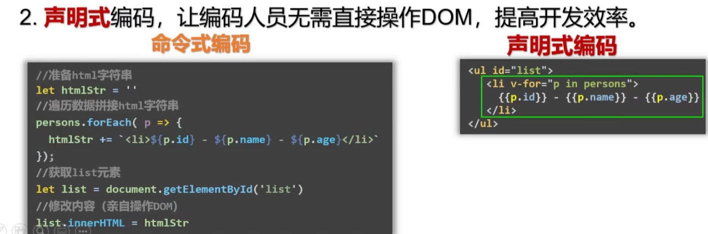

<<<<<<< HEAD
<<<<<<< HEAD
<<<<<<< HEAD
=======
# VUE前端框架

## 背景知识

**目前vue2已经不再被维护，但vue3依然继承了很多vue2的理念和接口，我们依然需要先从vue2开始学习。**

**vue2文档**：https://v2.vuejs.org/

★**vue3文档**：https://vuejs.org/

**官方全局状态管理**：

vuex：https://vuex.vuejs.org/zh/

★pinia：https://pinia.vuejs.org/zh/

**事件总线**：
如果你还想念事件总线的话。。。

tiny-emitter： https://www.npmjs.com/package/tiny-emitter

mitt: https://www.npmjs.com/package/mitt

**官方路由：**

★Vue-Router：https://router.vuejs.org/zh/

TanStack-Router：https://tanstack.com/router/v1/docs/overview

**官方脚手架**：

★Vite：https://cn.vitejs.dev/

vue-cli：https://cli.vuejs.org/zh/

**vscode插件**：

vue3：https://cn.vuejs.org/guide/typescript/overview.html#ide-support

vue2：自己找一下吧

**浏览器vue插件**：

https://chrome.google.com/webstore/detail/vuejs-devtools/nhdogjmejiglipccpnnnanhbledajbpd

**SFC插件**：

GraphQL插件1：https://gridsome.org/docs/querying-data/

GraphQL插件2： https://github.com/wheatjs/vite-plugin-vue-gql

高级自定义插件：https://cn.vuejs.org/guide/scaling-up/tooling.html#sfc-custom-block-integrations

**jsx语法支持：**

跟脚手架配置有关。

vite：https://github.com/vitejs/vite-plugin-vue/tree/main/packages/plugin-vue-jsx

vue-cli：https://github.com/vuejs/babel-plugin-jsx/blob/dev/packages/babel-plugin-jsx/README-zh_CN.md

**测试框架:**

vite：https://vitest.dev/

Cypress：https://www.cypress.io/

**后端框架**：

Nuxt: https://nuxt.com/

Vite-SSR: vite工具自带插件https://cn.vitejs.dev/guide/ssr.html

### vue的特点

什么是渐进式？
就是一开始不需要你完全掌握它的全部功能特性，可以后续逐步增加功能。没有多做职责之外的事情。现在react也是如此。

**根据SFC插件+脚手架插件的各种支持，我们应当选择合适的lang=""**

SFC组件化模式：

~/components/child.vue

```
<template lang="pug">
  <!-- 组件模板HTML区域，这里我们开启pug模板渲染模式 -->
  <div class="example">{{ msg }}</div>
</template>

<script lang="ts">
// 组件js区域，这里我们使用ts代码
export default {
  data() {
    return {
      msg: 'Hello world!'
    }
  }
}
</script>

<style lang="less">
/* 样式组件，这里我们使用less样式 */
.example {
  color: red;
}
</style>

<custom1>
  自定义模块，这里不常用，一般用来装载vue专属插件，实现更多功能。
</custom1>
```

#### 小技巧

```
# vue3比vue2更好的写法。
<script lang="ts" setup>
import { ref } from 'vue'

// 响应式变量
const count = ref(0)

// 变量
const msg = 'Hello!'

// 函数
function log() {
  console.log(msg)
}
</script>
```

```
# scoped标签让样式只影响当前组件
<style lang="less" scoped>
.example {
  color: red;
}
/* 如果想要某个样式影响子节点 */
.a :deep(.b) {
  /* 使用:deep(el) */
}
/* 如果想要某个样式影响插槽 */
:slotted(div) {
  color: red;
}
/* 如果想要某个样式影响全局 */
:global(.red) {
  color: red;
}
</style>
```
混合全局样式和局部样式

```
<style>
/* 全局样式 */
</style>

<style scoped>
/* 局部样式 */
</style>
```

动态组件

```
<script setup>
import Foo from './Foo.vue'
import Bar from './Bar.vue'
</script>

<template>
  <component :is="Foo" />
  <component :is="someCondition ? Foo : Bar" />
</template>
```

递归组件

```
import { FooBar as FooBarChild } from './components'
```

命名空间组件

```
<script setup>
import * as Form from './form-components'
</script>

<template>
  <Form.Input>
    <Form.Label>label</Form.Label>
  </Form.Input>
</template>
```

自定义指令

```
<script setup>
const vMyDirective = {
  beforeMount: (el) => {
    // 在元素上做些操作
  }
}
</script>
<template>
  <h1 v-my-directive>This is a Heading</h1>
</template>
```

```
<script setup>
import { myDirective as vMyDirective } from './MyDirective.js'
</script>
```

推荐使用ts语法

```
<script setup>
const props = defineProps({
  foo: String
})

const emit = defineEmits(['change', 'delete'])
// setup 代码
</script>
```


声明式编码，有点模板化的感觉。




css modules 模块化

推荐使用文件格式**style.module.css**。

但在**.vue**文件中，一个 `<style module>` 标签会被编译为 [CSS Modules](https://github.com/css-modules/css-modules) 并且将生成的 CSS class 作为 **`$style` 对象**暴露给组件：

```
<template>
  <p :class="$style.red">This should be red</p>
</template>

<style module>
.red {
  color: red;
}
</style>
```

```
<template>
  <p :class="classes.red">red</p>
</template>

<style module="classes">
/* 可以带入命名空间 */
.red {
  color: red;
}
</style>
```

如果想要多次调用模块化css，除了import外，还可以通过一个钩子。

```
import { useCssModule } from 'vue'

// 在 setup() 作用域中...
// 默认情况下, 返回 <style module> 的 class
useCssModule()

// 具名情况下, 返回 <style module="classes"> 的 class
useCssModule('classes')

```

同时也支持，动态组件的样式绑定法

```
<script setup>
const theme = {
  color: 'red'
}
</script>

<template>
  <p>hello</p>
</template>

<style scoped>
p {
  color: v-bind('theme.color');
}
</style>

```

## v2开始学习

 避免开发环境提示，我们可以全局配置，

```
Vue.config.productionTip = false;
```

特点记忆：

1.Vue实例和容器，一一对应，不存在多对多和一对多。

2.{{xxx}}有种模板语法的感觉，可以写js对象。

3.data中的数据一旦改变，则渲染结果也会改变


### 插值语法


### 指令语法


单项绑定


双向绑定


### Vue实例化

### el和data扩展写法


MVVM模型


本质：数据和模板合并，加入监听和渲染。

最后所有的属性都出现在了VM上


### 数据代理


### 事件


修饰符可以连写。


键盘事件

可以连写，组合键


### 计算属性


事件简写


### 监视属性


#### 监视，计算的区别？

计算属性可以创建一个实例，然后调用。

监视属性则必须先创建一个data实例属性，然后调用。

监视属性可以放入异步方法，必须可以放入

```
比如放入一个setTimeout延时器，计算属性需要return，而监视属性直接赋值
```


this始终指向调用者，当多个函数嵌套时，则默认指向外面一层。

箭头函数和function()的区别，取this的区别。

<div style="color:red">function()中的this默认指向，外层对象，如果没有则默认window。</div>

<div style="color:skyblue">箭头函数中的this始终指向最外层对象window。</div>

### class和style


### 条件渲染


### 列表渲染


虚拟DOM对比算法


Vue监测的底层逻辑


vue中监听的只有属性值，当不通过属性值进行传参的改变时，就会导致渲染失败.

### set功能

最主要时可以后期往data添加元素。


### 

### 表单


### 过滤器


###  常用指令

v-html与v-text


v-cloak


v-once


v-pre


自定义指令


自定义指令坑


### 生命周期


### 组件化


#### 非单文件组件


#### 单文件组件

vue文件封装组件


app管理子组件


各个子组件


但是缺少了脚手架 or webpack


### 脚手架vue-cli


这里我们使用CLI脚手架

```
vue指令
# 查看脚手架版本
vue -V
# 创建脚手架，名字回避npm包里的名字
vue create 
```

命令行会要求你选择选项

vue版本


选择默认包管理


```
一般选择npm
当然也可以选择yarn
```

编译文件，并运行一个实例服务器

```
# 可以多次重启
npm run serve
```


```
# 创建一个生产版本的dist
npm run build
```

```
# 执行检查文件（才不用）
npm run lint
```


记录一个错误


再次重启编译服务时，出现以上错误。

重要原因是，脚手架内的lint插件检查到了不符合命名规范的组件


我们需要配置vue.config.js让错误检查关闭


Vue如果不整这么多版本，导致体积太大，所以有

vue.js        完全体js

vue.min.js 压缩过的js

runtime.js 运行时js


### 轻量级脚手架 Vite


####  优势


### vuex使用

store是vue的管理中心。


一个在VM之外的数据和方法的存放方式，

使用devTool工具查看vuex触发过程


功能看代码。

### vue-router路由

单页面，适合展示，后台管理，数据可视化。局部刷新加路由url变化


多页面，适合大型商品网站，资料网站等等。其实也是多个单页面组成 - -


### Pinia的使用

```
Vue 的官方状态管理库已更改为Pinia。Pinia 具有与 Vuex 5 几乎完全相同或增强的 API，在Vuex 5 RFC中进行了描述。您可以简单地将 Pinia 视为具有不同名称的 Vuex 5。Pinia 也适用于 Vue 2.x。
```


### 部署


### UI组件库


## v3

#### vite新脚手架，vue-cli

这里我们推荐，使用vite构建vue3+Ts开发模块。vite是比webpack更先进的动态脚手架。

```
$ npm create vite@latest my-vue-ts --template vue-ts
```


#### Pinia.js新状态管理工具，vuex

这个构建起来更快。

```
npm install pinia
```

https://pinia.vuejs.org/getting-started.html

#### vue Loader 新格式文件


#### 服务端渲染Server-Side Rendering

1.反向代理服务器。

https://zxuqian.cn/vite-proxy-config/

2.SSR直接代理。用的太少了，一般都是借助nginx对static文件进行代理。

#### 组合式API ，setup

全新的数据和事务的包装形式setup，vue2和vue3语法之间存在较大差异，不要混用。


### 响应式的不同


操作对象中的属性

需要

Vue.$delete

Vue.$set(obj, key, value)

操作数组中的元素。

则需要数组那七个数组方法，才能触发响应式。


Vue3则不同


### vue3生命周期


## 混合开发hybrid

- 配合 [Electron](https://www.electronjs.org/) 或 [Tauri](https://tauri.studio/en/) 构建桌面应用
- 配合 [Ionic Vue](https://ionicframework.com/docs/vue/overview) 构建移动端应用
- 使用 [Quasar](https://quasar.dev/) 用同一套代码同时开发桌面端和移动端应用

## 小技巧

### object响应式


=======
<<<<<<< HEAD
<<<<<<< HEAD
# VUE前端框架

## 背景知识

**目前vue2已经不再被维护，但vue3依然继承了很多vue2的理念和接口，我们依然需要先从vue2开始学习。**

**vue2文档**：https://v2.vuejs.org/

★**vue3文档**：https://vuejs.org/

**官方全局状态管理**：

vuex：https://vuex.vuejs.org/zh/

★pinia：https://pinia.vuejs.org/zh/

**事件总线**：
如果你还想念事件总线的话。。。

tiny-emitter： https://www.npmjs.com/package/tiny-emitter

mitt: https://www.npmjs.com/package/mitt

**官方路由：**

★Vue-Router：https://router.vuejs.org/zh/

TanStack-Router：https://tanstack.com/router/v1/docs/overview

**官方脚手架**：

★Vite：https://cn.vitejs.dev/

vue-cli：https://cli.vuejs.org/zh/

**vscode插件**：

vue3：https://cn.vuejs.org/guide/typescript/overview.html#ide-support

vue2：自己找一下吧

**浏览器vue插件**：

https://chrome.google.com/webstore/detail/vuejs-devtools/nhdogjmejiglipccpnnnanhbledajbpd

**SFC插件**：

GraphQL插件1：https://gridsome.org/docs/querying-data/

GraphQL插件2： https://github.com/wheatjs/vite-plugin-vue-gql

高级自定义插件：https://cn.vuejs.org/guide/scaling-up/tooling.html#sfc-custom-block-integrations

**jsx语法支持：**

跟脚手架配置有关。

vite：https://github.com/vitejs/vite-plugin-vue/tree/main/packages/plugin-vue-jsx

vue-cli：https://github.com/vuejs/babel-plugin-jsx/blob/dev/packages/babel-plugin-jsx/README-zh_CN.md

**测试框架:**

vite：https://vitest.dev/

Cypress：https://www.cypress.io/

**后端框架**：

Nuxt: https://nuxt.com/

Vite-SSR: vite工具自带插件https://cn.vitejs.dev/guide/ssr.html

### vue的特点

什么是渐进式？
就是一开始不需要你完全掌握它的全部功能特性，可以后续逐步增加功能。没有多做职责之外的事情。现在react也是如此。

**根据SFC插件+脚手架插件的各种支持，我们应当选择合适的lang=""**

SFC组件化模式：

~/components/child.vue

```
<template lang="pug">
  <!-- 组件模板HTML区域，这里我们开启pug模板渲染模式 -->
  <div class="example">{{ msg }}</div>
</template>

<script lang="ts">
// 组件js区域，这里我们使用ts代码
export default {
  data() {
    return {
      msg: 'Hello world!'
    }
  }
}
</script>

<style lang="less">
/* 样式组件，这里我们使用less样式 */
.example {
  color: red;
}
</style>

<custom1>
  自定义模块，这里不常用，一般用来装载vue专属插件，实现更多功能。
</custom1>
```

#### 小技巧

```
# vue3比vue2更好的写法。
<script lang="ts" setup>
import { ref } from 'vue'

// 响应式变量
const count = ref(0)

// 变量
const msg = 'Hello!'

// 函数
function log() {
  console.log(msg)
}
</script>
```

```
# scoped标签让样式只影响当前组件
<style lang="less" scoped>
.example {
  color: red;
}
/* 如果想要某个样式影响子节点 */
.a :deep(.b) {
  /* 使用:deep(el) */
}
/* 如果想要某个样式影响插槽 */
:slotted(div) {
  color: red;
}
/* 如果想要某个样式影响全局 */
:global(.red) {
  color: red;
}
</style>
```
混合全局样式和局部样式

```
<style>
/* 全局样式 */
</style>

<style scoped>
/* 局部样式 */
</style>
```

动态组件

```
<script setup>
import Foo from './Foo.vue'
import Bar from './Bar.vue'
</script>

<template>
  <component :is="Foo" />
  <component :is="someCondition ? Foo : Bar" />
</template>
```

递归组件

```
import { FooBar as FooBarChild } from './components'
```

命名空间组件

```
<script setup>
import * as Form from './form-components'
</script>

<template>
  <Form.Input>
    <Form.Label>label</Form.Label>
  </Form.Input>
</template>
```

自定义指令

```
<script setup>
const vMyDirective = {
  beforeMount: (el) => {
    // 在元素上做些操作
  }
}
</script>
<template>
  <h1 v-my-directive>This is a Heading</h1>
</template>
```

```
<script setup>
import { myDirective as vMyDirective } from './MyDirective.js'
</script>
```

推荐使用ts语法

```
<script setup>
const props = defineProps({
  foo: String
})

const emit = defineEmits(['change', 'delete'])
// setup 代码
</script>
```


声明式编码，有点模板化的感觉。


css modules 模块化

推荐使用文件格式**style.module.css**。

但在**.vue**文件中，一个 `<style module>` 标签会被编译为 [CSS Modules](https://github.com/css-modules/css-modules) 并且将生成的 CSS class 作为 **`$style` 对象**暴露给组件：

```
<template>
  <p :class="$style.red">This should be red</p>
</template>

<style module>
.red {
  color: red;
}
</style>
```

```
<template>
  <p :class="classes.red">red</p>
</template>

<style module="classes">
/* 可以带入命名空间 */
.red {
  color: red;
}
</style>
```

如果想要多次调用模块化css，除了import外，还可以通过一个钩子。

```
import { useCssModule } from 'vue'

// 在 setup() 作用域中...
// 默认情况下, 返回 <style module> 的 class
useCssModule()

// 具名情况下, 返回 <style module="classes"> 的 class
useCssModule('classes')

```

同时也支持，动态组件的样式绑定法

```
<script setup>
const theme = {
  color: 'red'
}
</script>

<template>
  <p>hello</p>
</template>

<style scoped>
p {
  color: v-bind('theme.color');
}
</style>

```

## v2开始学习

 避免开发环境提示，我们可以全局配置，

```
Vue.config.productionTip = false;
```

特点记忆：

1.Vue实例和容器，一一对应，不存在多对多和一对多。

2.{{xxx}}有种模板语法的感觉，可以写js对象。

3.data中的数据一旦改变，则渲染结果也会改变


### 插值语法


### 指令语法


单项绑定


双向绑定


### Vue实例化

### el和data扩展写法


MVVM模型


本质：数据和模板合并，加入监听和渲染。

最后所有的属性都出现在了VM上


### 数据代理


### 事件


修饰符可以连写。


键盘事件

可以连写，组合键


### 计算属性


事件简写


### 监视属性


#### 监视，计算的区别？

计算属性可以创建一个实例，然后调用。

监视属性则必须先创建一个data实例属性，然后调用。

监视属性可以放入异步方法，必须可以放入

```
比如放入一个setTimeout延时器，计算属性需要return，而监视属性直接赋值
```


this始终指向调用者，当多个函数嵌套时，则默认指向外面一层。

箭头函数和function()的区别，取this的区别。

<div style="color:red">function()中的this默认指向，外层对象，如果没有则默认window。</div>

<div style="color:skyblue">箭头函数中的this始终指向最外层对象window。</div>

### class和style


### 条件渲染


### 列表渲染


虚拟DOM对比算法


Vue监测的底层逻辑


vue中监听的只有属性值，当不通过属性值进行传参的改变时，就会导致渲染失败.

### set功能

最主要时可以后期往data添加元素。


### 

### 表单


### 过滤器


###  常用指令

v-html与v-text


v-cloak


v-once


v-pre


自定义指令


自定义指令坑


### 生命周期


### 组件化


#### 非单文件组件


#### 单文件组件

vue文件封装组件


app管理子组件


各个子组件


但是缺少了脚手架 or webpack


### 脚手架vue-cli


这里我们使用CLI脚手架

```
vue指令
# 查看脚手架版本
vue -V
# 创建脚手架，名字回避npm包里的名字
vue create 
```

命令行会要求你选择选项

vue版本


选择默认包管理


```
一般选择npm
当然也可以选择yarn
```

编译文件，并运行一个实例服务器

```
# 可以多次重启
npm run serve
```


```
# 创建一个生产版本的dist
npm run build
```

```
# 执行检查文件（才不用）
npm run lint
```


记录一个错误


再次重启编译服务时，出现以上错误。

重要原因是，脚手架内的lint插件检查到了不符合命名规范的组件


我们需要配置vue.config.js让错误检查关闭


Vue如果不整这么多版本，导致体积太大，所以有

vue.js        完全体js

vue.min.js 压缩过的js

runtime.js 运行时js


### 轻量级脚手架 Vite


####  优势


### vuex使用

store是vue的管理中心。


一个在VM之外的数据和方法的存放方式，

使用devTool工具查看vuex触发过程


功能看代码。

### vue-router路由

单页面，适合展示，后台管理，数据可视化。局部刷新加路由url变化


多页面，适合大型商品网站，资料网站等等。其实也是多个单页面组成 - -


### Pinia的使用

```
Vue 的官方状态管理库已更改为Pinia。Pinia 具有与 Vuex 5 几乎完全相同或增强的 API，在Vuex 5 RFC中进行了描述。您可以简单地将 Pinia 视为具有不同名称的 Vuex 5。Pinia 也适用于 Vue 2.x。
```


### 部署


### UI组件库


## v3

#### vite新脚手架，vue-cli

这里我们推荐，使用vite构建vue3+Ts开发模块。vite是比webpack更先进的动态脚手架。

```
$ npm create vite@latest my-vue-ts --template vue-ts
```


#### Pinia.js新状态管理工具，vuex

这个构建起来更快。

```
npm install pinia
```

https://pinia.vuejs.org/getting-started.html

#### vue Loader 新格式文件


#### 服务端渲染Server-Side Rendering

1.反向代理服务器。

https://zxuqian.cn/vite-proxy-config/

2.SSR直接代理。用的太少了，一般都是借助nginx对static文件进行代理。

#### 组合式API ，setup

全新的数据和事务的包装形式setup，vue2和vue3语法之间存在较大差异，不要混用。


### 响应式的不同


操作对象中的属性

需要

Vue.$delete

Vue.$set(obj, key, value)

操作数组中的元素。

则需要数组那七个数组方法，才能触发响应式。


Vue3则不同


### vue3生命周期


## 混合开发hybrid

- 配合 [Electron](https://www.electronjs.org/) 或 [Tauri](https://tauri.studio/en/) 构建桌面应用
- 配合 [Ionic Vue](https://ionicframework.com/docs/vue/overview) 构建移动端应用
- 使用 [Quasar](https://quasar.dev/) 用同一套代码同时开发桌面端和移动端应用

## 小技巧

### object响应式


=======
=======
>>>>>>> 3c26437d4b69c42e353a41835d4c4a522810b254
# VUE前端框架

## 背景知识

**目前vue2已经不再被维护，但vue3依然继承了很多vue2的理念和接口，我们依然需要先从vue2开始学习。**

**vue2文档**：https://v2.vuejs.org/

★**vue3文档**：https://vuejs.org/

**官方全局状态管理**：

vuex：https://vuex.vuejs.org/zh/

★pinia：https://pinia.vuejs.org/zh/

**事件总线**：
如果你还想念事件总线的话。。。

tiny-emitter： https://www.npmjs.com/package/tiny-emitter

mitt: https://www.npmjs.com/package/mitt

**官方路由：**

★Vue-Router：https://router.vuejs.org/zh/

TanStack-Router：https://tanstack.com/router/v1/docs/overview

**官方脚手架**：

★Vite：https://cn.vitejs.dev/

vue-cli：https://cli.vuejs.org/zh/

**vscode插件**：

vue3：https://cn.vuejs.org/guide/typescript/overview.html#ide-support

vue2：自己找一下吧

**浏览器vue插件**：

https://chrome.google.com/webstore/detail/vuejs-devtools/nhdogjmejiglipccpnnnanhbledajbpd

**SFC插件**：

GraphQL插件1：https://gridsome.org/docs/querying-data/

GraphQL插件2： https://github.com/wheatjs/vite-plugin-vue-gql

高级自定义插件：https://cn.vuejs.org/guide/scaling-up/tooling.html#sfc-custom-block-integrations

**jsx语法支持：**

跟脚手架配置有关。

vite：https://github.com/vitejs/vite-plugin-vue/tree/main/packages/plugin-vue-jsx

vue-cli：https://github.com/vuejs/babel-plugin-jsx/blob/dev/packages/babel-plugin-jsx/README-zh_CN.md

**测试框架:**

vite：https://vitest.dev/

Cypress：https://www.cypress.io/

**后端框架**：

Nuxt: https://nuxt.com/

Vite-SSR: vite工具自带插件https://cn.vitejs.dev/guide/ssr.html

### vue的特点

什么是渐进式？
就是一开始不需要你完全掌握它的全部功能特性，可以后续逐步增加功能。没有多做职责之外的事情。现在react也是如此。

**根据SFC插件+脚手架插件的各种支持，我们应当选择合适的lang=""**

SFC组件化模式：

~/components/child.vue

```
<template lang="pug">
  <!-- 组件模板HTML区域，这里我们开启pug模板渲染模式 -->
  <div class="example">{{ msg }}</div>
</template>

<script lang="ts">
// 组件js区域，这里我们使用ts代码
export default {
  data() {
    return {
      msg: 'Hello world!'
    }
  }
}
</script>

<style lang="less">
/* 样式组件，这里我们使用less样式 */
.example {
  color: red;
}
</style>

<custom1>
  自定义模块，这里不常用，一般用来装载vue专属插件，实现更多功能。
</custom1>
```

#### 小技巧

```
# vue3比vue2更好的写法。
<script lang="ts" setup>
import { ref } from 'vue'

// 响应式变量
const count = ref(0)

// 变量
const msg = 'Hello!'

// 函数
function log() {
  console.log(msg)
}
</script>
```

```
# scoped标签让样式只影响当前组件
<style lang="less" scoped>
.example {
  color: red;
}
/* 如果想要某个样式影响子节点 */
.a :deep(.b) {
  /* 使用:deep(el) */
}
/* 如果想要某个样式影响插槽 */
:slotted(div) {
  color: red;
}
/* 如果想要某个样式影响全局 */
:global(.red) {
  color: red;
}
</style>
```
混合全局样式和局部样式

```
<style>
/* 全局样式 */
</style>

<style scoped>
/* 局部样式 */
</style>
```

动态组件

```
<script setup>
import Foo from './Foo.vue'
import Bar from './Bar.vue'
</script>

<template>
  <component :is="Foo" />
  <component :is="someCondition ? Foo : Bar" />
</template>
```

递归组件

```
import { FooBar as FooBarChild } from './components'
```

命名空间组件

```
<script setup>
import * as Form from './form-components'
</script>

<template>
  <Form.Input>
    <Form.Label>label</Form.Label>
  </Form.Input>
</template>
```

自定义指令

```
<script setup>
const vMyDirective = {
  beforeMount: (el) => {
    // 在元素上做些操作
  }
}
</script>
<template>
  <h1 v-my-directive>This is a Heading</h1>
</template>
```

```
<script setup>
import { myDirective as vMyDirective } from './MyDirective.js'
</script>
```

推荐使用ts语法

```
<script setup>
const props = defineProps({
  foo: String
})

const emit = defineEmits(['change', 'delete'])
// setup 代码
</script>
```


声明式编码，有点模板化的感觉。


css modules 模块化

推荐使用文件格式**style.module.css**。

但在**.vue**文件中，一个 `<style module>` 标签会被编译为 [CSS Modules](https://github.com/css-modules/css-modules) 并且将生成的 CSS class 作为 **`$style` 对象**暴露给组件：

```
<template>
  <p :class="$style.red">This should be red</p>
</template>

<style module>
.red {
  color: red;
}
</style>
```

```
<template>
  <p :class="classes.red">red</p>
</template>

<style module="classes">
/* 可以带入命名空间 */
.red {
  color: red;
}
</style>
```

如果想要多次调用模块化css，除了import外，还可以通过一个钩子。

```
import { useCssModule } from 'vue'

// 在 setup() 作用域中...
// 默认情况下, 返回 <style module> 的 class
useCssModule()

// 具名情况下, 返回 <style module="classes"> 的 class
useCssModule('classes')

```

同时也支持，动态组件的样式绑定法

```
<script setup>
const theme = {
  color: 'red'
}
</script>

<template>
  <p>hello</p>
</template>

<style scoped>
p {
  color: v-bind('theme.color');
}
</style>

```

## v2开始学习

 避免开发环境提示，我们可以全局配置，

```
Vue.config.productionTip = false;
```

特点记忆：

1.Vue实例和容器，一一对应，不存在多对多和一对多。

2.{{xxx}}有种模板语法的感觉，可以写js对象。

3.data中的数据一旦改变，则渲染结果也会改变


### 插值语法


### 指令语法


单项绑定


双向绑定


### Vue实例化

### el和data扩展写法


MVVM模型


本质：数据和模板合并，加入监听和渲染。

最后所有的属性都出现在了VM上


### 数据代理


### 事件


修饰符可以连写。


键盘事件

可以连写，组合键


### 计算属性


事件简写


### 监视属性


#### 监视，计算的区别？

计算属性可以创建一个实例，然后调用。

监视属性则必须先创建一个data实例属性，然后调用。

监视属性可以放入异步方法，必须可以放入

```
比如放入一个setTimeout延时器，计算属性需要return，而监视属性直接赋值
```


this始终指向调用者，当多个函数嵌套时，则默认指向外面一层。

箭头函数和function()的区别，取this的区别。

<div style="color:red">function()中的this默认指向，外层对象，如果没有则默认window。</div>

<div style="color:skyblue">箭头函数中的this始终指向最外层对象window。</div>

### class和style


### 条件渲染


### 列表渲染


虚拟DOM对比算法


Vue监测的底层逻辑


vue中监听的只有属性值，当不通过属性值进行传参的改变时，就会导致渲染失败.

### set功能

最主要时可以后期往data添加元素。


### 

### 表单


### 过滤器


###  常用指令

v-html与v-text


v-cloak


v-once


v-pre


自定义指令


自定义指令坑


### 生命周期


### 组件化


#### 非单文件组件


#### 单文件组件

vue文件封装组件


app管理子组件


各个子组件


但是缺少了脚手架 or webpack


### 脚手架vue-cli


这里我们使用CLI脚手架

```
vue指令
# 查看脚手架版本
vue -V
# 创建脚手架，名字回避npm包里的名字
vue create 
```

命令行会要求你选择选项

vue版本


选择默认包管理


```
一般选择npm
当然也可以选择yarn
```

编译文件，并运行一个实例服务器

```
# 可以多次重启
npm run serve
```


```
# 创建一个生产版本的dist
npm run build
```

```
# 执行检查文件（才不用）
npm run lint
```


记录一个错误


再次重启编译服务时，出现以上错误。

重要原因是，脚手架内的lint插件检查到了不符合命名规范的组件


我们需要配置vue.config.js让错误检查关闭


Vue如果不整这么多版本，导致体积太大，所以有

vue.js        完全体js

vue.min.js 压缩过的js

runtime.js 运行时js


### 轻量级脚手架 Vite


####  优势


### vuex使用

store是vue的管理中心。


一个在VM之外的数据和方法的存放方式，

使用devTool工具查看vuex触发过程


功能看代码。

### vue-router路由

单页面，适合展示，后台管理，数据可视化。局部刷新加路由url变化


多页面，适合大型商品网站，资料网站等等。其实也是多个单页面组成 - -


### Pinia的使用

```
Vue 的官方状态管理库已更改为Pinia。Pinia 具有与 Vuex 5 几乎完全相同或增强的 API，在Vuex 5 RFC中进行了描述。您可以简单地将 Pinia 视为具有不同名称的 Vuex 5。Pinia 也适用于 Vue 2.x。
```


### 部署


### UI组件库


## v3

#### vite新脚手架，vue-cli

这里我们推荐，使用vite构建vue3+Ts开发模块。vite是比webpack更先进的动态脚手架。

```
$ npm create vite@latest my-vue-ts --template vue-ts
```


#### Pinia.js新状态管理工具，vuex

这个构建起来更快。

```
npm install pinia
```

https://pinia.vuejs.org/getting-started.html

#### vue Loader 新格式文件


#### 服务端渲染Server-Side Rendering

1.反向代理服务器。

https://zxuqian.cn/vite-proxy-config/

2.SSR直接代理。用的太少了，一般都是借助nginx对static文件进行代理。

#### 组合式API ，setup

全新的数据和事务的包装形式setup，vue2和vue3语法之间存在较大差异，不要混用。


### 响应式的不同


操作对象中的属性

需要

Vue.$delete

Vue.$set(obj, key, value)

操作数组中的元素。

则需要数组那七个数组方法，才能触发响应式。


Vue3则不同


### vue3生命周期


## 混合开发hybrid

- 配合 [Electron](https://www.electronjs.org/) 或 [Tauri](https://tauri.studio/en/) 构建桌面应用
- 配合 [Ionic Vue](https://ionicframework.com/docs/vue/overview) 构建移动端应用
- 使用 [Quasar](https://quasar.dev/) 用同一套代码同时开发桌面端和移动端应用

## 小技巧

### object响应式


<<<<<<< HEAD
=======
=======
<<<<<<< HEAD
# VUE前端框架

## 背景知识

**目前vue2已经不再被维护，但vue3依然继承了很多vue2的理念和接口，我们依然需要先从vue2开始学习。**

**vue2文档**：https://v2.vuejs.org/

★**vue3文档**：https://vuejs.org/

**官方全局状态管理**：

vuex：https://vuex.vuejs.org/zh/

★pinia：https://pinia.vuejs.org/zh/

**事件总线**：
如果你还想念事件总线的话。。。

tiny-emitter： https://www.npmjs.com/package/tiny-emitter

mitt: https://www.npmjs.com/package/mitt

**官方路由：**

★Vue-Router：https://router.vuejs.org/zh/

TanStack-Router：https://tanstack.com/router/v1/docs/overview

**官方脚手架**：

★Vite：https://cn.vitejs.dev/

vue-cli：https://cli.vuejs.org/zh/

**vscode插件**：

vue3：https://cn.vuejs.org/guide/typescript/overview.html#ide-support

vue2：自己找一下吧

**浏览器vue插件**：

https://chrome.google.com/webstore/detail/vuejs-devtools/nhdogjmejiglipccpnnnanhbledajbpd

**SFC插件**：

GraphQL插件1：https://gridsome.org/docs/querying-data/

GraphQL插件2： https://github.com/wheatjs/vite-plugin-vue-gql

高级自定义插件：https://cn.vuejs.org/guide/scaling-up/tooling.html#sfc-custom-block-integrations

**jsx语法支持：**

跟脚手架配置有关。

vite：https://github.com/vitejs/vite-plugin-vue/tree/main/packages/plugin-vue-jsx

vue-cli：https://github.com/vuejs/babel-plugin-jsx/blob/dev/packages/babel-plugin-jsx/README-zh_CN.md

**测试框架:**

vite：https://vitest.dev/

Cypress：https://www.cypress.io/

**后端框架**：

Nuxt: https://nuxt.com/

Vite-SSR: vite工具自带插件https://cn.vitejs.dev/guide/ssr.html

### vue的特点

什么是渐进式？
就是一开始不需要你完全掌握它的全部功能特性，可以后续逐步增加功能。没有多做职责之外的事情。现在react也是如此。

**根据SFC插件+脚手架插件的各种支持，我们应当选择合适的lang=""**

SFC组件化模式：

~/components/child.vue

```
<template lang="pug">
  <!-- 组件模板HTML区域，这里我们开启pug模板渲染模式 -->
  <div class="example">{{ msg }}</div>
</template>

<script lang="ts">
// 组件js区域，这里我们使用ts代码
export default {
  data() {
    return {
      msg: 'Hello world!'
    }
  }
}
</script>

<style lang="less">
/* 样式组件，这里我们使用less样式 */
.example {
  color: red;
}
</style>

<custom1>
  自定义模块，这里不常用，一般用来装载vue专属插件，实现更多功能。
</custom1>
```

#### 小技巧

```
# vue3比vue2更好的写法。
<script lang="ts" setup>
import { ref } from 'vue'

// 响应式变量
const count = ref(0)

// 变量
const msg = 'Hello!'

// 函数
function log() {
  console.log(msg)
}
</script>
```

```
# scoped标签让样式只影响当前组件
<style lang="less" scoped>
.example {
  color: red;
}
/* 如果想要某个样式影响子节点 */
.a :deep(.b) {
  /* 使用:deep(el) */
}
/* 如果想要某个样式影响插槽 */
:slotted(div) {
  color: red;
}
/* 如果想要某个样式影响全局 */
:global(.red) {
  color: red;
}
</style>
```
混合全局样式和局部样式

```
<style>
/* 全局样式 */
</style>

<style scoped>
/* 局部样式 */
</style>
```

动态组件

```
<script setup>
import Foo from './Foo.vue'
import Bar from './Bar.vue'
</script>

<template>
  <component :is="Foo" />
  <component :is="someCondition ? Foo : Bar" />
</template>
```

递归组件

```
import { FooBar as FooBarChild } from './components'
```

命名空间组件

```
<script setup>
import * as Form from './form-components'
</script>

<template>
  <Form.Input>
    <Form.Label>label</Form.Label>
  </Form.Input>
</template>
```

自定义指令

```
<script setup>
const vMyDirective = {
  beforeMount: (el) => {
    // 在元素上做些操作
  }
}
</script>
<template>
  <h1 v-my-directive>This is a Heading</h1>
</template>
```

```
<script setup>
import { myDirective as vMyDirective } from './MyDirective.js'
</script>
```

推荐使用ts语法

```
<script setup>
const props = defineProps({
  foo: String
})

const emit = defineEmits(['change', 'delete'])
// setup 代码
</script>
```


声明式编码，有点模板化的感觉。


css modules 模块化

推荐使用文件格式**style.module.css**。

但在**.vue**文件中，一个 `<style module>` 标签会被编译为 [CSS Modules](https://github.com/css-modules/css-modules) 并且将生成的 CSS class 作为 **`$style` 对象**暴露给组件：

```
<template>
  <p :class="$style.red">This should be red</p>
</template>

<style module>
.red {
  color: red;
}
</style>
```

```
<template>
  <p :class="classes.red">red</p>
</template>

<style module="classes">
/* 可以带入命名空间 */
.red {
  color: red;
}
</style>
```

如果想要多次调用模块化css，除了import外，还可以通过一个钩子。

```
import { useCssModule } from 'vue'

// 在 setup() 作用域中...
// 默认情况下, 返回 <style module> 的 class
useCssModule()

// 具名情况下, 返回 <style module="classes"> 的 class
useCssModule('classes')

```

同时也支持，动态组件的样式绑定法

```
<script setup>
const theme = {
  color: 'red'
}
</script>

<template>
  <p>hello</p>
</template>

<style scoped>
p {
  color: v-bind('theme.color');
}
</style>

```

## v2开始学习

 避免开发环境提示，我们可以全局配置，

```
Vue.config.productionTip = false;
```

特点记忆：

1.Vue实例和容器，一一对应，不存在多对多和一对多。

2.{{xxx}}有种模板语法的感觉，可以写js对象。

3.data中的数据一旦改变，则渲染结果也会改变


### 插值语法


### 指令语法


单项绑定


双向绑定


### Vue实例化

### el和data扩展写法


MVVM模型


本质：数据和模板合并，加入监听和渲染。

最后所有的属性都出现在了VM上


### 数据代理


### 事件


修饰符可以连写。


键盘事件

可以连写，组合键


### 计算属性


事件简写


### 监视属性


#### 监视，计算的区别？

计算属性可以创建一个实例，然后调用。

监视属性则必须先创建一个data实例属性，然后调用。

监视属性可以放入异步方法，必须可以放入

```
比如放入一个setTimeout延时器，计算属性需要return，而监视属性直接赋值
```


this始终指向调用者，当多个函数嵌套时，则默认指向外面一层。

箭头函数和function()的区别，取this的区别。

<div style="color:red">function()中的this默认指向，外层对象，如果没有则默认window。</div>

<div style="color:skyblue">箭头函数中的this始终指向最外层对象window。</div>

### class和style


### 条件渲染


### 列表渲染


虚拟DOM对比算法


Vue监测的底层逻辑


vue中监听的只有属性值，当不通过属性值进行传参的改变时，就会导致渲染失败.

### set功能

最主要时可以后期往data添加元素。


### 

### 表单


### 过滤器


###  常用指令

v-html与v-text


v-cloak


v-once


v-pre


自定义指令


自定义指令坑


### 生命周期


### 组件化


#### 非单文件组件


#### 单文件组件

vue文件封装组件


app管理子组件


各个子组件


但是缺少了脚手架 or webpack


### 脚手架vue-cli


这里我们使用CLI脚手架

```
vue指令
# 查看脚手架版本
vue -V
# 创建脚手架，名字回避npm包里的名字
vue create 
```

命令行会要求你选择选项

vue版本


选择默认包管理


```
一般选择npm
当然也可以选择yarn
```

编译文件，并运行一个实例服务器

```
# 可以多次重启
npm run serve
```


```
# 创建一个生产版本的dist
npm run build
```

```
# 执行检查文件（才不用）
npm run lint
```


记录一个错误


再次重启编译服务时，出现以上错误。

重要原因是，脚手架内的lint插件检查到了不符合命名规范的组件


我们需要配置vue.config.js让错误检查关闭


Vue如果不整这么多版本，导致体积太大，所以有

vue.js        完全体js

vue.min.js 压缩过的js

runtime.js 运行时js


### 轻量级脚手架 Vite


####  优势


### vuex使用

store是vue的管理中心。


一个在VM之外的数据和方法的存放方式，

使用devTool工具查看vuex触发过程


功能看代码。

### vue-router路由

单页面，适合展示，后台管理，数据可视化。局部刷新加路由url变化


多页面，适合大型商品网站，资料网站等等。其实也是多个单页面组成 - -


### Pinia的使用

```
Vue 的官方状态管理库已更改为Pinia。Pinia 具有与 Vuex 5 几乎完全相同或增强的 API，在Vuex 5 RFC中进行了描述。您可以简单地将 Pinia 视为具有不同名称的 Vuex 5。Pinia 也适用于 Vue 2.x。
```


### 部署


### UI组件库


## v3

#### vite新脚手架，vue-cli

这里我们推荐，使用vite构建vue3+Ts开发模块。vite是比webpack更先进的动态脚手架。

```
$ npm create vite@latest my-vue-ts --template vue-ts
```


#### Pinia.js新状态管理工具，vuex

这个构建起来更快。

```
npm install pinia
```

https://pinia.vuejs.org/getting-started.html

#### vue Loader 新格式文件


#### 服务端渲染Server-Side Rendering

1.反向代理服务器。

https://zxuqian.cn/vite-proxy-config/

2.SSR直接代理。用的太少了，一般都是借助nginx对static文件进行代理。

#### 组合式API ，setup

全新的数据和事务的包装形式setup，vue2和vue3语法之间存在较大差异，不要混用。


### 响应式的不同


操作对象中的属性

需要

Vue.$delete

Vue.$set(obj, key, value)

操作数组中的元素。

则需要数组那七个数组方法，才能触发响应式。


Vue3则不同


### vue3生命周期


## 混合开发hybrid

- 配合 [Electron](https://www.electronjs.org/) 或 [Tauri](https://tauri.studio/en/) 构建桌面应用
- 配合 [Ionic Vue](https://ionicframework.com/docs/vue/overview) 构建移动端应用
- 使用 [Quasar](https://quasar.dev/) 用同一套代码同时开发桌面端和移动端应用

## 小技巧

### object响应式


=======
# VUE前端框架

## 背景知识

**目前vue2已经不再被维护，但vue3依然继承了很多vue2的理念和接口，我们依然需要先从vue2开始学习。**

**vue2文档**：https://v2.vuejs.org/

★**vue3文档**：https://vuejs.org/

**官方全局状态管理**：

vuex：https://vuex.vuejs.org/zh/

★pinia：https://pinia.vuejs.org/zh/

**事件总线**：
如果你还想念事件总线的话。。。

tiny-emitter： https://www.npmjs.com/package/tiny-emitter

mitt: https://www.npmjs.com/package/mitt

**官方路由：**

★Vue-Router：https://router.vuejs.org/zh/

TanStack-Router：https://tanstack.com/router/v1/docs/overview

**官方脚手架**：

★Vite：https://cn.vitejs.dev/

vue-cli：https://cli.vuejs.org/zh/

**vscode插件**：

vue3：https://cn.vuejs.org/guide/typescript/overview.html#ide-support

vue2：自己找一下吧

**浏览器vue插件**：

https://chrome.google.com/webstore/detail/vuejs-devtools/nhdogjmejiglipccpnnnanhbledajbpd

**SFC插件**：

GraphQL插件1：https://gridsome.org/docs/querying-data/

GraphQL插件2： https://github.com/wheatjs/vite-plugin-vue-gql

高级自定义插件：https://cn.vuejs.org/guide/scaling-up/tooling.html#sfc-custom-block-integrations

**jsx语法支持：**

跟脚手架配置有关。

vite：https://github.com/vitejs/vite-plugin-vue/tree/main/packages/plugin-vue-jsx

vue-cli：https://github.com/vuejs/babel-plugin-jsx/blob/dev/packages/babel-plugin-jsx/README-zh_CN.md

**测试框架:**

vite：https://vitest.dev/

Cypress：https://www.cypress.io/

**后端框架**：

Nuxt: https://nuxt.com/

Vite-SSR: vite工具自带插件https://cn.vitejs.dev/guide/ssr.html

### vue的特点

什么是渐进式？
就是一开始不需要你完全掌握它的全部功能特性，可以后续逐步增加功能。没有多做职责之外的事情。现在react也是如此。

**根据SFC插件+脚手架插件的各种支持，我们应当选择合适的lang=""**

SFC组件化模式：

~/components/child.vue

```
<template lang="pug">
  <!-- 组件模板HTML区域，这里我们开启pug模板渲染模式 -->
  <div class="example">{{ msg }}</div>
</template>

<script lang="ts">
// 组件js区域，这里我们使用ts代码
export default {
  data() {
    return {
      msg: 'Hello world!'
    }
  }
}
</script>

<style lang="less">
/* 样式组件，这里我们使用less样式 */
.example {
  color: red;
}
</style>

<custom1>
  自定义模块，这里不常用，一般用来装载vue专属插件，实现更多功能。
</custom1>
```

#### 小技巧

```
# vue3比vue2更好的写法。
<script lang="ts" setup>
import { ref } from 'vue'

// 响应式变量
const count = ref(0)

// 变量
const msg = 'Hello!'

// 函数
function log() {
  console.log(msg)
}
</script>
```

```
# scoped标签让样式只影响当前组件
<style lang="less" scoped>
.example {
  color: red;
}
/* 如果想要某个样式影响子节点 */
.a :deep(.b) {
  /* 使用:deep(el) */
}
/* 如果想要某个样式影响插槽 */
:slotted(div) {
  color: red;
}
/* 如果想要某个样式影响全局 */
:global(.red) {
  color: red;
}
</style>
```
混合全局样式和局部样式

```
<style>
/* 全局样式 */
</style>

<style scoped>
/* 局部样式 */
</style>
```

动态组件

```
<script setup>
import Foo from './Foo.vue'
import Bar from './Bar.vue'
</script>

<template>
  <component :is="Foo" />
  <component :is="someCondition ? Foo : Bar" />
</template>
```

递归组件

```
import { FooBar as FooBarChild } from './components'
```

命名空间组件

```
<script setup>
import * as Form from './form-components'
</script>

<template>
  <Form.Input>
    <Form.Label>label</Form.Label>
  </Form.Input>
</template>
```

自定义指令

```
<script setup>
const vMyDirective = {
  beforeMount: (el) => {
    // 在元素上做些操作
  }
}
</script>
<template>
  <h1 v-my-directive>This is a Heading</h1>
</template>
```

```
<script setup>
import { myDirective as vMyDirective } from './MyDirective.js'
</script>
```

推荐使用ts语法

```
<script setup>
const props = defineProps({
  foo: String
})

const emit = defineEmits(['change', 'delete'])
// setup 代码
</script>
```


声明式编码，有点模板化的感觉。


css modules 模块化

推荐使用文件格式**style.module.css**。

但在**.vue**文件中，一个 `<style module>` 标签会被编译为 [CSS Modules](https://github.com/css-modules/css-modules) 并且将生成的 CSS class 作为 **`$style` 对象**暴露给组件：

```
<template>
  <p :class="$style.red">This should be red</p>
</template>

<style module>
.red {
  color: red;
}
</style>
```

```
<template>
  <p :class="classes.red">red</p>
</template>

<style module="classes">
/* 可以带入命名空间 */
.red {
  color: red;
}
</style>
```

如果想要多次调用模块化css，除了import外，还可以通过一个钩子。

```
import { useCssModule } from 'vue'

// 在 setup() 作用域中...
// 默认情况下, 返回 <style module> 的 class
useCssModule()

// 具名情况下, 返回 <style module="classes"> 的 class
useCssModule('classes')

```

同时也支持，动态组件的样式绑定法

```
<script setup>
const theme = {
  color: 'red'
}
</script>

<template>
  <p>hello</p>
</template>

<style scoped>
p {
  color: v-bind('theme.color');
}
</style>

```

## v2开始学习

 避免开发环境提示，我们可以全局配置，

```
Vue.config.productionTip = false;
```

特点记忆：

1.Vue实例和容器，一一对应，不存在多对多和一对多。

2.{{xxx}}有种模板语法的感觉，可以写js对象。

3.data中的数据一旦改变，则渲染结果也会改变


### 插值语法


### 指令语法


单项绑定


双向绑定


### Vue实例化

### el和data扩展写法


MVVM模型


本质：数据和模板合并，加入监听和渲染。

最后所有的属性都出现在了VM上


### 数据代理


### 事件


修饰符可以连写。


键盘事件

可以连写，组合键


### 计算属性


事件简写


### 监视属性


#### 监视，计算的区别？

计算属性可以创建一个实例，然后调用。

监视属性则必须先创建一个data实例属性，然后调用。

监视属性可以放入异步方法，必须可以放入

```
比如放入一个setTimeout延时器，计算属性需要return，而监视属性直接赋值
```


this始终指向调用者，当多个函数嵌套时，则默认指向外面一层。

箭头函数和function()的区别，取this的区别。

<div style="color:red">function()中的this默认指向，外层对象，如果没有则默认window。</div>

<div style="color:skyblue">箭头函数中的this始终指向最外层对象window。</div>

### class和style


### 条件渲染


### 列表渲染


虚拟DOM对比算法


Vue监测的底层逻辑


vue中监听的只有属性值，当不通过属性值进行传参的改变时，就会导致渲染失败.

### set功能

最主要时可以后期往data添加元素。


### 

### 表单


### 过滤器


###  常用指令

v-html与v-text


v-cloak


v-once


v-pre


自定义指令


自定义指令坑


### 生命周期


### 组件化


#### 非单文件组件


#### 单文件组件

vue文件封装组件


app管理子组件


各个子组件


但是缺少了脚手架 or webpack


### 脚手架vue-cli


这里我们使用CLI脚手架

```
vue指令
# 查看脚手架版本
vue -V
# 创建脚手架，名字回避npm包里的名字
vue create 
```

命令行会要求你选择选项

vue版本


选择默认包管理


```
一般选择npm
当然也可以选择yarn
```

编译文件，并运行一个实例服务器

```
# 可以多次重启
npm run serve
```


```
# 创建一个生产版本的dist
npm run build
```

```
# 执行检查文件（才不用）
npm run lint
```


记录一个错误


再次重启编译服务时，出现以上错误。

重要原因是，脚手架内的lint插件检查到了不符合命名规范的组件


我们需要配置vue.config.js让错误检查关闭


Vue如果不整这么多版本，导致体积太大，所以有

vue.js        完全体js

vue.min.js 压缩过的js

runtime.js 运行时js


### 轻量级脚手架 Vite


####  优势


### vuex使用

store是vue的管理中心。


一个在VM之外的数据和方法的存放方式，

使用devTool工具查看vuex触发过程


功能看代码。

### vue-router路由

单页面，适合展示，后台管理，数据可视化。局部刷新加路由url变化


多页面，适合大型商品网站，资料网站等等。其实也是多个单页面组成 - -


### Pinia的使用

```
Vue 的官方状态管理库已更改为Pinia。Pinia 具有与 Vuex 5 几乎完全相同或增强的 API，在Vuex 5 RFC中进行了描述。您可以简单地将 Pinia 视为具有不同名称的 Vuex 5。Pinia 也适用于 Vue 2.x。
```


### 部署


### UI组件库


## v3

#### vite新脚手架，vue-cli

这里我们推荐，使用vite构建vue3+Ts开发模块。vite是比webpack更先进的动态脚手架。

```
$ npm create vite@latest my-vue-ts --template vue-ts
```


#### Pinia.js新状态管理工具，vuex

这个构建起来更快。

```
npm install pinia
```

https://pinia.vuejs.org/getting-started.html

#### vue Loader 新格式文件


#### 服务端渲染Server-Side Rendering

1.反向代理服务器。

https://zxuqian.cn/vite-proxy-config/

2.SSR直接代理。用的太少了，一般都是借助nginx对static文件进行代理。

#### 组合式API ，setup

全新的数据和事务的包装形式setup，vue2和vue3语法之间存在较大差异，不要混用。


### 响应式的不同


操作对象中的属性

需要

Vue.$delete

Vue.$set(obj, key, value)

操作数组中的元素。

则需要数组那七个数组方法，才能触发响应式。


Vue3则不同


### vue3生命周期


## 混合开发hybrid

- 配合 [Electron](https://www.electronjs.org/) 或 [Tauri](https://tauri.studio/en/) 构建桌面应用
- 配合 [Ionic Vue](https://ionicframework.com/docs/vue/overview) 构建移动端应用
- 使用 [Quasar](https://quasar.dev/) 用同一套代码同时开发桌面端和移动端应用

## 小技巧

### object响应式


## vite打包性能优化
### 将文件分门别类，js，css这些资源目录分别打包到对应的文件夹下
```js
build: {
    rollupOptions: {
      output: {
        chunkFileNames: 'js/[name]-[hash].js', // 引入文件名的名称
        entryFileNames: 'js/[name]-[hash].js', // 包的入口文件名称
        assetFileNames: '[ext]/[name]-[hash].[ext]', // 资源文件像 字体，图片等
      }
    }
}
```

### 查看项目的依赖，找出大块头
rollup-plugin-visualizer是一个打包体积分析插件，对应webpack中的webpack-bundle-analyzer。配置好后运行构建命令会生成一个stats.html。
```js
bash  
复制代码npm i rollup-plugin-visualizer -D  
js  
复制代码import { visualizer } from 'rollup-plugin-visualizer'  
js  
复制代码plugins: [  
    visualizer({open: true})  
]  
arduino  
复制代码npm run build // 打包结束后会出现下图
```


### 拆分包
这里有一个自己的个人见解：如果不同模块使用的插件基本相同那就尽可能打包在同一个文件中，减少http请求，如果不同模块使用不同插件明显，那就分成不同模块打包。这是一个矛盾体。这里使用的是最小化拆分包。如果是前者可以直接选择返回'vendor'。
```js
scss  
复制代码rollupOptions: {  
output: {  
manualChunks(id) {  
if (id.includes("node_modules")) {  
// 让每个插件都打包成独立的文件  
return id .toString() .split("node_modules/")[1] .split("/")[0] .toString();  
}  
}  
}  
}
```

### 去除注释和测试debugger
```
bash  
复制代码npm i terser -D  
js  
复制代码terserOptions: {  
  compress: {  
    drop_console: true,  
    drop_debugger: true  
  }  
}
```

###  CDN加速
内容分发网络（Content Delivery Network，简称 CDN）就是让用户从最近的服务器请求资源，提升网络请求的响应速度。同时减少应用打包出来的包体积，利用浏览器缓存，不会变动的文件长期缓存。(不建议使用第三方cdn，这里做学习讨论使用)
```js
bash
复制代码npm i rollup-plugin-external-globals -D
npm i vite-plugin-html -D
html
复制代码<head>
    <%- vuescript %>
</head>
css
复制代码import { createHtmlPlugin } from 'vite-plugin-html'

rollupOptions: {
  // 告诉打包工具 在external配置的 都是外部依赖项  不需要打包
  external: ['vue'],
  plugins: [
    externalGlobals({
      // "在项目中引入的变量名称"："CDN包导出的名称，一般在CDN包中都是可见的"
      vue: 'Vue'
    })
  ]
}

plugins: [
    createHtmlPlugin({
      minify: true,
      inject: {
        data: {
          vuescript: '<script src="https://cdn.jsdelivr.net/npm/vue@3.2.37"></script>'
        }
      }
    })
]
```

### 按需导入
仔细看上面那张图右下部分的模块，不知道你会不会感觉到奇怪，明明是同一个包，为什么既出现了lodash又出现了lodash-es。其实lodash-es 是 lodash 的 es modules 版本 ，是着具备 ES6 模块化的版本，体积小，而lodash是common.js版本。lodash最大的缺陷就是无法按需导入。
```js
js
复制代码import _ from 'lodash-es'; // 你将会把整个lodash的库引入到项目
import { cloneDeep } from 'lodash-es'; // 你将会把引入cloneDeep引入到项目
```
### 文件压缩
当请求静态资源时，服务端发现请求资源为gzip的格式时，应该设置响应头 content-encoding: gzip 。因为浏览器解压也需要时间，所以代码体积不是很大的话不建议使用 gzip 压缩。

```js
复制代码npm install vite-plugin-compression -D
js
复制代码// build.rollupOptions.plugins[]
viteCompression({
  verbose: true, // 是否在控制台中输出压缩结果
  disable: false,
  threshold: 10240, // 如果体积大于阈值，将被压缩，单位为b，体积过小时请不要压缩，以免适得其反
  algorithm: 'gzip', // 压缩算法，可选['gzip'，' brotliccompress '，'deflate '，'deflateRaw']
  ext: '.gz',
  deleteOriginFile: true // 源文件压缩后是否删除(我为了看压缩后的效果，先选择了true)
})
```

### 图片压缩
```
bash  
复制代码yarn add vite-plugin-imagemin -D
```
or
```js
bash  
复制代码npm i vite-plugin-imagemin -D  
js  
复制代码import viteImagemin from 'vite-plugin-imagemin'  
  
plugin: [  
    viteImagemin({  
      gifsicle: {  
        optimizationLevel: 7,  
        interlaced: false  
      },  
      optipng: {  
        optimizationLevel: 7  
      },  
      mozjpeg: {  
        quality: 20  
      },  
      pngquant: {  
        quality: [0.8, 0.9],  
        speed: 4  
      },  
      svgo: {  
        plugins: [  
          {  
            name: 'removeViewBox'  
          },  
          {  
            name: 'removeEmptyAttrs',  
            active: false  
          }  
        ]  
      }  
    })  
]
```

viteImagemin在国内比较难安装，容易出现报错，可以尝试一下下面几种解决方案。

viteImagemin报错
- 使用 yarn 在 package.json 内配置(推荐) "resolutions": { "bin-wrapper": "npm:bin-wrapper-china" }
- 使用 npm,在电脑 host 文件加上如下配置即可 199.232.4.133 raw.githubusercontent.com
- 使用 cnpm 安装(不推荐)

### 坑

- 在优化过程中发现有什么rollupOption不生效，请检查vite版本。上述配置在vite4.0版本生效，如需升级，请前往官方迁移文档。

- vue-demi报错，主要是element-plus 的问题
```js
Uncaught TypeError: Failed to resolve module specifier "Vue". Relative references must start with either "/", "./", or "../".
```

这里有可能是 vue-demi 引入了 vue，然而 rollup-plugin-external-globals 插件配置全局变量时不会处理 node_modules 下的依赖项，导致 vue-demi 还是通过 import 的方式与 node_modules 下的 vue 进行关联，而没有使用全局变量下的 vue，打包后 vue 已变成外部依赖项，vue-demi 自然无法找到 vue，所以就报错了。

而vue-demi是哪里来的呢，我的项目是由于element-plus引用了vue-demi，所以此时解决方案就是将vue-demi也用cdn引入。

``` js
// vite.config.js
import { defineConfig } from 'vite'
import { createHtmlPlugin } from 'vite-plugin-html'
import viteImagemin from 'vite-plugin-imagemin'
import externalGlobals from 'rollup-plugin-external-globals'
import { visualizer } from 'rollup-plugin-visualizer'
import viteCompression from 'vite-plugin-compression'
// https://vitejs.dev/config/
export default defineConfig({
  plugins: [
    visualizer({ open: true }),
    // 将下面的添加到plugin下
    createHtmlPlugin({
      minify: true,
      inject: {
        data: {
          vuescript: '<script src="https://cdn.jsdelivr.net/npm/vue@3.2.25"></script>',
          demiScript: '<script src="//cdn.jsdelivr.net/npm/vue-demi@0.13.7"></script>',
          elementPlusScript: `
            <link href="https://cdn.jsdelivr.net/npm/element-plus@2.2.22/dist/index.min.css" rel="stylesheet">
            <script src="https://cdn.jsdelivr.net/npm/element-plus@2.2.22/dist/index.full.min.js"></script>
          `,
          echartsSciprt: '<script src="https://cdn.jsdelivr.net/npm/echarts@5.0.2/dist/echarts.min.js"></script>'
        }
      }
    }),
    viteImagemin({
      gifsicle: {
        optimizationLevel: 7,
        interlaced: false
      },
      optipng: {
        optimizationLevel: 7
      },
      mozjpeg: {
        quality: 20
      },
      pngquant: {
        quality: [0.8, 0.9],
        speed: 4
      },
      svgo: {
        plugins: [
          {
            name: 'removeViewBox'
          },
          {
            name: 'removeEmptyAttrs',
            active: false
          }
        ]
      }
    })
  ],
  build: {
    target: 'es2020',
    minify: 'terser',
    // rollup 配置
    rollupOptions: {
      output: {
        chunkFileNames: 'js/[name]-[hash].js', // 引入文件名的名称
        entryFileNames: 'js/[name]-[hash].js', // 包的入口文件名称
        assetFileNames: '[ext]/[name]-[hash].[ext]', // 资源文件像 字体，图片等
        manualChunks(id) {
          if (id.includes('node_modules')) {
            return 'vendor'
          }
        }
      },
      //  告诉打包工具 在external配置的 都是外部依赖项  不需要打包
      external: ['vue', 'element-plus', 'echarts'],
      plugins: [
        externalGlobals({
          vue: 'Vue',
          'element-plus': 'ElementPlus',
          echarts: 'echarts',
          'vue-demi': 'VueDemi'
        }),
        viteCompression({
          verbose: true, // 是否在控制台中输出压缩结果
          disable: false,
          threshold: 10240, // 如果体积大于阈值，将被压缩，单位为b，体积过小时请不要压缩，以免适得其反
          algorithm: 'gzip', // 压缩算法，可选['gzip'，' brotliccompress '，'deflate '，'deflateRaw']
          ext: '.gz',
          deleteOriginFile: false // 源文件压缩后是否删除
        })
      ]
    },
    terserOptions: {
      compress: {
        // 生产环境时移除console
        drop_console: true,
        drop_debugger: true
      }
    }
  }
})
```

=======
=======
>>>>>>> d022207e15f9258ae0809664f3c7b20ddcdedccc
>>>>>>> a385ddd252e7b048bfd3198949256d64dac37711
# VUE前端框架

## 背景知识

**目前vue2已经不再被维护，但vue3依然继承了很多vue2的理念和接口，我们依然需要先从vue2开始学习。**

**vue2文档**：https://v2.vuejs.org/

★**vue3文档**：https://vuejs.org/

**官方全局状态管理**：

vuex：https://vuex.vuejs.org/zh/

★pinia：https://pinia.vuejs.org/zh/

**事件总线**：
如果你还想念事件总线的话。。。

tiny-emitter： https://www.npmjs.com/package/tiny-emitter

mitt: https://www.npmjs.com/package/mitt

**官方路由：**

★Vue-Router：https://router.vuejs.org/zh/

TanStack-Router：https://tanstack.com/router/v1/docs/overview

**官方脚手架**：

★Vite：https://cn.vitejs.dev/

vue-cli：https://cli.vuejs.org/zh/

**vscode插件**：

vue3：https://cn.vuejs.org/guide/typescript/overview.html#ide-support

vue2：自己找一下吧

**浏览器vue插件**：

https://chrome.google.com/webstore/detail/vuejs-devtools/nhdogjmejiglipccpnnnanhbledajbpd

**SFC插件**：

GraphQL插件1：https://gridsome.org/docs/querying-data/

GraphQL插件2： https://github.com/wheatjs/vite-plugin-vue-gql

高级自定义插件：https://cn.vuejs.org/guide/scaling-up/tooling.html#sfc-custom-block-integrations

**jsx语法支持：**

跟脚手架配置有关。

vite：https://github.com/vitejs/vite-plugin-vue/tree/main/packages/plugin-vue-jsx

vue-cli：https://github.com/vuejs/babel-plugin-jsx/blob/dev/packages/babel-plugin-jsx/README-zh_CN.md

**测试框架:**

vite：https://vitest.dev/

Cypress：https://www.cypress.io/

**后端框架**：

Nuxt: https://nuxt.com/

Vite-SSR: vite工具自带插件https://cn.vitejs.dev/guide/ssr.html

### vue的特点

什么是渐进式？
就是一开始不需要你完全掌握它的全部功能特性，可以后续逐步增加功能。没有多做职责之外的事情。现在react也是如此。

**根据SFC插件+脚手架插件的各种支持，我们应当选择合适的lang=""**

SFC组件化模式：

~/components/child.vue

```
<template lang="pug">
  <!-- 组件模板HTML区域，这里我们开启pug模板渲染模式 -->
  <div class="example">{{ msg }}</div>
</template>

<script lang="ts">
// 组件js区域，这里我们使用ts代码
export default {
  data() {
    return {
      msg: 'Hello world!'
    }
  }
}
</script>

<style lang="less">
/* 样式组件，这里我们使用less样式 */
.example {
  color: red;
}
</style>

<custom1>
  自定义模块，这里不常用，一般用来装载vue专属插件，实现更多功能。
</custom1>
```

#### 小技巧

```
# vue3比vue2更好的写法。
<script lang="ts" setup>
import { ref } from 'vue'

// 响应式变量
const count = ref(0)

// 变量
const msg = 'Hello!'

// 函数
function log() {
  console.log(msg)
}
</script>
```

```
# scoped标签让样式只影响当前组件
<style lang="less" scoped>
.example {
  color: red;
}
/* 如果想要某个样式影响子节点 */
.a :deep(.b) {
  /* 使用:deep(el) */
}
/* 如果想要某个样式影响插槽 */
:slotted(div) {
  color: red;
}
/* 如果想要某个样式影响全局 */
:global(.red) {
  color: red;
}
</style>
```
混合全局样式和局部样式

```
<style>
/* 全局样式 */
</style>

<style scoped>
/* 局部样式 */
</style>
```

动态组件

```
<script setup>
import Foo from './Foo.vue'
import Bar from './Bar.vue'
</script>

<template>
  <component :is="Foo" />
  <component :is="someCondition ? Foo : Bar" />
</template>
```

递归组件

```
import { FooBar as FooBarChild } from './components'
```

命名空间组件

```
<script setup>
import * as Form from './form-components'
</script>

<template>
  <Form.Input>
    <Form.Label>label</Form.Label>
  </Form.Input>
</template>
```

自定义指令

```
<script setup>
const vMyDirective = {
  beforeMount: (el) => {
    // 在元素上做些操作
  }
}
</script>
<template>
  <h1 v-my-directive>This is a Heading</h1>
</template>
```

```
<script setup>
import { myDirective as vMyDirective } from './MyDirective.js'
</script>
```

推荐使用ts语法

```
<script setup>
const props = defineProps({
  foo: String
})

const emit = defineEmits(['change', 'delete'])
// setup 代码
</script>
```


声明式编码，有点模板化的感觉。


css modules 模块化

推荐使用文件格式**style.module.css**。

但在**.vue**文件中，一个 `<style module>` 标签会被编译为 [CSS Modules](https://github.com/css-modules/css-modules) 并且将生成的 CSS class 作为 **`$style` 对象**暴露给组件：

```
<template>
  <p :class="$style.red">This should be red</p>
</template>

<style module>
.red {
  color: red;
}
</style>
```

```
<template>
  <p :class="classes.red">red</p>
</template>

<style module="classes">
/* 可以带入命名空间 */
.red {
  color: red;
}
</style>
```

如果想要多次调用模块化css，除了import外，还可以通过一个钩子。

```
import { useCssModule } from 'vue'

// 在 setup() 作用域中...
// 默认情况下, 返回 <style module> 的 class
useCssModule()

// 具名情况下, 返回 <style module="classes"> 的 class
useCssModule('classes')

```

同时也支持，动态组件的样式绑定法

```
<script setup>
const theme = {
  color: 'red'
}
</script>

<template>
  <p>hello</p>
</template>

<style scoped>
p {
  color: v-bind('theme.color');
}
</style>

```

## v2开始学习

 避免开发环境提示，我们可以全局配置，

```
Vue.config.productionTip = false;
```

特点记忆：

1.Vue实例和容器，一一对应，不存在多对多和一对多。

2.{{xxx}}有种模板语法的感觉，可以写js对象。

3.data中的数据一旦改变，则渲染结果也会改变


### 插值语法


### 指令语法


单项绑定


双向绑定


### Vue实例化

### el和data扩展写法


MVVM模型


本质：数据和模板合并，加入监听和渲染。

最后所有的属性都出现在了VM上


### 数据代理


### 事件


修饰符可以连写。


键盘事件

可以连写，组合键


### 计算属性


事件简写


### 监视属性


#### 监视，计算的区别？

计算属性可以创建一个实例，然后调用。

监视属性则必须先创建一个data实例属性，然后调用。

监视属性可以放入异步方法，必须可以放入

```
比如放入一个setTimeout延时器，计算属性需要return，而监视属性直接赋值
```


this始终指向调用者，当多个函数嵌套时，则默认指向外面一层。

箭头函数和function()的区别，取this的区别。

<div style="color:red">function()中的this默认指向，外层对象，如果没有则默认window。</div>

<div style="color:skyblue">箭头函数中的this始终指向最外层对象window。</div>

### class和style


### 条件渲染


### 列表渲染


虚拟DOM对比算法


Vue监测的底层逻辑


vue中监听的只有属性值，当不通过属性值进行传参的改变时，就会导致渲染失败.

### set功能

最主要时可以后期往data添加元素。


### 

### 表单


### 过滤器


###  常用指令

v-html与v-text


v-cloak


v-once


v-pre


自定义指令


自定义指令坑


### 生命周期


### 组件化


#### 非单文件组件


#### 单文件组件

vue文件封装组件


app管理子组件


各个子组件


但是缺少了脚手架 or webpack


### 脚手架vue-cli


这里我们使用CLI脚手架

```
vue指令
# 查看脚手架版本
vue -V
# 创建脚手架，名字回避npm包里的名字
vue create 
```

命令行会要求你选择选项

vue版本


选择默认包管理


```
一般选择npm
当然也可以选择yarn
```

编译文件，并运行一个实例服务器

```
# 可以多次重启
npm run serve
```


```
# 创建一个生产版本的dist
npm run build
```

```
# 执行检查文件（才不用）
npm run lint
```


记录一个错误


再次重启编译服务时，出现以上错误。

重要原因是，脚手架内的lint插件检查到了不符合命名规范的组件


我们需要配置vue.config.js让错误检查关闭


Vue如果不整这么多版本，导致体积太大，所以有

vue.js        完全体js

vue.min.js 压缩过的js

runtime.js 运行时js


### 轻量级脚手架 Vite


####  优势


### vuex使用

store是vue的管理中心。


一个在VM之外的数据和方法的存放方式，

使用devTool工具查看vuex触发过程


功能看代码。

### vue-router路由

单页面，适合展示，后台管理，数据可视化。局部刷新加路由url变化


多页面，适合大型商品网站，资料网站等等。其实也是多个单页面组成 - -


### Pinia的使用

```
Vue 的官方状态管理库已更改为Pinia。Pinia 具有与 Vuex 5 几乎完全相同或增强的 API，在Vuex 5 RFC中进行了描述。您可以简单地将 Pinia 视为具有不同名称的 Vuex 5。Pinia 也适用于 Vue 2.x。
```


### 部署


### UI组件库


## v3

#### vite新脚手架，vue-cli

这里我们推荐，使用vite构建vue3+Ts开发模块。vite是比webpack更先进的动态脚手架。

```
$ npm create vite@latest my-vue-ts --template vue-ts
```


#### Pinia.js新状态管理工具，vuex

这个构建起来更快。

```
npm install pinia
```

https://pinia.vuejs.org/getting-started.html

#### vue Loader 新格式文件


#### 服务端渲染Server-Side Rendering

1.反向代理服务器。

https://zxuqian.cn/vite-proxy-config/

2.SSR直接代理。用的太少了，一般都是借助nginx对static文件进行代理。

#### 组合式API ，setup

全新的数据和事务的包装形式setup，vue2和vue3语法之间存在较大差异，不要混用。


### 响应式的不同


操作对象中的属性

需要

Vue.$delete

Vue.$set(obj, key, value)

操作数组中的元素。

则需要数组那七个数组方法，才能触发响应式。


Vue3则不同


### vue3生命周期


## 混合开发hybrid

- 配合 [Electron](https://www.electronjs.org/) 或 [Tauri](https://tauri.studio/en/) 构建桌面应用
- 配合 [Ionic Vue](https://ionicframework.com/docs/vue/overview) 构建移动端应用
- 使用 [Quasar](https://quasar.dev/) 用同一套代码同时开发桌面端和移动端应用

## 小技巧

### object响应式


=======
<<<<<<< HEAD
<<<<<<< HEAD
# VUE前端框架

## 背景知识

**目前vue2已经不再被维护，但vue3依然继承了很多vue2的理念和接口，我们依然需要先从vue2开始学习。**

**vue2文档**：https://v2.vuejs.org/

★**vue3文档**：https://vuejs.org/

**官方全局状态管理**：

vuex：https://vuex.vuejs.org/zh/

★pinia：https://pinia.vuejs.org/zh/

**事件总线**：
如果你还想念事件总线的话。。。

tiny-emitter： https://www.npmjs.com/package/tiny-emitter

mitt: https://www.npmjs.com/package/mitt

**官方路由：**

★Vue-Router：https://router.vuejs.org/zh/

TanStack-Router：https://tanstack.com/router/v1/docs/overview

**官方脚手架**：

★Vite：https://cn.vitejs.dev/

vue-cli：https://cli.vuejs.org/zh/

**vscode插件**：

vue3：https://cn.vuejs.org/guide/typescript/overview.html#ide-support

vue2：自己找一下吧

**浏览器vue插件**：

https://chrome.google.com/webstore/detail/vuejs-devtools/nhdogjmejiglipccpnnnanhbledajbpd

**SFC插件**：

GraphQL插件1：https://gridsome.org/docs/querying-data/

GraphQL插件2： https://github.com/wheatjs/vite-plugin-vue-gql

高级自定义插件：https://cn.vuejs.org/guide/scaling-up/tooling.html#sfc-custom-block-integrations

**jsx语法支持：**

跟脚手架配置有关。

vite：https://github.com/vitejs/vite-plugin-vue/tree/main/packages/plugin-vue-jsx

vue-cli：https://github.com/vuejs/babel-plugin-jsx/blob/dev/packages/babel-plugin-jsx/README-zh_CN.md

**测试框架:**

vite：https://vitest.dev/

Cypress：https://www.cypress.io/

**后端框架**：

Nuxt: https://nuxt.com/

Vite-SSR: vite工具自带插件https://cn.vitejs.dev/guide/ssr.html

### vue的特点

什么是渐进式？
就是一开始不需要你完全掌握它的全部功能特性，可以后续逐步增加功能。没有多做职责之外的事情。现在react也是如此。

**根据SFC插件+脚手架插件的各种支持，我们应当选择合适的lang=""**

SFC组件化模式：

~/components/child.vue

```
<template lang="pug">
  <!-- 组件模板HTML区域，这里我们开启pug模板渲染模式 -->
  <div class="example">{{ msg }}</div>
</template>

<script lang="ts">
// 组件js区域，这里我们使用ts代码
export default {
  data() {
    return {
      msg: 'Hello world!'
    }
  }
}
</script>

<style lang="less">
/* 样式组件，这里我们使用less样式 */
.example {
  color: red;
}
</style>

<custom1>
  自定义模块，这里不常用，一般用来装载vue专属插件，实现更多功能。
</custom1>
```

#### 小技巧

```
# vue3比vue2更好的写法。
<script lang="ts" setup>
import { ref } from 'vue'

// 响应式变量
const count = ref(0)

// 变量
const msg = 'Hello!'

// 函数
function log() {
  console.log(msg)
}
</script>
```

```
# scoped标签让样式只影响当前组件
<style lang="less" scoped>
.example {
  color: red;
}
/* 如果想要某个样式影响子节点 */
.a :deep(.b) {
  /* 使用:deep(el) */
}
/* 如果想要某个样式影响插槽 */
:slotted(div) {
  color: red;
}
/* 如果想要某个样式影响全局 */
:global(.red) {
  color: red;
}
</style>
```
混合全局样式和局部样式

```
<style>
/* 全局样式 */
</style>

<style scoped>
/* 局部样式 */
</style>
```

动态组件

```
<script setup>
import Foo from './Foo.vue'
import Bar from './Bar.vue'
</script>

<template>
  <component :is="Foo" />
  <component :is="someCondition ? Foo : Bar" />
</template>
```

递归组件

```
import { FooBar as FooBarChild } from './components'
```

命名空间组件

```
<script setup>
import * as Form from './form-components'
</script>

<template>
  <Form.Input>
    <Form.Label>label</Form.Label>
  </Form.Input>
</template>
```

自定义指令

```
<script setup>
const vMyDirective = {
  beforeMount: (el) => {
    // 在元素上做些操作
  }
}
</script>
<template>
  <h1 v-my-directive>This is a Heading</h1>
</template>
```

```
<script setup>
import { myDirective as vMyDirective } from './MyDirective.js'
</script>
```

推荐使用ts语法

```
<script setup>
const props = defineProps({
  foo: String
})

const emit = defineEmits(['change', 'delete'])
// setup 代码
</script>
```


声明式编码，有点模板化的感觉。


css modules 模块化

推荐使用文件格式**style.module.css**。

但在**.vue**文件中，一个 `<style module>` 标签会被编译为 [CSS Modules](https://github.com/css-modules/css-modules) 并且将生成的 CSS class 作为 **`$style` 对象**暴露给组件：

```
<template>
  <p :class="$style.red">This should be red</p>
</template>

<style module>
.red {
  color: red;
}
</style>
```

```
<template>
  <p :class="classes.red">red</p>
</template>

<style module="classes">
/* 可以带入命名空间 */
.red {
  color: red;
}
</style>
```

如果想要多次调用模块化css，除了import外，还可以通过一个钩子。

```
import { useCssModule } from 'vue'

// 在 setup() 作用域中...
// 默认情况下, 返回 <style module> 的 class
useCssModule()

// 具名情况下, 返回 <style module="classes"> 的 class
useCssModule('classes')

```

同时也支持，动态组件的样式绑定法

```
<script setup>
const theme = {
  color: 'red'
}
</script>

<template>
  <p>hello</p>
</template>

<style scoped>
p {
  color: v-bind('theme.color');
}
</style>

```

## v2开始学习

 避免开发环境提示，我们可以全局配置，

```
Vue.config.productionTip = false;
```

特点记忆：

1.Vue实例和容器，一一对应，不存在多对多和一对多。

2.{{xxx}}有种模板语法的感觉，可以写js对象。

3.data中的数据一旦改变，则渲染结果也会改变


### 插值语法


### 指令语法


单项绑定


双向绑定


### Vue实例化

### el和data扩展写法


MVVM模型


本质：数据和模板合并，加入监听和渲染。

最后所有的属性都出现在了VM上


### 数据代理


### 事件


修饰符可以连写。


键盘事件

可以连写，组合键


### 计算属性


事件简写


### 监视属性


#### 监视，计算的区别？

计算属性可以创建一个实例，然后调用。

监视属性则必须先创建一个data实例属性，然后调用。

监视属性可以放入异步方法，必须可以放入

```
比如放入一个setTimeout延时器，计算属性需要return，而监视属性直接赋值
```


this始终指向调用者，当多个函数嵌套时，则默认指向外面一层。

箭头函数和function()的区别，取this的区别。

<div style="color:red">function()中的this默认指向，外层对象，如果没有则默认window。</div>

<div style="color:skyblue">箭头函数中的this始终指向最外层对象window。</div>

### class和style


### 条件渲染


### 列表渲染


虚拟DOM对比算法


Vue监测的底层逻辑


vue中监听的只有属性值，当不通过属性值进行传参的改变时，就会导致渲染失败.

### set功能

最主要时可以后期往data添加元素。


### 

### 表单


### 过滤器


###  常用指令

v-html与v-text


v-cloak


v-once


v-pre


自定义指令


自定义指令坑


### 生命周期


### 组件化


#### 非单文件组件


#### 单文件组件

vue文件封装组件


app管理子组件


各个子组件


但是缺少了脚手架 or webpack


### 脚手架vue-cli


这里我们使用CLI脚手架

```
vue指令
# 查看脚手架版本
vue -V
# 创建脚手架，名字回避npm包里的名字
vue create 
```

命令行会要求你选择选项

vue版本


选择默认包管理


```
一般选择npm
当然也可以选择yarn
```

编译文件，并运行一个实例服务器

```
# 可以多次重启
npm run serve
```


```
# 创建一个生产版本的dist
npm run build
```

```
# 执行检查文件（才不用）
npm run lint
```


记录一个错误


再次重启编译服务时，出现以上错误。

重要原因是，脚手架内的lint插件检查到了不符合命名规范的组件


我们需要配置vue.config.js让错误检查关闭


Vue如果不整这么多版本，导致体积太大，所以有

vue.js        完全体js

vue.min.js 压缩过的js

runtime.js 运行时js


### 轻量级脚手架 Vite


####  优势


### vuex使用

store是vue的管理中心。


一个在VM之外的数据和方法的存放方式，

使用devTool工具查看vuex触发过程


功能看代码。

### vue-router路由

单页面，适合展示，后台管理，数据可视化。局部刷新加路由url变化


多页面，适合大型商品网站，资料网站等等。其实也是多个单页面组成 - -


### Pinia的使用

```
Vue 的官方状态管理库已更改为Pinia。Pinia 具有与 Vuex 5 几乎完全相同或增强的 API，在Vuex 5 RFC中进行了描述。您可以简单地将 Pinia 视为具有不同名称的 Vuex 5。Pinia 也适用于 Vue 2.x。
```


### 部署


### UI组件库


## v3

#### vite新脚手架，vue-cli

这里我们推荐，使用vite构建vue3+Ts开发模块。vite是比webpack更先进的动态脚手架。

```
$ npm create vite@latest my-vue-ts --template vue-ts
```


#### Pinia.js新状态管理工具，vuex

这个构建起来更快。

```
npm install pinia
```

https://pinia.vuejs.org/getting-started.html

#### vue Loader 新格式文件


#### 服务端渲染Server-Side Rendering

1.反向代理服务器。

https://zxuqian.cn/vite-proxy-config/

2.SSR直接代理。用的太少了，一般都是借助nginx对static文件进行代理。

#### 组合式API ，setup

全新的数据和事务的包装形式setup，vue2和vue3语法之间存在较大差异，不要混用。


### 响应式的不同


操作对象中的属性

需要

Vue.$delete

Vue.$set(obj, key, value)

操作数组中的元素。

则需要数组那七个数组方法，才能触发响应式。


Vue3则不同


### vue3生命周期


## 混合开发hybrid

- 配合 [Electron](https://www.electronjs.org/) 或 [Tauri](https://tauri.studio/en/) 构建桌面应用
- 配合 [Ionic Vue](https://ionicframework.com/docs/vue/overview) 构建移动端应用
- 使用 [Quasar](https://quasar.dev/) 用同一套代码同时开发桌面端和移动端应用

## 小技巧

### object响应式


=======
=======
>>>>>>> 3c26437d4b69c42e353a41835d4c4a522810b254
# VUE前端框架

## 背景知识

**目前vue2已经不再被维护，但vue3依然继承了很多vue2的理念和接口，我们依然需要先从vue2开始学习。**

**vue2文档**：https://v2.vuejs.org/

★**vue3文档**：https://vuejs.org/

**官方全局状态管理**：

vuex：https://vuex.vuejs.org/zh/

★pinia：https://pinia.vuejs.org/zh/

**事件总线**：
如果你还想念事件总线的话。。。

tiny-emitter： https://www.npmjs.com/package/tiny-emitter

mitt: https://www.npmjs.com/package/mitt

**官方路由：**

★Vue-Router：https://router.vuejs.org/zh/

TanStack-Router：https://tanstack.com/router/v1/docs/overview

**官方脚手架**：

★Vite：https://cn.vitejs.dev/

vue-cli：https://cli.vuejs.org/zh/

**vscode插件**：

vue3：https://cn.vuejs.org/guide/typescript/overview.html#ide-support

vue2：自己找一下吧

**浏览器vue插件**：

https://chrome.google.com/webstore/detail/vuejs-devtools/nhdogjmejiglipccpnnnanhbledajbpd

**SFC插件**：

GraphQL插件1：https://gridsome.org/docs/querying-data/

GraphQL插件2： https://github.com/wheatjs/vite-plugin-vue-gql

高级自定义插件：https://cn.vuejs.org/guide/scaling-up/tooling.html#sfc-custom-block-integrations

**jsx语法支持：**

跟脚手架配置有关。

vite：https://github.com/vitejs/vite-plugin-vue/tree/main/packages/plugin-vue-jsx

vue-cli：https://github.com/vuejs/babel-plugin-jsx/blob/dev/packages/babel-plugin-jsx/README-zh_CN.md

**测试框架:**

vite：https://vitest.dev/

Cypress：https://www.cypress.io/

**后端框架**：

Nuxt: https://nuxt.com/

Vite-SSR: vite工具自带插件https://cn.vitejs.dev/guide/ssr.html

### vue的特点

什么是渐进式？
就是一开始不需要你完全掌握它的全部功能特性，可以后续逐步增加功能。没有多做职责之外的事情。现在react也是如此。

**根据SFC插件+脚手架插件的各种支持，我们应当选择合适的lang=""**

SFC组件化模式：

~/components/child.vue

```
<template lang="pug">
  <!-- 组件模板HTML区域，这里我们开启pug模板渲染模式 -->
  <div class="example">{{ msg }}</div>
</template>

<script lang="ts">
// 组件js区域，这里我们使用ts代码
export default {
  data() {
    return {
      msg: 'Hello world!'
    }
  }
}
</script>

<style lang="less">
/* 样式组件，这里我们使用less样式 */
.example {
  color: red;
}
</style>

<custom1>
  自定义模块，这里不常用，一般用来装载vue专属插件，实现更多功能。
</custom1>
```

#### 小技巧

```
# vue3比vue2更好的写法。
<script lang="ts" setup>
import { ref } from 'vue'

// 响应式变量
const count = ref(0)

// 变量
const msg = 'Hello!'

// 函数
function log() {
  console.log(msg)
}
</script>
```

```
# scoped标签让样式只影响当前组件
<style lang="less" scoped>
.example {
  color: red;
}
/* 如果想要某个样式影响子节点 */
.a :deep(.b) {
  /* 使用:deep(el) */
}
/* 如果想要某个样式影响插槽 */
:slotted(div) {
  color: red;
}
/* 如果想要某个样式影响全局 */
:global(.red) {
  color: red;
}
</style>
```
混合全局样式和局部样式

```
<style>
/* 全局样式 */
</style>

<style scoped>
/* 局部样式 */
</style>
```

动态组件

```
<script setup>
import Foo from './Foo.vue'
import Bar from './Bar.vue'
</script>

<template>
  <component :is="Foo" />
  <component :is="someCondition ? Foo : Bar" />
</template>
```

递归组件

```
import { FooBar as FooBarChild } from './components'
```

命名空间组件

```
<script setup>
import * as Form from './form-components'
</script>

<template>
  <Form.Input>
    <Form.Label>label</Form.Label>
  </Form.Input>
</template>
```

自定义指令

```
<script setup>
const vMyDirective = {
  beforeMount: (el) => {
    // 在元素上做些操作
  }
}
</script>
<template>
  <h1 v-my-directive>This is a Heading</h1>
</template>
```

```
<script setup>
import { myDirective as vMyDirective } from './MyDirective.js'
</script>
```

推荐使用ts语法

```
<script setup>
const props = defineProps({
  foo: String
})

const emit = defineEmits(['change', 'delete'])
// setup 代码
</script>
```


声明式编码，有点模板化的感觉。


css modules 模块化

推荐使用文件格式**style.module.css**。

但在**.vue**文件中，一个 `<style module>` 标签会被编译为 [CSS Modules](https://github.com/css-modules/css-modules) 并且将生成的 CSS class 作为 **`$style` 对象**暴露给组件：

```
<template>
  <p :class="$style.red">This should be red</p>
</template>

<style module>
.red {
  color: red;
}
</style>
```

```
<template>
  <p :class="classes.red">red</p>
</template>

<style module="classes">
/* 可以带入命名空间 */
.red {
  color: red;
}
</style>
```

如果想要多次调用模块化css，除了import外，还可以通过一个钩子。

```
import { useCssModule } from 'vue'

// 在 setup() 作用域中...
// 默认情况下, 返回 <style module> 的 class
useCssModule()

// 具名情况下, 返回 <style module="classes"> 的 class
useCssModule('classes')

```

同时也支持，动态组件的样式绑定法

```
<script setup>
const theme = {
  color: 'red'
}
</script>

<template>
  <p>hello</p>
</template>

<style scoped>
p {
  color: v-bind('theme.color');
}
</style>

```

## v2开始学习

 避免开发环境提示，我们可以全局配置，

```
Vue.config.productionTip = false;
```

特点记忆：

1.Vue实例和容器，一一对应，不存在多对多和一对多。

2.{{xxx}}有种模板语法的感觉，可以写js对象。

3.data中的数据一旦改变，则渲染结果也会改变


### 插值语法


### 指令语法


单项绑定


双向绑定


### Vue实例化

### el和data扩展写法


MVVM模型


本质：数据和模板合并，加入监听和渲染。

最后所有的属性都出现在了VM上


### 数据代理


### 事件


修饰符可以连写。


键盘事件

可以连写，组合键


### 计算属性


事件简写


### 监视属性


#### 监视，计算的区别？

计算属性可以创建一个实例，然后调用。

监视属性则必须先创建一个data实例属性，然后调用。

监视属性可以放入异步方法，必须可以放入

```
比如放入一个setTimeout延时器，计算属性需要return，而监视属性直接赋值
```


this始终指向调用者，当多个函数嵌套时，则默认指向外面一层。

箭头函数和function()的区别，取this的区别。

<div style="color:red">function()中的this默认指向，外层对象，如果没有则默认window。</div>

<div style="color:skyblue">箭头函数中的this始终指向最外层对象window。</div>

### class和style


### 条件渲染


### 列表渲染


虚拟DOM对比算法


Vue监测的底层逻辑


vue中监听的只有属性值，当不通过属性值进行传参的改变时，就会导致渲染失败.

### set功能

最主要时可以后期往data添加元素。


### 

### 表单


### 过滤器


###  常用指令

v-html与v-text


v-cloak


v-once


v-pre


自定义指令


自定义指令坑


### 生命周期


### 组件化


#### 非单文件组件


#### 单文件组件

vue文件封装组件


app管理子组件


各个子组件


但是缺少了脚手架 or webpack


### 脚手架vue-cli


这里我们使用CLI脚手架

```
vue指令
# 查看脚手架版本
vue -V
# 创建脚手架，名字回避npm包里的名字
vue create 
```

命令行会要求你选择选项

vue版本


选择默认包管理


```
一般选择npm
当然也可以选择yarn
```

编译文件，并运行一个实例服务器

```
# 可以多次重启
npm run serve
```


```
# 创建一个生产版本的dist
npm run build
```

```
# 执行检查文件（才不用）
npm run lint
```


记录一个错误


再次重启编译服务时，出现以上错误。

重要原因是，脚手架内的lint插件检查到了不符合命名规范的组件


我们需要配置vue.config.js让错误检查关闭


Vue如果不整这么多版本，导致体积太大，所以有

vue.js        完全体js

vue.min.js 压缩过的js

runtime.js 运行时js


### 轻量级脚手架 Vite


####  优势


### vuex使用

store是vue的管理中心。


一个在VM之外的数据和方法的存放方式，

使用devTool工具查看vuex触发过程


功能看代码。

### vue-router路由

单页面，适合展示，后台管理，数据可视化。局部刷新加路由url变化


多页面，适合大型商品网站，资料网站等等。其实也是多个单页面组成 - -


### Pinia的使用

```
Vue 的官方状态管理库已更改为Pinia。Pinia 具有与 Vuex 5 几乎完全相同或增强的 API，在Vuex 5 RFC中进行了描述。您可以简单地将 Pinia 视为具有不同名称的 Vuex 5。Pinia 也适用于 Vue 2.x。
```


### 部署


### UI组件库


## v3

#### vite新脚手架，vue-cli

这里我们推荐，使用vite构建vue3+Ts开发模块。vite是比webpack更先进的动态脚手架。

```
$ npm create vite@latest my-vue-ts --template vue-ts
```


#### Pinia.js新状态管理工具，vuex

这个构建起来更快。

```
npm install pinia
```

https://pinia.vuejs.org/getting-started.html

#### vue Loader 新格式文件


#### 服务端渲染Server-Side Rendering

1.反向代理服务器。

https://zxuqian.cn/vite-proxy-config/

2.SSR直接代理。用的太少了，一般都是借助nginx对static文件进行代理。

#### 组合式API ，setup

全新的数据和事务的包装形式setup，vue2和vue3语法之间存在较大差异，不要混用。


### 响应式的不同


操作对象中的属性

需要

Vue.$delete

Vue.$set(obj, key, value)

操作数组中的元素。

则需要数组那七个数组方法，才能触发响应式。


Vue3则不同


### vue3生命周期


## 混合开发hybrid

- 配合 [Electron](https://www.electronjs.org/) 或 [Tauri](https://tauri.studio/en/) 构建桌面应用
- 配合 [Ionic Vue](https://ionicframework.com/docs/vue/overview) 构建移动端应用
- 使用 [Quasar](https://quasar.dev/) 用同一套代码同时开发桌面端和移动端应用

## 小技巧

### object响应式


<<<<<<< HEAD
=======
=======
<<<<<<< HEAD
# VUE前端框架

## 背景知识

**目前vue2已经不再被维护，但vue3依然继承了很多vue2的理念和接口，我们依然需要先从vue2开始学习。**

**vue2文档**：https://v2.vuejs.org/

★**vue3文档**：https://vuejs.org/

**官方全局状态管理**：

vuex：https://vuex.vuejs.org/zh/

★pinia：https://pinia.vuejs.org/zh/

**事件总线**：
如果你还想念事件总线的话。。。

tiny-emitter： https://www.npmjs.com/package/tiny-emitter

mitt: https://www.npmjs.com/package/mitt

**官方路由：**

★Vue-Router：https://router.vuejs.org/zh/

TanStack-Router：https://tanstack.com/router/v1/docs/overview

**官方脚手架**：

★Vite：https://cn.vitejs.dev/

vue-cli：https://cli.vuejs.org/zh/

**vscode插件**：

vue3：https://cn.vuejs.org/guide/typescript/overview.html#ide-support

vue2：自己找一下吧

**浏览器vue插件**：

https://chrome.google.com/webstore/detail/vuejs-devtools/nhdogjmejiglipccpnnnanhbledajbpd

**SFC插件**：

GraphQL插件1：https://gridsome.org/docs/querying-data/

GraphQL插件2： https://github.com/wheatjs/vite-plugin-vue-gql

高级自定义插件：https://cn.vuejs.org/guide/scaling-up/tooling.html#sfc-custom-block-integrations

**jsx语法支持：**

跟脚手架配置有关。

vite：https://github.com/vitejs/vite-plugin-vue/tree/main/packages/plugin-vue-jsx

vue-cli：https://github.com/vuejs/babel-plugin-jsx/blob/dev/packages/babel-plugin-jsx/README-zh_CN.md

**测试框架:**

vite：https://vitest.dev/

Cypress：https://www.cypress.io/

**后端框架**：

Nuxt: https://nuxt.com/

Vite-SSR: vite工具自带插件https://cn.vitejs.dev/guide/ssr.html

### vue的特点

什么是渐进式？
就是一开始不需要你完全掌握它的全部功能特性，可以后续逐步增加功能。没有多做职责之外的事情。现在react也是如此。

**根据SFC插件+脚手架插件的各种支持，我们应当选择合适的lang=""**

SFC组件化模式：

~/components/child.vue

```
<template lang="pug">
  <!-- 组件模板HTML区域，这里我们开启pug模板渲染模式 -->
  <div class="example">{{ msg }}</div>
</template>

<script lang="ts">
// 组件js区域，这里我们使用ts代码
export default {
  data() {
    return {
      msg: 'Hello world!'
    }
  }
}
</script>

<style lang="less">
/* 样式组件，这里我们使用less样式 */
.example {
  color: red;
}
</style>

<custom1>
  自定义模块，这里不常用，一般用来装载vue专属插件，实现更多功能。
</custom1>
```

#### 小技巧

```
# vue3比vue2更好的写法。
<script lang="ts" setup>
import { ref } from 'vue'

// 响应式变量
const count = ref(0)

// 变量
const msg = 'Hello!'

// 函数
function log() {
  console.log(msg)
}
</script>
```

```
# scoped标签让样式只影响当前组件
<style lang="less" scoped>
.example {
  color: red;
}
/* 如果想要某个样式影响子节点 */
.a :deep(.b) {
  /* 使用:deep(el) */
}
/* 如果想要某个样式影响插槽 */
:slotted(div) {
  color: red;
}
/* 如果想要某个样式影响全局 */
:global(.red) {
  color: red;
}
</style>
```
混合全局样式和局部样式

```
<style>
/* 全局样式 */
</style>

<style scoped>
/* 局部样式 */
</style>
```

动态组件

```
<script setup>
import Foo from './Foo.vue'
import Bar from './Bar.vue'
</script>

<template>
  <component :is="Foo" />
  <component :is="someCondition ? Foo : Bar" />
</template>
```

递归组件

```
import { FooBar as FooBarChild } from './components'
```

命名空间组件

```
<script setup>
import * as Form from './form-components'
</script>

<template>
  <Form.Input>
    <Form.Label>label</Form.Label>
  </Form.Input>
</template>
```

自定义指令

```
<script setup>
const vMyDirective = {
  beforeMount: (el) => {
    // 在元素上做些操作
  }
}
</script>
<template>
  <h1 v-my-directive>This is a Heading</h1>
</template>
```

```
<script setup>
import { myDirective as vMyDirective } from './MyDirective.js'
</script>
```

推荐使用ts语法

```
<script setup>
const props = defineProps({
  foo: String
})

const emit = defineEmits(['change', 'delete'])
// setup 代码
</script>
```


声明式编码，有点模板化的感觉。


css modules 模块化

推荐使用文件格式**style.module.css**。

但在**.vue**文件中，一个 `<style module>` 标签会被编译为 [CSS Modules](https://github.com/css-modules/css-modules) 并且将生成的 CSS class 作为 **`$style` 对象**暴露给组件：

```
<template>
  <p :class="$style.red">This should be red</p>
</template>

<style module>
.red {
  color: red;
}
</style>
```

```
<template>
  <p :class="classes.red">red</p>
</template>

<style module="classes">
/* 可以带入命名空间 */
.red {
  color: red;
}
</style>
```

如果想要多次调用模块化css，除了import外，还可以通过一个钩子。

```
import { useCssModule } from 'vue'

// 在 setup() 作用域中...
// 默认情况下, 返回 <style module> 的 class
useCssModule()

// 具名情况下, 返回 <style module="classes"> 的 class
useCssModule('classes')

```

同时也支持，动态组件的样式绑定法

```
<script setup>
const theme = {
  color: 'red'
}
</script>

<template>
  <p>hello</p>
</template>

<style scoped>
p {
  color: v-bind('theme.color');
}
</style>

```

## v2开始学习

 避免开发环境提示，我们可以全局配置，

```
Vue.config.productionTip = false;
```

特点记忆：

1.Vue实例和容器，一一对应，不存在多对多和一对多。

2.{{xxx}}有种模板语法的感觉，可以写js对象。

3.data中的数据一旦改变，则渲染结果也会改变


### 插值语法


### 指令语法


单项绑定


双向绑定


### Vue实例化

### el和data扩展写法


MVVM模型


本质：数据和模板合并，加入监听和渲染。

最后所有的属性都出现在了VM上


### 数据代理


### 事件


修饰符可以连写。


键盘事件

可以连写，组合键


### 计算属性


事件简写


### 监视属性


#### 监视，计算的区别？

计算属性可以创建一个实例，然后调用。

监视属性则必须先创建一个data实例属性，然后调用。

监视属性可以放入异步方法，必须可以放入

```
比如放入一个setTimeout延时器，计算属性需要return，而监视属性直接赋值
```


this始终指向调用者，当多个函数嵌套时，则默认指向外面一层。

箭头函数和function()的区别，取this的区别。

<div style="color:red">function()中的this默认指向，外层对象，如果没有则默认window。</div>

<div style="color:skyblue">箭头函数中的this始终指向最外层对象window。</div>

### class和style


### 条件渲染


### 列表渲染


虚拟DOM对比算法


Vue监测的底层逻辑


vue中监听的只有属性值，当不通过属性值进行传参的改变时，就会导致渲染失败.

### set功能

最主要时可以后期往data添加元素。


### 

### 表单


### 过滤器


###  常用指令

v-html与v-text


v-cloak


v-once


v-pre


自定义指令


自定义指令坑


### 生命周期


### 组件化


#### 非单文件组件


#### 单文件组件

vue文件封装组件


app管理子组件


各个子组件


但是缺少了脚手架 or webpack


### 脚手架vue-cli


这里我们使用CLI脚手架

```
vue指令
# 查看脚手架版本
vue -V
# 创建脚手架，名字回避npm包里的名字
vue create 
```

命令行会要求你选择选项

vue版本


选择默认包管理


```
一般选择npm
当然也可以选择yarn
```

编译文件，并运行一个实例服务器

```
# 可以多次重启
npm run serve
```


```
# 创建一个生产版本的dist
npm run build
```

```
# 执行检查文件（才不用）
npm run lint
```


记录一个错误


再次重启编译服务时，出现以上错误。

重要原因是，脚手架内的lint插件检查到了不符合命名规范的组件


我们需要配置vue.config.js让错误检查关闭


Vue如果不整这么多版本，导致体积太大，所以有

vue.js        完全体js

vue.min.js 压缩过的js

runtime.js 运行时js


### 轻量级脚手架 Vite


####  优势


### vuex使用

store是vue的管理中心。


一个在VM之外的数据和方法的存放方式，

使用devTool工具查看vuex触发过程


功能看代码。

### vue-router路由

单页面，适合展示，后台管理，数据可视化。局部刷新加路由url变化


多页面，适合大型商品网站，资料网站等等。其实也是多个单页面组成 - -


### Pinia的使用

```
Vue 的官方状态管理库已更改为Pinia。Pinia 具有与 Vuex 5 几乎完全相同或增强的 API，在Vuex 5 RFC中进行了描述。您可以简单地将 Pinia 视为具有不同名称的 Vuex 5。Pinia 也适用于 Vue 2.x。
```


### 部署


### UI组件库


## v3

#### vite新脚手架，vue-cli

这里我们推荐，使用vite构建vue3+Ts开发模块。vite是比webpack更先进的动态脚手架。

```
$ npm create vite@latest my-vue-ts --template vue-ts
```


#### Pinia.js新状态管理工具，vuex

这个构建起来更快。

```
npm install pinia
```

https://pinia.vuejs.org/getting-started.html

#### vue Loader 新格式文件


#### 服务端渲染Server-Side Rendering

1.反向代理服务器。

https://zxuqian.cn/vite-proxy-config/

2.SSR直接代理。用的太少了，一般都是借助nginx对static文件进行代理。

#### 组合式API ，setup

全新的数据和事务的包装形式setup，vue2和vue3语法之间存在较大差异，不要混用。


### 响应式的不同


操作对象中的属性

需要

Vue.$delete

Vue.$set(obj, key, value)

操作数组中的元素。

则需要数组那七个数组方法，才能触发响应式。


Vue3则不同


### vue3生命周期


## 混合开发hybrid

- 配合 [Electron](https://www.electronjs.org/) 或 [Tauri](https://tauri.studio/en/) 构建桌面应用
- 配合 [Ionic Vue](https://ionicframework.com/docs/vue/overview) 构建移动端应用
- 使用 [Quasar](https://quasar.dev/) 用同一套代码同时开发桌面端和移动端应用

## 小技巧

### object响应式


=======
# VUE前端框架

## 背景知识

**目前vue2已经不再被维护，但vue3依然继承了很多vue2的理念和接口，我们依然需要先从vue2开始学习。**

**vue2文档**：https://v2.vuejs.org/

★**vue3文档**：https://vuejs.org/

**官方全局状态管理**：

vuex：https://vuex.vuejs.org/zh/

★pinia：https://pinia.vuejs.org/zh/

**事件总线**：
如果你还想念事件总线的话。。。

tiny-emitter： https://www.npmjs.com/package/tiny-emitter

mitt: https://www.npmjs.com/package/mitt

**官方路由：**

★Vue-Router：https://router.vuejs.org/zh/

TanStack-Router：https://tanstack.com/router/v1/docs/overview

**官方脚手架**：

★Vite：https://cn.vitejs.dev/

vue-cli：https://cli.vuejs.org/zh/

**vscode插件**：

vue3：https://cn.vuejs.org/guide/typescript/overview.html#ide-support

vue2：自己找一下吧

**浏览器vue插件**：

https://chrome.google.com/webstore/detail/vuejs-devtools/nhdogjmejiglipccpnnnanhbledajbpd

**SFC插件**：

GraphQL插件1：https://gridsome.org/docs/querying-data/

GraphQL插件2： https://github.com/wheatjs/vite-plugin-vue-gql

高级自定义插件：https://cn.vuejs.org/guide/scaling-up/tooling.html#sfc-custom-block-integrations

**jsx语法支持：**

跟脚手架配置有关。

vite：https://github.com/vitejs/vite-plugin-vue/tree/main/packages/plugin-vue-jsx

vue-cli：https://github.com/vuejs/babel-plugin-jsx/blob/dev/packages/babel-plugin-jsx/README-zh_CN.md

**测试框架:**

vite：https://vitest.dev/

Cypress：https://www.cypress.io/

**后端框架**：

Nuxt: https://nuxt.com/

Vite-SSR: vite工具自带插件https://cn.vitejs.dev/guide/ssr.html

### vue的特点

什么是渐进式？
就是一开始不需要你完全掌握它的全部功能特性，可以后续逐步增加功能。没有多做职责之外的事情。现在react也是如此。

**根据SFC插件+脚手架插件的各种支持，我们应当选择合适的lang=""**

SFC组件化模式：

~/components/child.vue

```
<template lang="pug">
  <!-- 组件模板HTML区域，这里我们开启pug模板渲染模式 -->
  <div class="example">{{ msg }}</div>
</template>

<script lang="ts">
// 组件js区域，这里我们使用ts代码
export default {
  data() {
    return {
      msg: 'Hello world!'
    }
  }
}
</script>

<style lang="less">
/* 样式组件，这里我们使用less样式 */
.example {
  color: red;
}
</style>

<custom1>
  自定义模块，这里不常用，一般用来装载vue专属插件，实现更多功能。
</custom1>
```

#### 小技巧

```
# vue3比vue2更好的写法。
<script lang="ts" setup>
import { ref } from 'vue'

// 响应式变量
const count = ref(0)

// 变量
const msg = 'Hello!'

// 函数
function log() {
  console.log(msg)
}
</script>
```

```
# scoped标签让样式只影响当前组件
<style lang="less" scoped>
.example {
  color: red;
}
/* 如果想要某个样式影响子节点 */
.a :deep(.b) {
  /* 使用:deep(el) */
}
/* 如果想要某个样式影响插槽 */
:slotted(div) {
  color: red;
}
/* 如果想要某个样式影响全局 */
:global(.red) {
  color: red;
}
</style>
```
混合全局样式和局部样式

```
<style>
/* 全局样式 */
</style>

<style scoped>
/* 局部样式 */
</style>
```

动态组件

```
<script setup>
import Foo from './Foo.vue'
import Bar from './Bar.vue'
</script>

<template>
  <component :is="Foo" />
  <component :is="someCondition ? Foo : Bar" />
</template>
```

递归组件

```
import { FooBar as FooBarChild } from './components'
```

命名空间组件

```
<script setup>
import * as Form from './form-components'
</script>

<template>
  <Form.Input>
    <Form.Label>label</Form.Label>
  </Form.Input>
</template>
```

自定义指令

```
<script setup>
const vMyDirective = {
  beforeMount: (el) => {
    // 在元素上做些操作
  }
}
</script>
<template>
  <h1 v-my-directive>This is a Heading</h1>
</template>
```

```
<script setup>
import { myDirective as vMyDirective } from './MyDirective.js'
</script>
```

推荐使用ts语法

```
<script setup>
const props = defineProps({
  foo: String
})

const emit = defineEmits(['change', 'delete'])
// setup 代码
</script>
```


声明式编码，有点模板化的感觉。


css modules 模块化

推荐使用文件格式**style.module.css**。

但在**.vue**文件中，一个 `<style module>` 标签会被编译为 [CSS Modules](https://github.com/css-modules/css-modules) 并且将生成的 CSS class 作为 **`$style` 对象**暴露给组件：

```
<template>
  <p :class="$style.red">This should be red</p>
</template>

<style module>
.red {
  color: red;
}
</style>
```

```
<template>
  <p :class="classes.red">red</p>
</template>

<style module="classes">
/* 可以带入命名空间 */
.red {
  color: red;
}
</style>
```

如果想要多次调用模块化css，除了import外，还可以通过一个钩子。

```
import { useCssModule } from 'vue'

// 在 setup() 作用域中...
// 默认情况下, 返回 <style module> 的 class
useCssModule()

// 具名情况下, 返回 <style module="classes"> 的 class
useCssModule('classes')

```

同时也支持，动态组件的样式绑定法

```
<script setup>
const theme = {
  color: 'red'
}
</script>

<template>
  <p>hello</p>
</template>

<style scoped>
p {
  color: v-bind('theme.color');
}
</style>

```

## v2开始学习

 避免开发环境提示，我们可以全局配置，

```
Vue.config.productionTip = false;
```

特点记忆：

1.Vue实例和容器，一一对应，不存在多对多和一对多。

2.{{xxx}}有种模板语法的感觉，可以写js对象。

3.data中的数据一旦改变，则渲染结果也会改变


### 插值语法


### 指令语法


单项绑定


双向绑定


### Vue实例化

### el和data扩展写法


MVVM模型


本质：数据和模板合并，加入监听和渲染。

最后所有的属性都出现在了VM上


### 数据代理


### 事件


修饰符可以连写。


键盘事件

可以连写，组合键


### 计算属性


事件简写


### 监视属性


#### 监视，计算的区别？

计算属性可以创建一个实例，然后调用。

监视属性则必须先创建一个data实例属性，然后调用。

监视属性可以放入异步方法，必须可以放入

```
比如放入一个setTimeout延时器，计算属性需要return，而监视属性直接赋值
```


this始终指向调用者，当多个函数嵌套时，则默认指向外面一层。

箭头函数和function()的区别，取this的区别。

<div style="color:red">function()中的this默认指向，外层对象，如果没有则默认window。</div>

<div style="color:skyblue">箭头函数中的this始终指向最外层对象window。</div>

### class和style


### 条件渲染


### 列表渲染


虚拟DOM对比算法


Vue监测的底层逻辑


vue中监听的只有属性值，当不通过属性值进行传参的改变时，就会导致渲染失败.

### set功能

最主要时可以后期往data添加元素。


### 

### 表单


### 过滤器


###  常用指令

v-html与v-text


v-cloak


v-once


v-pre


自定义指令


自定义指令坑


### 生命周期


### 组件化


#### 非单文件组件


#### 单文件组件

vue文件封装组件


app管理子组件


各个子组件


但是缺少了脚手架 or webpack


### 脚手架vue-cli


这里我们使用CLI脚手架

```
vue指令
# 查看脚手架版本
vue -V
# 创建脚手架，名字回避npm包里的名字
vue create 
```

命令行会要求你选择选项

vue版本


选择默认包管理


```
一般选择npm
当然也可以选择yarn
```

编译文件，并运行一个实例服务器

```
# 可以多次重启
npm run serve
```


```
# 创建一个生产版本的dist
npm run build
```

```
# 执行检查文件（才不用）
npm run lint
```


记录一个错误


再次重启编译服务时，出现以上错误。

重要原因是，脚手架内的lint插件检查到了不符合命名规范的组件


我们需要配置vue.config.js让错误检查关闭


Vue如果不整这么多版本，导致体积太大，所以有

vue.js        完全体js

vue.min.js 压缩过的js

runtime.js 运行时js


### 轻量级脚手架 Vite


####  优势


### vuex使用

store是vue的管理中心。


一个在VM之外的数据和方法的存放方式，

使用devTool工具查看vuex触发过程


功能看代码。

### vue-router路由

单页面，适合展示，后台管理，数据可视化。局部刷新加路由url变化


多页面，适合大型商品网站，资料网站等等。其实也是多个单页面组成 - -


### Pinia的使用

```
Vue 的官方状态管理库已更改为Pinia。Pinia 具有与 Vuex 5 几乎完全相同或增强的 API，在Vuex 5 RFC中进行了描述。您可以简单地将 Pinia 视为具有不同名称的 Vuex 5。Pinia 也适用于 Vue 2.x。
```


### 部署


### UI组件库


## v3

#### vite新脚手架，vue-cli

这里我们推荐，使用vite构建vue3+Ts开发模块。vite是比webpack更先进的动态脚手架。

```
$ npm create vite@latest my-vue-ts --template vue-ts
```


#### Pinia.js新状态管理工具，vuex

这个构建起来更快。

```
npm install pinia
```

https://pinia.vuejs.org/getting-started.html

#### vue Loader 新格式文件


#### 服务端渲染Server-Side Rendering

1.反向代理服务器。

https://zxuqian.cn/vite-proxy-config/

2.SSR直接代理。用的太少了，一般都是借助nginx对static文件进行代理。

#### 组合式API ，setup

全新的数据和事务的包装形式setup，vue2和vue3语法之间存在较大差异，不要混用。


### 响应式的不同


操作对象中的属性

需要

Vue.$delete

Vue.$set(obj, key, value)

操作数组中的元素。

则需要数组那七个数组方法，才能触发响应式。


Vue3则不同


### vue3生命周期


## 混合开发hybrid

- 配合 [Electron](https://www.electronjs.org/) 或 [Tauri](https://tauri.studio/en/) 构建桌面应用
- 配合 [Ionic Vue](https://ionicframework.com/docs/vue/overview) 构建移动端应用
- 使用 [Quasar](https://quasar.dev/) 用同一套代码同时开发桌面端和移动端应用

## 小技巧

### object响应式


## vite打包性能优化
### 将文件分门别类，js，css这些资源目录分别打包到对应的文件夹下
```js
build: {
    rollupOptions: {
      output: {
        chunkFileNames: 'js/[name]-[hash].js', // 引入文件名的名称
        entryFileNames: 'js/[name]-[hash].js', // 包的入口文件名称
        assetFileNames: '[ext]/[name]-[hash].[ext]', // 资源文件像 字体，图片等
      }
    }
}
```

### 查看项目的依赖，找出大块头
rollup-plugin-visualizer是一个打包体积分析插件，对应webpack中的webpack-bundle-analyzer。配置好后运行构建命令会生成一个stats.html。
```js
bash  
复制代码npm i rollup-plugin-visualizer -D  
js  
复制代码import { visualizer } from 'rollup-plugin-visualizer'  
js  
复制代码plugins: [  
    visualizer({open: true})  
]  
arduino  
复制代码npm run build // 打包结束后会出现下图
```


### 拆分包
这里有一个自己的个人见解：如果不同模块使用的插件基本相同那就尽可能打包在同一个文件中，减少http请求，如果不同模块使用不同插件明显，那就分成不同模块打包。这是一个矛盾体。这里使用的是最小化拆分包。如果是前者可以直接选择返回'vendor'。
```js
scss  
复制代码rollupOptions: {  
output: {  
manualChunks(id) {  
if (id.includes("node_modules")) {  
// 让每个插件都打包成独立的文件  
return id .toString() .split("node_modules/")[1] .split("/")[0] .toString();  
}  
}  
}  
}
```

### 去除注释和测试debugger
```
bash  
复制代码npm i terser -D  
js  
复制代码terserOptions: {  
  compress: {  
    drop_console: true,  
    drop_debugger: true  
  }  
}
```

###  CDN加速
内容分发网络（Content Delivery Network，简称 CDN）就是让用户从最近的服务器请求资源，提升网络请求的响应速度。同时减少应用打包出来的包体积，利用浏览器缓存，不会变动的文件长期缓存。(不建议使用第三方cdn，这里做学习讨论使用)
```js
bash
复制代码npm i rollup-plugin-external-globals -D
npm i vite-plugin-html -D
html
复制代码<head>
    <%- vuescript %>
</head>
css
复制代码import { createHtmlPlugin } from 'vite-plugin-html'

rollupOptions: {
  // 告诉打包工具 在external配置的 都是外部依赖项  不需要打包
  external: ['vue'],
  plugins: [
    externalGlobals({
      // "在项目中引入的变量名称"："CDN包导出的名称，一般在CDN包中都是可见的"
      vue: 'Vue'
    })
  ]
}

plugins: [
    createHtmlPlugin({
      minify: true,
      inject: {
        data: {
          vuescript: '<script src="https://cdn.jsdelivr.net/npm/vue@3.2.37"></script>'
        }
      }
    })
]
```

### 按需导入
仔细看上面那张图右下部分的模块，不知道你会不会感觉到奇怪，明明是同一个包，为什么既出现了lodash又出现了lodash-es。其实lodash-es 是 lodash 的 es modules 版本 ，是着具备 ES6 模块化的版本，体积小，而lodash是common.js版本。lodash最大的缺陷就是无法按需导入。
```js
js
复制代码import _ from 'lodash-es'; // 你将会把整个lodash的库引入到项目
import { cloneDeep } from 'lodash-es'; // 你将会把引入cloneDeep引入到项目
```
### 文件压缩
当请求静态资源时，服务端发现请求资源为gzip的格式时，应该设置响应头 content-encoding: gzip 。因为浏览器解压也需要时间，所以代码体积不是很大的话不建议使用 gzip 压缩。

```js
复制代码npm install vite-plugin-compression -D
js
复制代码// build.rollupOptions.plugins[]
viteCompression({
  verbose: true, // 是否在控制台中输出压缩结果
  disable: false,
  threshold: 10240, // 如果体积大于阈值，将被压缩，单位为b，体积过小时请不要压缩，以免适得其反
  algorithm: 'gzip', // 压缩算法，可选['gzip'，' brotliccompress '，'deflate '，'deflateRaw']
  ext: '.gz',
  deleteOriginFile: true // 源文件压缩后是否删除(我为了看压缩后的效果，先选择了true)
})
```

### 图片压缩
```
bash  
复制代码yarn add vite-plugin-imagemin -D
```
or
```js
bash  
复制代码npm i vite-plugin-imagemin -D  
js  
复制代码import viteImagemin from 'vite-plugin-imagemin'  
  
plugin: [  
    viteImagemin({  
      gifsicle: {  
        optimizationLevel: 7,  
        interlaced: false  
      },  
      optipng: {  
        optimizationLevel: 7  
      },  
      mozjpeg: {  
        quality: 20  
      },  
      pngquant: {  
        quality: [0.8, 0.9],  
        speed: 4  
      },  
      svgo: {  
        plugins: [  
          {  
            name: 'removeViewBox'  
          },  
          {  
            name: 'removeEmptyAttrs',  
            active: false  
          }  
        ]  
      }  
    })  
]
```

viteImagemin在国内比较难安装，容易出现报错，可以尝试一下下面几种解决方案。

viteImagemin报错
- 使用 yarn 在 package.json 内配置(推荐) "resolutions": { "bin-wrapper": "npm:bin-wrapper-china" }
- 使用 npm,在电脑 host 文件加上如下配置即可 199.232.4.133 raw.githubusercontent.com
- 使用 cnpm 安装(不推荐)

### 坑

- 在优化过程中发现有什么rollupOption不生效，请检查vite版本。上述配置在vite4.0版本生效，如需升级，请前往官方迁移文档。

- vue-demi报错，主要是element-plus 的问题
```js
Uncaught TypeError: Failed to resolve module specifier "Vue". Relative references must start with either "/", "./", or "../".
```

这里有可能是 vue-demi 引入了 vue，然而 rollup-plugin-external-globals 插件配置全局变量时不会处理 node_modules 下的依赖项，导致 vue-demi 还是通过 import 的方式与 node_modules 下的 vue 进行关联，而没有使用全局变量下的 vue，打包后 vue 已变成外部依赖项，vue-demi 自然无法找到 vue，所以就报错了。

而vue-demi是哪里来的呢，我的项目是由于element-plus引用了vue-demi，所以此时解决方案就是将vue-demi也用cdn引入。

``` js
// vite.config.js
import { defineConfig } from 'vite'
import { createHtmlPlugin } from 'vite-plugin-html'
import viteImagemin from 'vite-plugin-imagemin'
import externalGlobals from 'rollup-plugin-external-globals'
import { visualizer } from 'rollup-plugin-visualizer'
import viteCompression from 'vite-plugin-compression'
// https://vitejs.dev/config/
export default defineConfig({
  plugins: [
    visualizer({ open: true }),
    // 将下面的添加到plugin下
    createHtmlPlugin({
      minify: true,
      inject: {
        data: {
          vuescript: '<script src="https://cdn.jsdelivr.net/npm/vue@3.2.25"></script>',
          demiScript: '<script src="//cdn.jsdelivr.net/npm/vue-demi@0.13.7"></script>',
          elementPlusScript: `
            <link href="https://cdn.jsdelivr.net/npm/element-plus@2.2.22/dist/index.min.css" rel="stylesheet">
            <script src="https://cdn.jsdelivr.net/npm/element-plus@2.2.22/dist/index.full.min.js"></script>
          `,
          echartsSciprt: '<script src="https://cdn.jsdelivr.net/npm/echarts@5.0.2/dist/echarts.min.js"></script>'
        }
      }
    }),
    viteImagemin({
      gifsicle: {
        optimizationLevel: 7,
        interlaced: false
      },
      optipng: {
        optimizationLevel: 7
      },
      mozjpeg: {
        quality: 20
      },
      pngquant: {
        quality: [0.8, 0.9],
        speed: 4
      },
      svgo: {
        plugins: [
          {
            name: 'removeViewBox'
          },
          {
            name: 'removeEmptyAttrs',
            active: false
          }
        ]
      }
    })
  ],
  build: {
    target: 'es2020',
    minify: 'terser',
    // rollup 配置
    rollupOptions: {
      output: {
        chunkFileNames: 'js/[name]-[hash].js', // 引入文件名的名称
        entryFileNames: 'js/[name]-[hash].js', // 包的入口文件名称
        assetFileNames: '[ext]/[name]-[hash].[ext]', // 资源文件像 字体，图片等
        manualChunks(id) {
          if (id.includes('node_modules')) {
            return 'vendor'
          }
        }
      },
      //  告诉打包工具 在external配置的 都是外部依赖项  不需要打包
      external: ['vue', 'element-plus', 'echarts'],
      plugins: [
        externalGlobals({
          vue: 'Vue',
          'element-plus': 'ElementPlus',
          echarts: 'echarts',
          'vue-demi': 'VueDemi'
        }),
        viteCompression({
          verbose: true, // 是否在控制台中输出压缩结果
          disable: false,
          threshold: 10240, // 如果体积大于阈值，将被压缩，单位为b，体积过小时请不要压缩，以免适得其反
          algorithm: 'gzip', // 压缩算法，可选['gzip'，' brotliccompress '，'deflate '，'deflateRaw']
          ext: '.gz',
          deleteOriginFile: false // 源文件压缩后是否删除
        })
      ]
    },
    terserOptions: {
      compress: {
        // 生产环境时移除console
        drop_console: true,
        drop_debugger: true
      }
    }
  }
})
```

<<<<<<< HEAD
=======
=======
=======
>>>>>>> d022207e15f9258ae0809664f3c7b20ddcdedccc
# VUE前端框架

## 背景知识

**目前vue2已经不再被维护，但vue3依然继承了很多vue2的理念和接口，我们依然需要先从vue2开始学习。**

**vue2文档**：https://v2.vuejs.org/

★**vue3文档**：https://vuejs.org/

**官方全局状态管理**：

vuex：https://vuex.vuejs.org/zh/

★pinia：https://pinia.vuejs.org/zh/

**事件总线**：
如果你还想念事件总线的话。。。

tiny-emitter： https://www.npmjs.com/package/tiny-emitter

mitt: https://www.npmjs.com/package/mitt

**官方路由：**

★Vue-Router：https://router.vuejs.org/zh/

TanStack-Router：https://tanstack.com/router/v1/docs/overview

**官方脚手架**：

★Vite：https://cn.vitejs.dev/

vue-cli：https://cli.vuejs.org/zh/

**vscode插件**：

vue3：https://cn.vuejs.org/guide/typescript/overview.html#ide-support

vue2：自己找一下吧

**浏览器vue插件**：

https://chrome.google.com/webstore/detail/vuejs-devtools/nhdogjmejiglipccpnnnanhbledajbpd

**SFC插件**：

GraphQL插件1：https://gridsome.org/docs/querying-data/

GraphQL插件2： https://github.com/wheatjs/vite-plugin-vue-gql

高级自定义插件：https://cn.vuejs.org/guide/scaling-up/tooling.html#sfc-custom-block-integrations

**jsx语法支持：**

跟脚手架配置有关。

vite：https://github.com/vitejs/vite-plugin-vue/tree/main/packages/plugin-vue-jsx

vue-cli：https://github.com/vuejs/babel-plugin-jsx/blob/dev/packages/babel-plugin-jsx/README-zh_CN.md

**测试框架:**

vite：https://vitest.dev/

Cypress：https://www.cypress.io/

**后端框架**：

Nuxt: https://nuxt.com/

Vite-SSR: vite工具自带插件https://cn.vitejs.dev/guide/ssr.html

### vue的特点

什么是渐进式？
就是一开始不需要你完全掌握它的全部功能特性，可以后续逐步增加功能。没有多做职责之外的事情。现在react也是如此。

**根据SFC插件+脚手架插件的各种支持，我们应当选择合适的lang=""**

SFC组件化模式：

~/components/child.vue

```
<template lang="pug">
  <!-- 组件模板HTML区域，这里我们开启pug模板渲染模式 -->
  <div class="example">{{ msg }}</div>
</template>

<script lang="ts">
// 组件js区域，这里我们使用ts代码
export default {
  data() {
    return {
      msg: 'Hello world!'
    }
  }
}
</script>

<style lang="less">
/* 样式组件，这里我们使用less样式 */
.example {
  color: red;
}
</style>

<custom1>
  自定义模块，这里不常用，一般用来装载vue专属插件，实现更多功能。
</custom1>
```

#### 小技巧

```
# vue3比vue2更好的写法。
<script lang="ts" setup>
import { ref } from 'vue'

// 响应式变量
const count = ref(0)

// 变量
const msg = 'Hello!'

// 函数
function log() {
  console.log(msg)
}
</script>
```

```
# scoped标签让样式只影响当前组件
<style lang="less" scoped>
.example {
  color: red;
}
/* 如果想要某个样式影响子节点 */
.a :deep(.b) {
  /* 使用:deep(el) */
}
/* 如果想要某个样式影响插槽 */
:slotted(div) {
  color: red;
}
/* 如果想要某个样式影响全局 */
:global(.red) {
  color: red;
}
</style>
```
混合全局样式和局部样式

```
<style>
/* 全局样式 */
</style>

<style scoped>
/* 局部样式 */
</style>
```

动态组件

```
<script setup>
import Foo from './Foo.vue'
import Bar from './Bar.vue'
</script>

<template>
  <component :is="Foo" />
  <component :is="someCondition ? Foo : Bar" />
</template>
```

递归组件

```
import { FooBar as FooBarChild } from './components'
```

命名空间组件

```
<script setup>
import * as Form from './form-components'
</script>

<template>
  <Form.Input>
    <Form.Label>label</Form.Label>
  </Form.Input>
</template>
```

自定义指令

```
<script setup>
const vMyDirective = {
  beforeMount: (el) => {
    // 在元素上做些操作
  }
}
</script>
<template>
  <h1 v-my-directive>This is a Heading</h1>
</template>
```

```
<script setup>
import { myDirective as vMyDirective } from './MyDirective.js'
</script>
```

推荐使用ts语法

```
<script setup>
const props = defineProps({
  foo: String
})

const emit = defineEmits(['change', 'delete'])
// setup 代码
</script>
```


声明式编码，有点模板化的感觉。


css modules 模块化

推荐使用文件格式**style.module.css**。

但在**.vue**文件中，一个 `<style module>` 标签会被编译为 [CSS Modules](https://github.com/css-modules/css-modules) 并且将生成的 CSS class 作为 **`$style` 对象**暴露给组件：

```
<template>
  <p :class="$style.red">This should be red</p>
</template>

<style module>
.red {
  color: red;
}
</style>
```

```
<template>
  <p :class="classes.red">red</p>
</template>

<style module="classes">
/* 可以带入命名空间 */
.red {
  color: red;
}
</style>
```

如果想要多次调用模块化css，除了import外，还可以通过一个钩子。

```
import { useCssModule } from 'vue'

// 在 setup() 作用域中...
// 默认情况下, 返回 <style module> 的 class
useCssModule()

// 具名情况下, 返回 <style module="classes"> 的 class
useCssModule('classes')

```

同时也支持，动态组件的样式绑定法

```
<script setup>
const theme = {
  color: 'red'
}
</script>

<template>
  <p>hello</p>
</template>

<style scoped>
p {
  color: v-bind('theme.color');
}
</style>

```

## v2开始学习

 避免开发环境提示，我们可以全局配置，

```
Vue.config.productionTip = false;
```

特点记忆：

1.Vue实例和容器，一一对应，不存在多对多和一对多。

2.{{xxx}}有种模板语法的感觉，可以写js对象。

3.data中的数据一旦改变，则渲染结果也会改变


### 插值语法


### 指令语法


单项绑定


双向绑定


### Vue实例化

### el和data扩展写法


MVVM模型


本质：数据和模板合并，加入监听和渲染。

最后所有的属性都出现在了VM上


### 数据代理


### 事件


修饰符可以连写。


键盘事件

可以连写，组合键


### 计算属性


事件简写


### 监视属性


#### 监视，计算的区别？

计算属性可以创建一个实例，然后调用。

监视属性则必须先创建一个data实例属性，然后调用。

监视属性可以放入异步方法，必须可以放入

```
比如放入一个setTimeout延时器，计算属性需要return，而监视属性直接赋值
```


this始终指向调用者，当多个函数嵌套时，则默认指向外面一层。

箭头函数和function()的区别，取this的区别。

<div style="color:red">function()中的this默认指向，外层对象，如果没有则默认window。</div>

<div style="color:skyblue">箭头函数中的this始终指向最外层对象window。</div>

### class和style


### 条件渲染


### 列表渲染


虚拟DOM对比算法


Vue监测的底层逻辑


vue中监听的只有属性值，当不通过属性值进行传参的改变时，就会导致渲染失败.

### set功能

最主要时可以后期往data添加元素。


### 

### 表单


### 过滤器


###  常用指令

v-html与v-text


v-cloak


v-once


v-pre


自定义指令


自定义指令坑


### 生命周期


### 组件化


#### 非单文件组件


#### 单文件组件

vue文件封装组件


app管理子组件


各个子组件


但是缺少了脚手架 or webpack


### 脚手架vue-cli


这里我们使用CLI脚手架

```
vue指令
# 查看脚手架版本
vue -V
# 创建脚手架，名字回避npm包里的名字
vue create 
```

命令行会要求你选择选项

vue版本


选择默认包管理


```
一般选择npm
当然也可以选择yarn
```

编译文件，并运行一个实例服务器

```
# 可以多次重启
npm run serve
```


```
# 创建一个生产版本的dist
npm run build
```

```
# 执行检查文件（才不用）
npm run lint
```


记录一个错误


再次重启编译服务时，出现以上错误。

重要原因是，脚手架内的lint插件检查到了不符合命名规范的组件


我们需要配置vue.config.js让错误检查关闭


Vue如果不整这么多版本，导致体积太大，所以有

vue.js        完全体js

vue.min.js 压缩过的js

runtime.js 运行时js


### 轻量级脚手架 Vite


####  优势


### vuex使用

store是vue的管理中心。


一个在VM之外的数据和方法的存放方式，

使用devTool工具查看vuex触发过程


功能看代码。

### vue-router路由

单页面，适合展示，后台管理，数据可视化。局部刷新加路由url变化


多页面，适合大型商品网站，资料网站等等。其实也是多个单页面组成 - -


### Pinia的使用

```
Vue 的官方状态管理库已更改为Pinia。Pinia 具有与 Vuex 5 几乎完全相同或增强的 API，在Vuex 5 RFC中进行了描述。您可以简单地将 Pinia 视为具有不同名称的 Vuex 5。Pinia 也适用于 Vue 2.x。
```


### 部署


### UI组件库


## v3

#### vite新脚手架，vue-cli

这里我们推荐，使用vite构建vue3+Ts开发模块。vite是比webpack更先进的动态脚手架。

```
$ npm create vite@latest my-vue-ts --template vue-ts
```


#### Pinia.js新状态管理工具，vuex

这个构建起来更快。

```
npm install pinia
```

https://pinia.vuejs.org/getting-started.html

#### vue Loader 新格式文件


#### 服务端渲染Server-Side Rendering

1.反向代理服务器。

https://zxuqian.cn/vite-proxy-config/

2.SSR直接代理。用的太少了，一般都是借助nginx对static文件进行代理。

#### 组合式API ，setup

全新的数据和事务的包装形式setup，vue2和vue3语法之间存在较大差异，不要混用。


### 响应式的不同


操作对象中的属性

需要

Vue.$delete

Vue.$set(obj, key, value)

操作数组中的元素。

则需要数组那七个数组方法，才能触发响应式。


Vue3则不同


### vue3生命周期


## 混合开发hybrid

- 配合 [Electron](https://www.electronjs.org/) 或 [Tauri](https://tauri.studio/en/) 构建桌面应用
- 配合 [Ionic Vue](https://ionicframework.com/docs/vue/overview) 构建移动端应用
- 使用 [Quasar](https://quasar.dev/) 用同一套代码同时开发桌面端和移动端应用

## 小技巧

### object响应式


=======
<<<<<<< HEAD
<<<<<<< HEAD
# VUE前端框架

## 背景知识

**目前vue2已经不再被维护，但vue3依然继承了很多vue2的理念和接口，我们依然需要先从vue2开始学习。**

**vue2文档**：https://v2.vuejs.org/

★**vue3文档**：https://vuejs.org/

**官方全局状态管理**：

vuex：https://vuex.vuejs.org/zh/

★pinia：https://pinia.vuejs.org/zh/

**事件总线**：
如果你还想念事件总线的话。。。

tiny-emitter： https://www.npmjs.com/package/tiny-emitter

mitt: https://www.npmjs.com/package/mitt

**官方路由：**

★Vue-Router：https://router.vuejs.org/zh/

TanStack-Router：https://tanstack.com/router/v1/docs/overview

**官方脚手架**：

★Vite：https://cn.vitejs.dev/

vue-cli：https://cli.vuejs.org/zh/

**vscode插件**：

vue3：https://cn.vuejs.org/guide/typescript/overview.html#ide-support

vue2：自己找一下吧

**浏览器vue插件**：

https://chrome.google.com/webstore/detail/vuejs-devtools/nhdogjmejiglipccpnnnanhbledajbpd

**SFC插件**：

GraphQL插件1：https://gridsome.org/docs/querying-data/

GraphQL插件2： https://github.com/wheatjs/vite-plugin-vue-gql

高级自定义插件：https://cn.vuejs.org/guide/scaling-up/tooling.html#sfc-custom-block-integrations

**jsx语法支持：**

跟脚手架配置有关。

vite：https://github.com/vitejs/vite-plugin-vue/tree/main/packages/plugin-vue-jsx

vue-cli：https://github.com/vuejs/babel-plugin-jsx/blob/dev/packages/babel-plugin-jsx/README-zh_CN.md

**测试框架:**

vite：https://vitest.dev/

Cypress：https://www.cypress.io/

**后端框架**：

Nuxt: https://nuxt.com/

Vite-SSR: vite工具自带插件https://cn.vitejs.dev/guide/ssr.html

### vue的特点

什么是渐进式？
就是一开始不需要你完全掌握它的全部功能特性，可以后续逐步增加功能。没有多做职责之外的事情。现在react也是如此。

**根据SFC插件+脚手架插件的各种支持，我们应当选择合适的lang=""**

SFC组件化模式：

~/components/child.vue

```
<template lang="pug">
  <!-- 组件模板HTML区域，这里我们开启pug模板渲染模式 -->
  <div class="example">{{ msg }}</div>
</template>

<script lang="ts">
// 组件js区域，这里我们使用ts代码
export default {
  data() {
    return {
      msg: 'Hello world!'
    }
  }
}
</script>

<style lang="less">
/* 样式组件，这里我们使用less样式 */
.example {
  color: red;
}
</style>

<custom1>
  自定义模块，这里不常用，一般用来装载vue专属插件，实现更多功能。
</custom1>
```

#### 小技巧

```
# vue3比vue2更好的写法。
<script lang="ts" setup>
import { ref } from 'vue'

// 响应式变量
const count = ref(0)

// 变量
const msg = 'Hello!'

// 函数
function log() {
  console.log(msg)
}
</script>
```

```
# scoped标签让样式只影响当前组件
<style lang="less" scoped>
.example {
  color: red;
}
/* 如果想要某个样式影响子节点 */
.a :deep(.b) {
  /* 使用:deep(el) */
}
/* 如果想要某个样式影响插槽 */
:slotted(div) {
  color: red;
}
/* 如果想要某个样式影响全局 */
:global(.red) {
  color: red;
}
</style>
```
混合全局样式和局部样式

```
<style>
/* 全局样式 */
</style>

<style scoped>
/* 局部样式 */
</style>
```

动态组件

```
<script setup>
import Foo from './Foo.vue'
import Bar from './Bar.vue'
</script>

<template>
  <component :is="Foo" />
  <component :is="someCondition ? Foo : Bar" />
</template>
```

递归组件

```
import { FooBar as FooBarChild } from './components'
```

命名空间组件

```
<script setup>
import * as Form from './form-components'
</script>

<template>
  <Form.Input>
    <Form.Label>label</Form.Label>
  </Form.Input>
</template>
```

自定义指令

```
<script setup>
const vMyDirective = {
  beforeMount: (el) => {
    // 在元素上做些操作
  }
}
</script>
<template>
  <h1 v-my-directive>This is a Heading</h1>
</template>
```

```
<script setup>
import { myDirective as vMyDirective } from './MyDirective.js'
</script>
```

推荐使用ts语法

```
<script setup>
const props = defineProps({
  foo: String
})

const emit = defineEmits(['change', 'delete'])
// setup 代码
</script>
```


声明式编码，有点模板化的感觉。


css modules 模块化

推荐使用文件格式**style.module.css**。

但在**.vue**文件中，一个 `<style module>` 标签会被编译为 [CSS Modules](https://github.com/css-modules/css-modules) 并且将生成的 CSS class 作为 **`$style` 对象**暴露给组件：

```
<template>
  <p :class="$style.red">This should be red</p>
</template>

<style module>
.red {
  color: red;
}
</style>
```

```
<template>
  <p :class="classes.red">red</p>
</template>

<style module="classes">
/* 可以带入命名空间 */
.red {
  color: red;
}
</style>
```

如果想要多次调用模块化css，除了import外，还可以通过一个钩子。

```
import { useCssModule } from 'vue'

// 在 setup() 作用域中...
// 默认情况下, 返回 <style module> 的 class
useCssModule()

// 具名情况下, 返回 <style module="classes"> 的 class
useCssModule('classes')

```

同时也支持，动态组件的样式绑定法

```
<script setup>
const theme = {
  color: 'red'
}
</script>

<template>
  <p>hello</p>
</template>

<style scoped>
p {
  color: v-bind('theme.color');
}
</style>

```

## v2开始学习

 避免开发环境提示，我们可以全局配置，

```
Vue.config.productionTip = false;
```

特点记忆：

1.Vue实例和容器，一一对应，不存在多对多和一对多。

2.{{xxx}}有种模板语法的感觉，可以写js对象。

3.data中的数据一旦改变，则渲染结果也会改变


### 插值语法


### 指令语法


单项绑定


双向绑定


### Vue实例化

### el和data扩展写法


MVVM模型


本质：数据和模板合并，加入监听和渲染。

最后所有的属性都出现在了VM上


### 数据代理


### 事件


修饰符可以连写。


键盘事件

可以连写，组合键


### 计算属性


事件简写


### 监视属性


#### 监视，计算的区别？

计算属性可以创建一个实例，然后调用。

监视属性则必须先创建一个data实例属性，然后调用。

监视属性可以放入异步方法，必须可以放入

```
比如放入一个setTimeout延时器，计算属性需要return，而监视属性直接赋值
```


this始终指向调用者，当多个函数嵌套时，则默认指向外面一层。

箭头函数和function()的区别，取this的区别。

<div style="color:red">function()中的this默认指向，外层对象，如果没有则默认window。</div>

<div style="color:skyblue">箭头函数中的this始终指向最外层对象window。</div>

### class和style


### 条件渲染


### 列表渲染


虚拟DOM对比算法


Vue监测的底层逻辑


vue中监听的只有属性值，当不通过属性值进行传参的改变时，就会导致渲染失败.

### set功能

最主要时可以后期往data添加元素。


### 

### 表单


### 过滤器


###  常用指令

v-html与v-text


v-cloak


v-once


v-pre


自定义指令


自定义指令坑


### 生命周期


### 组件化


#### 非单文件组件


#### 单文件组件

vue文件封装组件


app管理子组件


各个子组件


但是缺少了脚手架 or webpack


### 脚手架vue-cli


这里我们使用CLI脚手架

```
vue指令
# 查看脚手架版本
vue -V
# 创建脚手架，名字回避npm包里的名字
vue create 
```

命令行会要求你选择选项

vue版本


选择默认包管理


```
一般选择npm
当然也可以选择yarn
```

编译文件，并运行一个实例服务器

```
# 可以多次重启
npm run serve
```


```
# 创建一个生产版本的dist
npm run build
```

```
# 执行检查文件（才不用）
npm run lint
```


记录一个错误


再次重启编译服务时，出现以上错误。

重要原因是，脚手架内的lint插件检查到了不符合命名规范的组件


我们需要配置vue.config.js让错误检查关闭


Vue如果不整这么多版本，导致体积太大，所以有

vue.js        完全体js

vue.min.js 压缩过的js

runtime.js 运行时js


### 轻量级脚手架 Vite


####  优势


### vuex使用

store是vue的管理中心。


一个在VM之外的数据和方法的存放方式，

使用devTool工具查看vuex触发过程


功能看代码。

### vue-router路由

单页面，适合展示，后台管理，数据可视化。局部刷新加路由url变化


多页面，适合大型商品网站，资料网站等等。其实也是多个单页面组成 - -


### Pinia的使用

```
Vue 的官方状态管理库已更改为Pinia。Pinia 具有与 Vuex 5 几乎完全相同或增强的 API，在Vuex 5 RFC中进行了描述。您可以简单地将 Pinia 视为具有不同名称的 Vuex 5。Pinia 也适用于 Vue 2.x。
```


### 部署


### UI组件库


## v3

#### vite新脚手架，vue-cli

这里我们推荐，使用vite构建vue3+Ts开发模块。vite是比webpack更先进的动态脚手架。

```
$ npm create vite@latest my-vue-ts --template vue-ts
```


#### Pinia.js新状态管理工具，vuex

这个构建起来更快。

```
npm install pinia
```

https://pinia.vuejs.org/getting-started.html

#### vue Loader 新格式文件


#### 服务端渲染Server-Side Rendering

1.反向代理服务器。

https://zxuqian.cn/vite-proxy-config/

2.SSR直接代理。用的太少了，一般都是借助nginx对static文件进行代理。

#### 组合式API ，setup

全新的数据和事务的包装形式setup，vue2和vue3语法之间存在较大差异，不要混用。


### 响应式的不同


操作对象中的属性

需要

Vue.$delete

Vue.$set(obj, key, value)

操作数组中的元素。

则需要数组那七个数组方法，才能触发响应式。


Vue3则不同


### vue3生命周期


## 混合开发hybrid

- 配合 [Electron](https://www.electronjs.org/) 或 [Tauri](https://tauri.studio/en/) 构建桌面应用
- 配合 [Ionic Vue](https://ionicframework.com/docs/vue/overview) 构建移动端应用
- 使用 [Quasar](https://quasar.dev/) 用同一套代码同时开发桌面端和移动端应用

## 小技巧

### object响应式


=======
=======
>>>>>>> 3c26437d4b69c42e353a41835d4c4a522810b254
# VUE前端框架

## 背景知识

**目前vue2已经不再被维护，但vue3依然继承了很多vue2的理念和接口，我们依然需要先从vue2开始学习。**

**vue2文档**：https://v2.vuejs.org/

★**vue3文档**：https://vuejs.org/

**官方全局状态管理**：

vuex：https://vuex.vuejs.org/zh/

★pinia：https://pinia.vuejs.org/zh/

**事件总线**：
如果你还想念事件总线的话。。。

tiny-emitter： https://www.npmjs.com/package/tiny-emitter

mitt: https://www.npmjs.com/package/mitt

**官方路由：**

★Vue-Router：https://router.vuejs.org/zh/

TanStack-Router：https://tanstack.com/router/v1/docs/overview

**官方脚手架**：

★Vite：https://cn.vitejs.dev/

vue-cli：https://cli.vuejs.org/zh/

**vscode插件**：

vue3：https://cn.vuejs.org/guide/typescript/overview.html#ide-support

vue2：自己找一下吧

**浏览器vue插件**：

https://chrome.google.com/webstore/detail/vuejs-devtools/nhdogjmejiglipccpnnnanhbledajbpd

**SFC插件**：

GraphQL插件1：https://gridsome.org/docs/querying-data/

GraphQL插件2： https://github.com/wheatjs/vite-plugin-vue-gql

高级自定义插件：https://cn.vuejs.org/guide/scaling-up/tooling.html#sfc-custom-block-integrations

**jsx语法支持：**

跟脚手架配置有关。

vite：https://github.com/vitejs/vite-plugin-vue/tree/main/packages/plugin-vue-jsx

vue-cli：https://github.com/vuejs/babel-plugin-jsx/blob/dev/packages/babel-plugin-jsx/README-zh_CN.md

**测试框架:**

vite：https://vitest.dev/

Cypress：https://www.cypress.io/

**后端框架**：

Nuxt: https://nuxt.com/

Vite-SSR: vite工具自带插件https://cn.vitejs.dev/guide/ssr.html

### vue的特点

什么是渐进式？
就是一开始不需要你完全掌握它的全部功能特性，可以后续逐步增加功能。没有多做职责之外的事情。现在react也是如此。

**根据SFC插件+脚手架插件的各种支持，我们应当选择合适的lang=""**

SFC组件化模式：

~/components/child.vue

```
<template lang="pug">
  <!-- 组件模板HTML区域，这里我们开启pug模板渲染模式 -->
  <div class="example">{{ msg }}</div>
</template>

<script lang="ts">
// 组件js区域，这里我们使用ts代码
export default {
  data() {
    return {
      msg: 'Hello world!'
    }
  }
}
</script>

<style lang="less">
/* 样式组件，这里我们使用less样式 */
.example {
  color: red;
}
</style>

<custom1>
  自定义模块，这里不常用，一般用来装载vue专属插件，实现更多功能。
</custom1>
```

#### 小技巧

```
# vue3比vue2更好的写法。
<script lang="ts" setup>
import { ref } from 'vue'

// 响应式变量
const count = ref(0)

// 变量
const msg = 'Hello!'

// 函数
function log() {
  console.log(msg)
}
</script>
```

```
# scoped标签让样式只影响当前组件
<style lang="less" scoped>
.example {
  color: red;
}
/* 如果想要某个样式影响子节点 */
.a :deep(.b) {
  /* 使用:deep(el) */
}
/* 如果想要某个样式影响插槽 */
:slotted(div) {
  color: red;
}
/* 如果想要某个样式影响全局 */
:global(.red) {
  color: red;
}
</style>
```
混合全局样式和局部样式

```
<style>
/* 全局样式 */
</style>

<style scoped>
/* 局部样式 */
</style>
```

动态组件

```
<script setup>
import Foo from './Foo.vue'
import Bar from './Bar.vue'
</script>

<template>
  <component :is="Foo" />
  <component :is="someCondition ? Foo : Bar" />
</template>
```

递归组件

```
import { FooBar as FooBarChild } from './components'
```

命名空间组件

```
<script setup>
import * as Form from './form-components'
</script>

<template>
  <Form.Input>
    <Form.Label>label</Form.Label>
  </Form.Input>
</template>
```

自定义指令

```
<script setup>
const vMyDirective = {
  beforeMount: (el) => {
    // 在元素上做些操作
  }
}
</script>
<template>
  <h1 v-my-directive>This is a Heading</h1>
</template>
```

```
<script setup>
import { myDirective as vMyDirective } from './MyDirective.js'
</script>
```

推荐使用ts语法

```
<script setup>
const props = defineProps({
  foo: String
})

const emit = defineEmits(['change', 'delete'])
// setup 代码
</script>
```


声明式编码，有点模板化的感觉。


css modules 模块化

推荐使用文件格式**style.module.css**。

但在**.vue**文件中，一个 `<style module>` 标签会被编译为 [CSS Modules](https://github.com/css-modules/css-modules) 并且将生成的 CSS class 作为 **`$style` 对象**暴露给组件：

```
<template>
  <p :class="$style.red">This should be red</p>
</template>

<style module>
.red {
  color: red;
}
</style>
```

```
<template>
  <p :class="classes.red">red</p>
</template>

<style module="classes">
/* 可以带入命名空间 */
.red {
  color: red;
}
</style>
```

如果想要多次调用模块化css，除了import外，还可以通过一个钩子。

```
import { useCssModule } from 'vue'

// 在 setup() 作用域中...
// 默认情况下, 返回 <style module> 的 class
useCssModule()

// 具名情况下, 返回 <style module="classes"> 的 class
useCssModule('classes')

```

同时也支持，动态组件的样式绑定法

```
<script setup>
const theme = {
  color: 'red'
}
</script>

<template>
  <p>hello</p>
</template>

<style scoped>
p {
  color: v-bind('theme.color');
}
</style>

```

## v2开始学习

 避免开发环境提示，我们可以全局配置，

```
Vue.config.productionTip = false;
```

特点记忆：

1.Vue实例和容器，一一对应，不存在多对多和一对多。

2.{{xxx}}有种模板语法的感觉，可以写js对象。

3.data中的数据一旦改变，则渲染结果也会改变


### 插值语法


### 指令语法


单项绑定


双向绑定


### Vue实例化

### el和data扩展写法


MVVM模型


本质：数据和模板合并，加入监听和渲染。

最后所有的属性都出现在了VM上


### 数据代理


### 事件


修饰符可以连写。


键盘事件

可以连写，组合键


### 计算属性


事件简写


### 监视属性


#### 监视，计算的区别？

计算属性可以创建一个实例，然后调用。

监视属性则必须先创建一个data实例属性，然后调用。

监视属性可以放入异步方法，必须可以放入

```
比如放入一个setTimeout延时器，计算属性需要return，而监视属性直接赋值
```


this始终指向调用者，当多个函数嵌套时，则默认指向外面一层。

箭头函数和function()的区别，取this的区别。

<div style="color:red">function()中的this默认指向，外层对象，如果没有则默认window。</div>

<div style="color:skyblue">箭头函数中的this始终指向最外层对象window。</div>

### class和style


### 条件渲染


### 列表渲染


虚拟DOM对比算法


Vue监测的底层逻辑


vue中监听的只有属性值，当不通过属性值进行传参的改变时，就会导致渲染失败.

### set功能

最主要时可以后期往data添加元素。


### 

### 表单


### 过滤器


###  常用指令

v-html与v-text


v-cloak


v-once


v-pre


自定义指令


自定义指令坑


### 生命周期


### 组件化


#### 非单文件组件


#### 单文件组件

vue文件封装组件


app管理子组件


各个子组件


但是缺少了脚手架 or webpack


### 脚手架vue-cli


这里我们使用CLI脚手架

```
vue指令
# 查看脚手架版本
vue -V
# 创建脚手架，名字回避npm包里的名字
vue create 
```

命令行会要求你选择选项

vue版本


选择默认包管理


```
一般选择npm
当然也可以选择yarn
```

编译文件，并运行一个实例服务器

```
# 可以多次重启
npm run serve
```


```
# 创建一个生产版本的dist
npm run build
```

```
# 执行检查文件（才不用）
npm run lint
```


记录一个错误


再次重启编译服务时，出现以上错误。

重要原因是，脚手架内的lint插件检查到了不符合命名规范的组件


我们需要配置vue.config.js让错误检查关闭


Vue如果不整这么多版本，导致体积太大，所以有

vue.js        完全体js

vue.min.js 压缩过的js

runtime.js 运行时js


### 轻量级脚手架 Vite


####  优势


### vuex使用

store是vue的管理中心。


一个在VM之外的数据和方法的存放方式，

使用devTool工具查看vuex触发过程


功能看代码。

### vue-router路由

单页面，适合展示，后台管理，数据可视化。局部刷新加路由url变化


多页面，适合大型商品网站，资料网站等等。其实也是多个单页面组成 - -


### Pinia的使用

```
Vue 的官方状态管理库已更改为Pinia。Pinia 具有与 Vuex 5 几乎完全相同或增强的 API，在Vuex 5 RFC中进行了描述。您可以简单地将 Pinia 视为具有不同名称的 Vuex 5。Pinia 也适用于 Vue 2.x。
```


### 部署


### UI组件库


## v3

#### vite新脚手架，vue-cli

这里我们推荐，使用vite构建vue3+Ts开发模块。vite是比webpack更先进的动态脚手架。

```
$ npm create vite@latest my-vue-ts --template vue-ts
```


#### Pinia.js新状态管理工具，vuex

这个构建起来更快。

```
npm install pinia
```

https://pinia.vuejs.org/getting-started.html

#### vue Loader 新格式文件


#### 服务端渲染Server-Side Rendering

1.反向代理服务器。

https://zxuqian.cn/vite-proxy-config/

2.SSR直接代理。用的太少了，一般都是借助nginx对static文件进行代理。

#### 组合式API ，setup

全新的数据和事务的包装形式setup，vue2和vue3语法之间存在较大差异，不要混用。


### 响应式的不同


操作对象中的属性

需要

Vue.$delete

Vue.$set(obj, key, value)

操作数组中的元素。

则需要数组那七个数组方法，才能触发响应式。


Vue3则不同


### vue3生命周期


## 混合开发hybrid

- 配合 [Electron](https://www.electronjs.org/) 或 [Tauri](https://tauri.studio/en/) 构建桌面应用
- 配合 [Ionic Vue](https://ionicframework.com/docs/vue/overview) 构建移动端应用
- 使用 [Quasar](https://quasar.dev/) 用同一套代码同时开发桌面端和移动端应用

## 小技巧

### object响应式


<<<<<<< HEAD
=======
=======
<<<<<<< HEAD
# VUE前端框架

## 背景知识

**目前vue2已经不再被维护，但vue3依然继承了很多vue2的理念和接口，我们依然需要先从vue2开始学习。**

**vue2文档**：https://v2.vuejs.org/

★**vue3文档**：https://vuejs.org/

**官方全局状态管理**：

vuex：https://vuex.vuejs.org/zh/

★pinia：https://pinia.vuejs.org/zh/

**事件总线**：
如果你还想念事件总线的话。。。

tiny-emitter： https://www.npmjs.com/package/tiny-emitter

mitt: https://www.npmjs.com/package/mitt

**官方路由：**

★Vue-Router：https://router.vuejs.org/zh/

TanStack-Router：https://tanstack.com/router/v1/docs/overview

**官方脚手架**：

★Vite：https://cn.vitejs.dev/

vue-cli：https://cli.vuejs.org/zh/

**vscode插件**：

vue3：https://cn.vuejs.org/guide/typescript/overview.html#ide-support

vue2：自己找一下吧

**浏览器vue插件**：

https://chrome.google.com/webstore/detail/vuejs-devtools/nhdogjmejiglipccpnnnanhbledajbpd

**SFC插件**：

GraphQL插件1：https://gridsome.org/docs/querying-data/

GraphQL插件2： https://github.com/wheatjs/vite-plugin-vue-gql

高级自定义插件：https://cn.vuejs.org/guide/scaling-up/tooling.html#sfc-custom-block-integrations

**jsx语法支持：**

跟脚手架配置有关。

vite：https://github.com/vitejs/vite-plugin-vue/tree/main/packages/plugin-vue-jsx

vue-cli：https://github.com/vuejs/babel-plugin-jsx/blob/dev/packages/babel-plugin-jsx/README-zh_CN.md

**测试框架:**

vite：https://vitest.dev/

Cypress：https://www.cypress.io/

**后端框架**：

Nuxt: https://nuxt.com/

Vite-SSR: vite工具自带插件https://cn.vitejs.dev/guide/ssr.html

### vue的特点

什么是渐进式？
就是一开始不需要你完全掌握它的全部功能特性，可以后续逐步增加功能。没有多做职责之外的事情。现在react也是如此。

**根据SFC插件+脚手架插件的各种支持，我们应当选择合适的lang=""**

SFC组件化模式：

~/components/child.vue

```
<template lang="pug">
  <!-- 组件模板HTML区域，这里我们开启pug模板渲染模式 -->
  <div class="example">{{ msg }}</div>
</template>

<script lang="ts">
// 组件js区域，这里我们使用ts代码
export default {
  data() {
    return {
      msg: 'Hello world!'
    }
  }
}
</script>

<style lang="less">
/* 样式组件，这里我们使用less样式 */
.example {
  color: red;
}
</style>

<custom1>
  自定义模块，这里不常用，一般用来装载vue专属插件，实现更多功能。
</custom1>
```

#### 小技巧

```
# vue3比vue2更好的写法。
<script lang="ts" setup>
import { ref } from 'vue'

// 响应式变量
const count = ref(0)

// 变量
const msg = 'Hello!'

// 函数
function log() {
  console.log(msg)
}
</script>
```

```
# scoped标签让样式只影响当前组件
<style lang="less" scoped>
.example {
  color: red;
}
/* 如果想要某个样式影响子节点 */
.a :deep(.b) {
  /* 使用:deep(el) */
}
/* 如果想要某个样式影响插槽 */
:slotted(div) {
  color: red;
}
/* 如果想要某个样式影响全局 */
:global(.red) {
  color: red;
}
</style>
```
混合全局样式和局部样式

```
<style>
/* 全局样式 */
</style>

<style scoped>
/* 局部样式 */
</style>
```

动态组件

```
<script setup>
import Foo from './Foo.vue'
import Bar from './Bar.vue'
</script>

<template>
  <component :is="Foo" />
  <component :is="someCondition ? Foo : Bar" />
</template>
```

递归组件

```
import { FooBar as FooBarChild } from './components'
```

命名空间组件

```
<script setup>
import * as Form from './form-components'
</script>

<template>
  <Form.Input>
    <Form.Label>label</Form.Label>
  </Form.Input>
</template>
```

自定义指令

```
<script setup>
const vMyDirective = {
  beforeMount: (el) => {
    // 在元素上做些操作
  }
}
</script>
<template>
  <h1 v-my-directive>This is a Heading</h1>
</template>
```

```
<script setup>
import { myDirective as vMyDirective } from './MyDirective.js'
</script>
```

推荐使用ts语法

```
<script setup>
const props = defineProps({
  foo: String
})

const emit = defineEmits(['change', 'delete'])
// setup 代码
</script>
```


声明式编码，有点模板化的感觉。


css modules 模块化

推荐使用文件格式**style.module.css**。

但在**.vue**文件中，一个 `<style module>` 标签会被编译为 [CSS Modules](https://github.com/css-modules/css-modules) 并且将生成的 CSS class 作为 **`$style` 对象**暴露给组件：

```
<template>
  <p :class="$style.red">This should be red</p>
</template>

<style module>
.red {
  color: red;
}
</style>
```

```
<template>
  <p :class="classes.red">red</p>
</template>

<style module="classes">
/* 可以带入命名空间 */
.red {
  color: red;
}
</style>
```

如果想要多次调用模块化css，除了import外，还可以通过一个钩子。

```
import { useCssModule } from 'vue'

// 在 setup() 作用域中...
// 默认情况下, 返回 <style module> 的 class
useCssModule()

// 具名情况下, 返回 <style module="classes"> 的 class
useCssModule('classes')

```

同时也支持，动态组件的样式绑定法

```
<script setup>
const theme = {
  color: 'red'
}
</script>

<template>
  <p>hello</p>
</template>

<style scoped>
p {
  color: v-bind('theme.color');
}
</style>

```

## v2开始学习

 避免开发环境提示，我们可以全局配置，

```
Vue.config.productionTip = false;
```

特点记忆：

1.Vue实例和容器，一一对应，不存在多对多和一对多。

2.{{xxx}}有种模板语法的感觉，可以写js对象。

3.data中的数据一旦改变，则渲染结果也会改变


### 插值语法


### 指令语法


单项绑定


双向绑定


### Vue实例化

### el和data扩展写法


MVVM模型


本质：数据和模板合并，加入监听和渲染。

最后所有的属性都出现在了VM上


### 数据代理


### 事件


修饰符可以连写。


键盘事件

可以连写，组合键


### 计算属性


事件简写


### 监视属性


#### 监视，计算的区别？

计算属性可以创建一个实例，然后调用。

监视属性则必须先创建一个data实例属性，然后调用。

监视属性可以放入异步方法，必须可以放入

```
比如放入一个setTimeout延时器，计算属性需要return，而监视属性直接赋值
```


this始终指向调用者，当多个函数嵌套时，则默认指向外面一层。

箭头函数和function()的区别，取this的区别。

<div style="color:red">function()中的this默认指向，外层对象，如果没有则默认window。</div>

<div style="color:skyblue">箭头函数中的this始终指向最外层对象window。</div>

### class和style


### 条件渲染


### 列表渲染


虚拟DOM对比算法


Vue监测的底层逻辑


vue中监听的只有属性值，当不通过属性值进行传参的改变时，就会导致渲染失败.

### set功能

最主要时可以后期往data添加元素。


### 

### 表单


### 过滤器


###  常用指令

v-html与v-text


v-cloak


v-once


v-pre


自定义指令


自定义指令坑


### 生命周期


### 组件化


#### 非单文件组件


#### 单文件组件

vue文件封装组件


app管理子组件


各个子组件


但是缺少了脚手架 or webpack


### 脚手架vue-cli


这里我们使用CLI脚手架

```
vue指令
# 查看脚手架版本
vue -V
# 创建脚手架，名字回避npm包里的名字
vue create 
```

命令行会要求你选择选项

vue版本


选择默认包管理


```
一般选择npm
当然也可以选择yarn
```

编译文件，并运行一个实例服务器

```
# 可以多次重启
npm run serve
```


```
# 创建一个生产版本的dist
npm run build
```

```
# 执行检查文件（才不用）
npm run lint
```


记录一个错误


再次重启编译服务时，出现以上错误。

重要原因是，脚手架内的lint插件检查到了不符合命名规范的组件


我们需要配置vue.config.js让错误检查关闭


Vue如果不整这么多版本，导致体积太大，所以有

vue.js        完全体js

vue.min.js 压缩过的js

runtime.js 运行时js


### 轻量级脚手架 Vite


####  优势


### vuex使用

store是vue的管理中心。


一个在VM之外的数据和方法的存放方式，

使用devTool工具查看vuex触发过程


功能看代码。

### vue-router路由

单页面，适合展示，后台管理，数据可视化。局部刷新加路由url变化


多页面，适合大型商品网站，资料网站等等。其实也是多个单页面组成 - -


### Pinia的使用

```
Vue 的官方状态管理库已更改为Pinia。Pinia 具有与 Vuex 5 几乎完全相同或增强的 API，在Vuex 5 RFC中进行了描述。您可以简单地将 Pinia 视为具有不同名称的 Vuex 5。Pinia 也适用于 Vue 2.x。
```


### 部署


### UI组件库


## v3

#### vite新脚手架，vue-cli

这里我们推荐，使用vite构建vue3+Ts开发模块。vite是比webpack更先进的动态脚手架。

```
$ npm create vite@latest my-vue-ts --template vue-ts
```


#### Pinia.js新状态管理工具，vuex

这个构建起来更快。

```
npm install pinia
```

https://pinia.vuejs.org/getting-started.html

#### vue Loader 新格式文件


#### 服务端渲染Server-Side Rendering

1.反向代理服务器。

https://zxuqian.cn/vite-proxy-config/

2.SSR直接代理。用的太少了，一般都是借助nginx对static文件进行代理。

#### 组合式API ，setup

全新的数据和事务的包装形式setup，vue2和vue3语法之间存在较大差异，不要混用。


### 响应式的不同


操作对象中的属性

需要

Vue.$delete

Vue.$set(obj, key, value)

操作数组中的元素。

则需要数组那七个数组方法，才能触发响应式。


Vue3则不同


### vue3生命周期


## 混合开发hybrid

- 配合 [Electron](https://www.electronjs.org/) 或 [Tauri](https://tauri.studio/en/) 构建桌面应用
- 配合 [Ionic Vue](https://ionicframework.com/docs/vue/overview) 构建移动端应用
- 使用 [Quasar](https://quasar.dev/) 用同一套代码同时开发桌面端和移动端应用

## 小技巧

### object响应式


=======
# VUE前端框架

## 背景知识

**目前vue2已经不再被维护，但vue3依然继承了很多vue2的理念和接口，我们依然需要先从vue2开始学习。**

**vue2文档**：https://v2.vuejs.org/

★**vue3文档**：https://vuejs.org/

**官方全局状态管理**：

vuex：https://vuex.vuejs.org/zh/

★pinia：https://pinia.vuejs.org/zh/

**事件总线**：
如果你还想念事件总线的话。。。

tiny-emitter： https://www.npmjs.com/package/tiny-emitter

mitt: https://www.npmjs.com/package/mitt

**官方路由：**

★Vue-Router：https://router.vuejs.org/zh/

TanStack-Router：https://tanstack.com/router/v1/docs/overview

**官方脚手架**：

★Vite：https://cn.vitejs.dev/

vue-cli：https://cli.vuejs.org/zh/

**vscode插件**：

vue3：https://cn.vuejs.org/guide/typescript/overview.html#ide-support

vue2：自己找一下吧

**浏览器vue插件**：

https://chrome.google.com/webstore/detail/vuejs-devtools/nhdogjmejiglipccpnnnanhbledajbpd

**SFC插件**：

GraphQL插件1：https://gridsome.org/docs/querying-data/

GraphQL插件2： https://github.com/wheatjs/vite-plugin-vue-gql

高级自定义插件：https://cn.vuejs.org/guide/scaling-up/tooling.html#sfc-custom-block-integrations

**jsx语法支持：**

跟脚手架配置有关。

vite：https://github.com/vitejs/vite-plugin-vue/tree/main/packages/plugin-vue-jsx

vue-cli：https://github.com/vuejs/babel-plugin-jsx/blob/dev/packages/babel-plugin-jsx/README-zh_CN.md

**测试框架:**

vite：https://vitest.dev/

Cypress：https://www.cypress.io/

**后端框架**：

Nuxt: https://nuxt.com/

Vite-SSR: vite工具自带插件https://cn.vitejs.dev/guide/ssr.html

### vue的特点

什么是渐进式？
就是一开始不需要你完全掌握它的全部功能特性，可以后续逐步增加功能。没有多做职责之外的事情。现在react也是如此。

**根据SFC插件+脚手架插件的各种支持，我们应当选择合适的lang=""**

SFC组件化模式：

~/components/child.vue

```
<template lang="pug">
  <!-- 组件模板HTML区域，这里我们开启pug模板渲染模式 -->
  <div class="example">{{ msg }}</div>
</template>

<script lang="ts">
// 组件js区域，这里我们使用ts代码
export default {
  data() {
    return {
      msg: 'Hello world!'
    }
  }
}
</script>

<style lang="less">
/* 样式组件，这里我们使用less样式 */
.example {
  color: red;
}
</style>

<custom1>
  自定义模块，这里不常用，一般用来装载vue专属插件，实现更多功能。
</custom1>
```

#### 小技巧

```
# vue3比vue2更好的写法。
<script lang="ts" setup>
import { ref } from 'vue'

// 响应式变量
const count = ref(0)

// 变量
const msg = 'Hello!'

// 函数
function log() {
  console.log(msg)
}
</script>
```

```
# scoped标签让样式只影响当前组件
<style lang="less" scoped>
.example {
  color: red;
}
/* 如果想要某个样式影响子节点 */
.a :deep(.b) {
  /* 使用:deep(el) */
}
/* 如果想要某个样式影响插槽 */
:slotted(div) {
  color: red;
}
/* 如果想要某个样式影响全局 */
:global(.red) {
  color: red;
}
</style>
```
混合全局样式和局部样式

```
<style>
/* 全局样式 */
</style>

<style scoped>
/* 局部样式 */
</style>
```

动态组件

```
<script setup>
import Foo from './Foo.vue'
import Bar from './Bar.vue'
</script>

<template>
  <component :is="Foo" />
  <component :is="someCondition ? Foo : Bar" />
</template>
```

递归组件

```
import { FooBar as FooBarChild } from './components'
```

命名空间组件

```
<script setup>
import * as Form from './form-components'
</script>

<template>
  <Form.Input>
    <Form.Label>label</Form.Label>
  </Form.Input>
</template>
```

自定义指令

```
<script setup>
const vMyDirective = {
  beforeMount: (el) => {
    // 在元素上做些操作
  }
}
</script>
<template>
  <h1 v-my-directive>This is a Heading</h1>
</template>
```

```
<script setup>
import { myDirective as vMyDirective } from './MyDirective.js'
</script>
```

推荐使用ts语法

```
<script setup>
const props = defineProps({
  foo: String
})

const emit = defineEmits(['change', 'delete'])
// setup 代码
</script>
```


声明式编码，有点模板化的感觉。


css modules 模块化

推荐使用文件格式**style.module.css**。

但在**.vue**文件中，一个 `<style module>` 标签会被编译为 [CSS Modules](https://github.com/css-modules/css-modules) 并且将生成的 CSS class 作为 **`$style` 对象**暴露给组件：

```
<template>
  <p :class="$style.red">This should be red</p>
</template>

<style module>
.red {
  color: red;
}
</style>
```

```
<template>
  <p :class="classes.red">red</p>
</template>

<style module="classes">
/* 可以带入命名空间 */
.red {
  color: red;
}
</style>
```

如果想要多次调用模块化css，除了import外，还可以通过一个钩子。

```
import { useCssModule } from 'vue'

// 在 setup() 作用域中...
// 默认情况下, 返回 <style module> 的 class
useCssModule()

// 具名情况下, 返回 <style module="classes"> 的 class
useCssModule('classes')

```

同时也支持，动态组件的样式绑定法

```
<script setup>
const theme = {
  color: 'red'
}
</script>

<template>
  <p>hello</p>
</template>

<style scoped>
p {
  color: v-bind('theme.color');
}
</style>

```

## v2开始学习

 避免开发环境提示，我们可以全局配置，

```
Vue.config.productionTip = false;
```

特点记忆：

1.Vue实例和容器，一一对应，不存在多对多和一对多。

2.{{xxx}}有种模板语法的感觉，可以写js对象。

3.data中的数据一旦改变，则渲染结果也会改变


### 插值语法


### 指令语法


单项绑定


双向绑定


### Vue实例化

### el和data扩展写法


MVVM模型


本质：数据和模板合并，加入监听和渲染。

最后所有的属性都出现在了VM上


### 数据代理


### 事件


修饰符可以连写。


键盘事件

可以连写，组合键


### 计算属性


事件简写


### 监视属性


#### 监视，计算的区别？

计算属性可以创建一个实例，然后调用。

监视属性则必须先创建一个data实例属性，然后调用。

监视属性可以放入异步方法，必须可以放入

```
比如放入一个setTimeout延时器，计算属性需要return，而监视属性直接赋值
```


this始终指向调用者，当多个函数嵌套时，则默认指向外面一层。

箭头函数和function()的区别，取this的区别。

<div style="color:red">function()中的this默认指向，外层对象，如果没有则默认window。</div>

<div style="color:skyblue">箭头函数中的this始终指向最外层对象window。</div>

### class和style


### 条件渲染


### 列表渲染


虚拟DOM对比算法


Vue监测的底层逻辑


vue中监听的只有属性值，当不通过属性值进行传参的改变时，就会导致渲染失败.

### set功能

最主要时可以后期往data添加元素。


### 

### 表单


### 过滤器


###  常用指令

v-html与v-text


v-cloak


v-once


v-pre


自定义指令


自定义指令坑


### 生命周期


### 组件化


#### 非单文件组件


#### 单文件组件

vue文件封装组件


app管理子组件


各个子组件


但是缺少了脚手架 or webpack


### 脚手架vue-cli


这里我们使用CLI脚手架

```
vue指令
# 查看脚手架版本
vue -V
# 创建脚手架，名字回避npm包里的名字
vue create 
```

命令行会要求你选择选项

vue版本


选择默认包管理


```
一般选择npm
当然也可以选择yarn
```

编译文件，并运行一个实例服务器

```
# 可以多次重启
npm run serve
```


```
# 创建一个生产版本的dist
npm run build
```

```
# 执行检查文件（才不用）
npm run lint
```


记录一个错误


再次重启编译服务时，出现以上错误。

重要原因是，脚手架内的lint插件检查到了不符合命名规范的组件


我们需要配置vue.config.js让错误检查关闭


Vue如果不整这么多版本，导致体积太大，所以有

vue.js        完全体js

vue.min.js 压缩过的js

runtime.js 运行时js


### 轻量级脚手架 Vite


####  优势


### vuex使用

store是vue的管理中心。


一个在VM之外的数据和方法的存放方式，

使用devTool工具查看vuex触发过程


功能看代码。

### vue-router路由

单页面，适合展示，后台管理，数据可视化。局部刷新加路由url变化


多页面，适合大型商品网站，资料网站等等。其实也是多个单页面组成 - -


### Pinia的使用

```
Vue 的官方状态管理库已更改为Pinia。Pinia 具有与 Vuex 5 几乎完全相同或增强的 API，在Vuex 5 RFC中进行了描述。您可以简单地将 Pinia 视为具有不同名称的 Vuex 5。Pinia 也适用于 Vue 2.x。
```


### 部署


### UI组件库


## v3

#### vite新脚手架，vue-cli

这里我们推荐，使用vite构建vue3+Ts开发模块。vite是比webpack更先进的动态脚手架。

```
$ npm create vite@latest my-vue-ts --template vue-ts
```


#### Pinia.js新状态管理工具，vuex

这个构建起来更快。

```
npm install pinia
```

https://pinia.vuejs.org/getting-started.html

#### vue Loader 新格式文件


#### 服务端渲染Server-Side Rendering

1.反向代理服务器。

https://zxuqian.cn/vite-proxy-config/

2.SSR直接代理。用的太少了，一般都是借助nginx对static文件进行代理。

#### 组合式API ，setup

全新的数据和事务的包装形式setup，vue2和vue3语法之间存在较大差异，不要混用。


### 响应式的不同


操作对象中的属性

需要

Vue.$delete

Vue.$set(obj, key, value)

操作数组中的元素。

则需要数组那七个数组方法，才能触发响应式。


Vue3则不同


### vue3生命周期


## 混合开发hybrid

- 配合 [Electron](https://www.electronjs.org/) 或 [Tauri](https://tauri.studio/en/) 构建桌面应用
- 配合 [Ionic Vue](https://ionicframework.com/docs/vue/overview) 构建移动端应用
- 使用 [Quasar](https://quasar.dev/) 用同一套代码同时开发桌面端和移动端应用

## 小技巧

### object响应式


## vite打包性能优化
### 将文件分门别类，js，css这些资源目录分别打包到对应的文件夹下
```js
build: {
    rollupOptions: {
      output: {
        chunkFileNames: 'js/[name]-[hash].js', // 引入文件名的名称
        entryFileNames: 'js/[name]-[hash].js', // 包的入口文件名称
        assetFileNames: '[ext]/[name]-[hash].[ext]', // 资源文件像 字体，图片等
      }
    }
}
```

### 查看项目的依赖，找出大块头
rollup-plugin-visualizer是一个打包体积分析插件，对应webpack中的webpack-bundle-analyzer。配置好后运行构建命令会生成一个stats.html。
```js
bash  
复制代码npm i rollup-plugin-visualizer -D  
js  
复制代码import { visualizer } from 'rollup-plugin-visualizer'  
js  
复制代码plugins: [  
    visualizer({open: true})  
]  
arduino  
复制代码npm run build // 打包结束后会出现下图
```


### 拆分包
这里有一个自己的个人见解：如果不同模块使用的插件基本相同那就尽可能打包在同一个文件中，减少http请求，如果不同模块使用不同插件明显，那就分成不同模块打包。这是一个矛盾体。这里使用的是最小化拆分包。如果是前者可以直接选择返回'vendor'。
```js
scss  
复制代码rollupOptions: {  
output: {  
manualChunks(id) {  
if (id.includes("node_modules")) {  
// 让每个插件都打包成独立的文件  
return id .toString() .split("node_modules/")[1] .split("/")[0] .toString();  
}  
}  
}  
}
```

### 去除注释和测试debugger
```
bash  
复制代码npm i terser -D  
js  
复制代码terserOptions: {  
  compress: {  
    drop_console: true,  
    drop_debugger: true  
  }  
}
```

###  CDN加速
内容分发网络（Content Delivery Network，简称 CDN）就是让用户从最近的服务器请求资源，提升网络请求的响应速度。同时减少应用打包出来的包体积，利用浏览器缓存，不会变动的文件长期缓存。(不建议使用第三方cdn，这里做学习讨论使用)
```js
bash
复制代码npm i rollup-plugin-external-globals -D
npm i vite-plugin-html -D
html
复制代码<head>
    <%- vuescript %>
</head>
css
复制代码import { createHtmlPlugin } from 'vite-plugin-html'

rollupOptions: {
  // 告诉打包工具 在external配置的 都是外部依赖项  不需要打包
  external: ['vue'],
  plugins: [
    externalGlobals({
      // "在项目中引入的变量名称"："CDN包导出的名称，一般在CDN包中都是可见的"
      vue: 'Vue'
    })
  ]
}

plugins: [
    createHtmlPlugin({
      minify: true,
      inject: {
        data: {
          vuescript: '<script src="https://cdn.jsdelivr.net/npm/vue@3.2.37"></script>'
        }
      }
    })
]
```

### 按需导入
仔细看上面那张图右下部分的模块，不知道你会不会感觉到奇怪，明明是同一个包，为什么既出现了lodash又出现了lodash-es。其实lodash-es 是 lodash 的 es modules 版本 ，是着具备 ES6 模块化的版本，体积小，而lodash是common.js版本。lodash最大的缺陷就是无法按需导入。
```js
js
复制代码import _ from 'lodash-es'; // 你将会把整个lodash的库引入到项目
import { cloneDeep } from 'lodash-es'; // 你将会把引入cloneDeep引入到项目
```
### 文件压缩
当请求静态资源时，服务端发现请求资源为gzip的格式时，应该设置响应头 content-encoding: gzip 。因为浏览器解压也需要时间，所以代码体积不是很大的话不建议使用 gzip 压缩。

```js
复制代码npm install vite-plugin-compression -D
js
复制代码// build.rollupOptions.plugins[]
viteCompression({
  verbose: true, // 是否在控制台中输出压缩结果
  disable: false,
  threshold: 10240, // 如果体积大于阈值，将被压缩，单位为b，体积过小时请不要压缩，以免适得其反
  algorithm: 'gzip', // 压缩算法，可选['gzip'，' brotliccompress '，'deflate '，'deflateRaw']
  ext: '.gz',
  deleteOriginFile: true // 源文件压缩后是否删除(我为了看压缩后的效果，先选择了true)
})
```

### 图片压缩
```
bash  
复制代码yarn add vite-plugin-imagemin -D
```
or
```js
bash  
复制代码npm i vite-plugin-imagemin -D  
js  
复制代码import viteImagemin from 'vite-plugin-imagemin'  
  
plugin: [  
    viteImagemin({  
      gifsicle: {  
        optimizationLevel: 7,  
        interlaced: false  
      },  
      optipng: {  
        optimizationLevel: 7  
      },  
      mozjpeg: {  
        quality: 20  
      },  
      pngquant: {  
        quality: [0.8, 0.9],  
        speed: 4  
      },  
      svgo: {  
        plugins: [  
          {  
            name: 'removeViewBox'  
          },  
          {  
            name: 'removeEmptyAttrs',  
            active: false  
          }  
        ]  
      }  
    })  
]
```

viteImagemin在国内比较难安装，容易出现报错，可以尝试一下下面几种解决方案。

viteImagemin报错
- 使用 yarn 在 package.json 内配置(推荐) "resolutions": { "bin-wrapper": "npm:bin-wrapper-china" }
- 使用 npm,在电脑 host 文件加上如下配置即可 199.232.4.133 raw.githubusercontent.com
- 使用 cnpm 安装(不推荐)

### 坑

- 在优化过程中发现有什么rollupOption不生效，请检查vite版本。上述配置在vite4.0版本生效，如需升级，请前往官方迁移文档。

- vue-demi报错，主要是element-plus 的问题
```js
Uncaught TypeError: Failed to resolve module specifier "Vue". Relative references must start with either "/", "./", or "../".
```

这里有可能是 vue-demi 引入了 vue，然而 rollup-plugin-external-globals 插件配置全局变量时不会处理 node_modules 下的依赖项，导致 vue-demi 还是通过 import 的方式与 node_modules 下的 vue 进行关联，而没有使用全局变量下的 vue，打包后 vue 已变成外部依赖项，vue-demi 自然无法找到 vue，所以就报错了。

而vue-demi是哪里来的呢，我的项目是由于element-plus引用了vue-demi，所以此时解决方案就是将vue-demi也用cdn引入。

``` js
// vite.config.js
import { defineConfig } from 'vite'
import { createHtmlPlugin } from 'vite-plugin-html'
import viteImagemin from 'vite-plugin-imagemin'
import externalGlobals from 'rollup-plugin-external-globals'
import { visualizer } from 'rollup-plugin-visualizer'
import viteCompression from 'vite-plugin-compression'
// https://vitejs.dev/config/
export default defineConfig({
  plugins: [
    visualizer({ open: true }),
    // 将下面的添加到plugin下
    createHtmlPlugin({
      minify: true,
      inject: {
        data: {
          vuescript: '<script src="https://cdn.jsdelivr.net/npm/vue@3.2.25"></script>',
          demiScript: '<script src="//cdn.jsdelivr.net/npm/vue-demi@0.13.7"></script>',
          elementPlusScript: `
            <link href="https://cdn.jsdelivr.net/npm/element-plus@2.2.22/dist/index.min.css" rel="stylesheet">
            <script src="https://cdn.jsdelivr.net/npm/element-plus@2.2.22/dist/index.full.min.js"></script>
          `,
          echartsSciprt: '<script src="https://cdn.jsdelivr.net/npm/echarts@5.0.2/dist/echarts.min.js"></script>'
        }
      }
    }),
    viteImagemin({
      gifsicle: {
        optimizationLevel: 7,
        interlaced: false
      },
      optipng: {
        optimizationLevel: 7
      },
      mozjpeg: {
        quality: 20
      },
      pngquant: {
        quality: [0.8, 0.9],
        speed: 4
      },
      svgo: {
        plugins: [
          {
            name: 'removeViewBox'
          },
          {
            name: 'removeEmptyAttrs',
            active: false
          }
        ]
      }
    })
  ],
  build: {
    target: 'es2020',
    minify: 'terser',
    // rollup 配置
    rollupOptions: {
      output: {
        chunkFileNames: 'js/[name]-[hash].js', // 引入文件名的名称
        entryFileNames: 'js/[name]-[hash].js', // 包的入口文件名称
        assetFileNames: '[ext]/[name]-[hash].[ext]', // 资源文件像 字体，图片等
        manualChunks(id) {
          if (id.includes('node_modules')) {
            return 'vendor'
          }
        }
      },
      //  告诉打包工具 在external配置的 都是外部依赖项  不需要打包
      external: ['vue', 'element-plus', 'echarts'],
      plugins: [
        externalGlobals({
          vue: 'Vue',
          'element-plus': 'ElementPlus',
          echarts: 'echarts',
          'vue-demi': 'VueDemi'
        }),
        viteCompression({
          verbose: true, // 是否在控制台中输出压缩结果
          disable: false,
          threshold: 10240, // 如果体积大于阈值，将被压缩，单位为b，体积过小时请不要压缩，以免适得其反
          algorithm: 'gzip', // 压缩算法，可选['gzip'，' brotliccompress '，'deflate '，'deflateRaw']
          ext: '.gz',
          deleteOriginFile: false // 源文件压缩后是否删除
        })
      ]
    },
    terserOptions: {
      compress: {
        // 生产环境时移除console
        drop_console: true,
        drop_debugger: true
      }
    }
  }
})
```

<<<<<<< HEAD
<<<<<<< HEAD
=======
=======
# VUE前端框架

## 背景知识

**目前vue2已经不再被维护，但vue3依然继承了很多vue2的理念和接口，我们依然需要先从vue2开始学习。**

**vue2文档**：https://v2.vuejs.org/

★**vue3文档**：https://vuejs.org/

**官方全局状态管理**：

vuex：https://vuex.vuejs.org/zh/

★pinia：https://pinia.vuejs.org/zh/

**事件总线**：
如果你还想念事件总线的话。。。

tiny-emitter： https://www.npmjs.com/package/tiny-emitter

mitt: https://www.npmjs.com/package/mitt

**官方路由：**

★Vue-Router：https://router.vuejs.org/zh/

TanStack-Router：https://tanstack.com/router/v1/docs/overview

**官方脚手架**：

★Vite：https://cn.vitejs.dev/

vue-cli：https://cli.vuejs.org/zh/

**vscode插件**：

vue3：https://cn.vuejs.org/guide/typescript/overview.html#ide-support

vue2：自己找一下吧

**浏览器vue插件**：

https://chrome.google.com/webstore/detail/vuejs-devtools/nhdogjmejiglipccpnnnanhbledajbpd

**SFC插件**：

GraphQL插件1：https://gridsome.org/docs/querying-data/

GraphQL插件2： https://github.com/wheatjs/vite-plugin-vue-gql

高级自定义插件：https://cn.vuejs.org/guide/scaling-up/tooling.html#sfc-custom-block-integrations

**jsx语法支持：**

跟脚手架配置有关。

vite：https://github.com/vitejs/vite-plugin-vue/tree/main/packages/plugin-vue-jsx

vue-cli：https://github.com/vuejs/babel-plugin-jsx/blob/dev/packages/babel-plugin-jsx/README-zh_CN.md

**测试框架:**

vite：https://vitest.dev/

Cypress：https://www.cypress.io/

**后端框架**：

Nuxt: https://nuxt.com/

Vite-SSR: vite工具自带插件https://cn.vitejs.dev/guide/ssr.html

### vue的特点

什么是渐进式？
就是一开始不需要你完全掌握它的全部功能特性，可以后续逐步增加功能。没有多做职责之外的事情。现在react也是如此。

**根据SFC插件+脚手架插件的各种支持，我们应当选择合适的lang=""**

SFC组件化模式：

~/components/child.vue

```
<template lang="pug">
  <!-- 组件模板HTML区域，这里我们开启pug模板渲染模式 -->
  <div class="example">{{ msg }}</div>
</template>

<script lang="ts">
// 组件js区域，这里我们使用ts代码
export default {
  data() {
    return {
      msg: 'Hello world!'
    }
  }
}
</script>

<style lang="less">
/* 样式组件，这里我们使用less样式 */
.example {
  color: red;
}
</style>

<custom1>
  自定义模块，这里不常用，一般用来装载vue专属插件，实现更多功能。
</custom1>
```

#### 小技巧

```
# vue3比vue2更好的写法。
<script lang="ts" setup>
import { ref } from 'vue'

// 响应式变量
const count = ref(0)

// 变量
const msg = 'Hello!'

// 函数
function log() {
  console.log(msg)
}
</script>
```

```
# scoped标签让样式只影响当前组件
<style lang="less" scoped>
.example {
  color: red;
}
/* 如果想要某个样式影响子节点 */
.a :deep(.b) {
  /* 使用:deep(el) */
}
/* 如果想要某个样式影响插槽 */
:slotted(div) {
  color: red;
}
/* 如果想要某个样式影响全局 */
:global(.red) {
  color: red;
}
</style>
```
混合全局样式和局部样式

```
<style>
/* 全局样式 */
</style>

<style scoped>
/* 局部样式 */
</style>
```

动态组件

```
<script setup>
import Foo from './Foo.vue'
import Bar from './Bar.vue'
</script>

<template>
  <component :is="Foo" />
  <component :is="someCondition ? Foo : Bar" />
</template>
```

递归组件

```
import { FooBar as FooBarChild } from './components'
```

命名空间组件

```
<script setup>
import * as Form from './form-components'
</script>

<template>
  <Form.Input>
    <Form.Label>label</Form.Label>
  </Form.Input>
</template>
```

自定义指令

```
<script setup>
const vMyDirective = {
  beforeMount: (el) => {
    // 在元素上做些操作
  }
}
</script>
<template>
  <h1 v-my-directive>This is a Heading</h1>
</template>
```

```
<script setup>
import { myDirective as vMyDirective } from './MyDirective.js'
</script>
```

推荐使用ts语法

```
<script setup>
const props = defineProps({
  foo: String
})

const emit = defineEmits(['change', 'delete'])
// setup 代码
</script>
```


声明式编码，有点模板化的感觉。


css modules 模块化

推荐使用文件格式**style.module.css**。

但在**.vue**文件中，一个 `<style module>` 标签会被编译为 [CSS Modules](https://github.com/css-modules/css-modules) 并且将生成的 CSS class 作为 **`$style` 对象**暴露给组件：

```
<template>
  <p :class="$style.red">This should be red</p>
</template>

<style module>
.red {
  color: red;
}
</style>
```

```
<template>
  <p :class="classes.red">red</p>
</template>

<style module="classes">
/* 可以带入命名空间 */
.red {
  color: red;
}
</style>
```

如果想要多次调用模块化css，除了import外，还可以通过一个钩子。

```
import { useCssModule } from 'vue'

// 在 setup() 作用域中...
// 默认情况下, 返回 <style module> 的 class
useCssModule()

// 具名情况下, 返回 <style module="classes"> 的 class
useCssModule('classes')

```

同时也支持，动态组件的样式绑定法

```
<script setup>
const theme = {
  color: 'red'
}
</script>

<template>
  <p>hello</p>
</template>

<style scoped>
p {
  color: v-bind('theme.color');
}
</style>

```

## v2开始学习

 避免开发环境提示，我们可以全局配置，

```
Vue.config.productionTip = false;
```

特点记忆：

1.Vue实例和容器，一一对应，不存在多对多和一对多。

2.{{xxx}}有种模板语法的感觉，可以写js对象。

3.data中的数据一旦改变，则渲染结果也会改变


### 插值语法


### 指令语法


单项绑定


双向绑定


### Vue实例化

### el和data扩展写法


MVVM模型


本质：数据和模板合并，加入监听和渲染。

最后所有的属性都出现在了VM上


### 数据代理


### 事件


修饰符可以连写。


键盘事件

可以连写，组合键


### 计算属性


事件简写


### 监视属性


#### 监视，计算的区别？

计算属性可以创建一个实例，然后调用。

监视属性则必须先创建一个data实例属性，然后调用。

监视属性可以放入异步方法，必须可以放入

```
比如放入一个setTimeout延时器，计算属性需要return，而监视属性直接赋值
```


this始终指向调用者，当多个函数嵌套时，则默认指向外面一层。

箭头函数和function()的区别，取this的区别。

<div style="color:red">function()中的this默认指向，外层对象，如果没有则默认window。</div>

<div style="color:skyblue">箭头函数中的this始终指向最外层对象window。</div>

### class和style


### 条件渲染


### 列表渲染


虚拟DOM对比算法


Vue监测的底层逻辑


vue中监听的只有属性值，当不通过属性值进行传参的改变时，就会导致渲染失败.

### set功能

最主要时可以后期往data添加元素。


### 

### 表单


### 过滤器


###  常用指令

v-html与v-text


v-cloak


v-once


v-pre


自定义指令


自定义指令坑


### 生命周期


### 组件化


#### 非单文件组件


#### 单文件组件

vue文件封装组件


app管理子组件


各个子组件


但是缺少了脚手架 or webpack


### 脚手架vue-cli


这里我们使用CLI脚手架

```
vue指令
# 查看脚手架版本
vue -V
# 创建脚手架，名字回避npm包里的名字
vue create 
```

命令行会要求你选择选项

vue版本


选择默认包管理


```
一般选择npm
当然也可以选择yarn
```

编译文件，并运行一个实例服务器

```
# 可以多次重启
npm run serve
```


```
# 创建一个生产版本的dist
npm run build
```

```
# 执行检查文件（才不用）
npm run lint
```


记录一个错误


再次重启编译服务时，出现以上错误。

重要原因是，脚手架内的lint插件检查到了不符合命名规范的组件


我们需要配置vue.config.js让错误检查关闭


Vue如果不整这么多版本，导致体积太大，所以有

vue.js        完全体js

vue.min.js 压缩过的js

runtime.js 运行时js


### 轻量级脚手架 Vite


####  优势


### vuex使用

store是vue的管理中心。


一个在VM之外的数据和方法的存放方式，

使用devTool工具查看vuex触发过程


功能看代码。

### vue-router路由

单页面，适合展示，后台管理，数据可视化。局部刷新加路由url变化


多页面，适合大型商品网站，资料网站等等。其实也是多个单页面组成 - -


### Pinia的使用

```
Vue 的官方状态管理库已更改为Pinia。Pinia 具有与 Vuex 5 几乎完全相同或增强的 API，在Vuex 5 RFC中进行了描述。您可以简单地将 Pinia 视为具有不同名称的 Vuex 5。Pinia 也适用于 Vue 2.x。
```


### 部署


### UI组件库


## v3

#### vite新脚手架，vue-cli

这里我们推荐，使用vite构建vue3+Ts开发模块。vite是比webpack更先进的动态脚手架。

```
$ npm create vite@latest my-vue-ts --template vue-ts
```


#### Pinia.js新状态管理工具，vuex

这个构建起来更快。

```
npm install pinia
```

https://pinia.vuejs.org/getting-started.html

#### vue Loader 新格式文件


#### 服务端渲染Server-Side Rendering

1.反向代理服务器。

https://zxuqian.cn/vite-proxy-config/

2.SSR直接代理。用的太少了，一般都是借助nginx对static文件进行代理。

#### 组合式API ，setup

全新的数据和事务的包装形式setup，vue2和vue3语法之间存在较大差异，不要混用。


### 响应式的不同


操作对象中的属性

需要

Vue.$delete

Vue.$set(obj, key, value)

操作数组中的元素。

则需要数组那七个数组方法，才能触发响应式。


Vue3则不同


### vue3生命周期


## 混合开发hybrid

- 配合 [Electron](https://www.electronjs.org/) 或 [Tauri](https://tauri.studio/en/) 构建桌面应用
- 配合 [Ionic Vue](https://ionicframework.com/docs/vue/overview) 构建移动端应用
- 使用 [Quasar](https://quasar.dev/) 用同一套代码同时开发桌面端和移动端应用

## 小技巧

### object响应式


=======
<<<<<<< HEAD
<<<<<<< HEAD
# VUE前端框架

## 背景知识

**目前vue2已经不再被维护，但vue3依然继承了很多vue2的理念和接口，我们依然需要先从vue2开始学习。**

**vue2文档**：https://v2.vuejs.org/

★**vue3文档**：https://vuejs.org/

**官方全局状态管理**：

vuex：https://vuex.vuejs.org/zh/

★pinia：https://pinia.vuejs.org/zh/

**事件总线**：
如果你还想念事件总线的话。。。

tiny-emitter： https://www.npmjs.com/package/tiny-emitter

mitt: https://www.npmjs.com/package/mitt

**官方路由：**

★Vue-Router：https://router.vuejs.org/zh/

TanStack-Router：https://tanstack.com/router/v1/docs/overview

**官方脚手架**：

★Vite：https://cn.vitejs.dev/

vue-cli：https://cli.vuejs.org/zh/

**vscode插件**：

vue3：https://cn.vuejs.org/guide/typescript/overview.html#ide-support

vue2：自己找一下吧

**浏览器vue插件**：

https://chrome.google.com/webstore/detail/vuejs-devtools/nhdogjmejiglipccpnnnanhbledajbpd

**SFC插件**：

GraphQL插件1：https://gridsome.org/docs/querying-data/

GraphQL插件2： https://github.com/wheatjs/vite-plugin-vue-gql

高级自定义插件：https://cn.vuejs.org/guide/scaling-up/tooling.html#sfc-custom-block-integrations

**jsx语法支持：**

跟脚手架配置有关。

vite：https://github.com/vitejs/vite-plugin-vue/tree/main/packages/plugin-vue-jsx

vue-cli：https://github.com/vuejs/babel-plugin-jsx/blob/dev/packages/babel-plugin-jsx/README-zh_CN.md

**测试框架:**

vite：https://vitest.dev/

Cypress：https://www.cypress.io/

**后端框架**：

Nuxt: https://nuxt.com/

Vite-SSR: vite工具自带插件https://cn.vitejs.dev/guide/ssr.html

### vue的特点

什么是渐进式？
就是一开始不需要你完全掌握它的全部功能特性，可以后续逐步增加功能。没有多做职责之外的事情。现在react也是如此。

**根据SFC插件+脚手架插件的各种支持，我们应当选择合适的lang=""**

SFC组件化模式：

~/components/child.vue

```
<template lang="pug">
  <!-- 组件模板HTML区域，这里我们开启pug模板渲染模式 -->
  <div class="example">{{ msg }}</div>
</template>

<script lang="ts">
// 组件js区域，这里我们使用ts代码
export default {
  data() {
    return {
      msg: 'Hello world!'
    }
  }
}
</script>

<style lang="less">
/* 样式组件，这里我们使用less样式 */
.example {
  color: red;
}
</style>

<custom1>
  自定义模块，这里不常用，一般用来装载vue专属插件，实现更多功能。
</custom1>
```

#### 小技巧

```
# vue3比vue2更好的写法。
<script lang="ts" setup>
import { ref } from 'vue'

// 响应式变量
const count = ref(0)

// 变量
const msg = 'Hello!'

// 函数
function log() {
  console.log(msg)
}
</script>
```

```
# scoped标签让样式只影响当前组件
<style lang="less" scoped>
.example {
  color: red;
}
/* 如果想要某个样式影响子节点 */
.a :deep(.b) {
  /* 使用:deep(el) */
}
/* 如果想要某个样式影响插槽 */
:slotted(div) {
  color: red;
}
/* 如果想要某个样式影响全局 */
:global(.red) {
  color: red;
}
</style>
```
混合全局样式和局部样式

```
<style>
/* 全局样式 */
</style>

<style scoped>
/* 局部样式 */
</style>
```

动态组件

```
<script setup>
import Foo from './Foo.vue'
import Bar from './Bar.vue'
</script>

<template>
  <component :is="Foo" />
  <component :is="someCondition ? Foo : Bar" />
</template>
```

递归组件

```
import { FooBar as FooBarChild } from './components'
```

命名空间组件

```
<script setup>
import * as Form from './form-components'
</script>

<template>
  <Form.Input>
    <Form.Label>label</Form.Label>
  </Form.Input>
</template>
```

自定义指令

```
<script setup>
const vMyDirective = {
  beforeMount: (el) => {
    // 在元素上做些操作
  }
}
</script>
<template>
  <h1 v-my-directive>This is a Heading</h1>
</template>
```

```
<script setup>
import { myDirective as vMyDirective } from './MyDirective.js'
</script>
```

推荐使用ts语法

```
<script setup>
const props = defineProps({
  foo: String
})

const emit = defineEmits(['change', 'delete'])
// setup 代码
</script>
```


声明式编码，有点模板化的感觉。


css modules 模块化

推荐使用文件格式**style.module.css**。

但在**.vue**文件中，一个 `<style module>` 标签会被编译为 [CSS Modules](https://github.com/css-modules/css-modules) 并且将生成的 CSS class 作为 **`$style` 对象**暴露给组件：

```
<template>
  <p :class="$style.red">This should be red</p>
</template>

<style module>
.red {
  color: red;
}
</style>
```

```
<template>
  <p :class="classes.red">red</p>
</template>

<style module="classes">
/* 可以带入命名空间 */
.red {
  color: red;
}
</style>
```

如果想要多次调用模块化css，除了import外，还可以通过一个钩子。

```
import { useCssModule } from 'vue'

// 在 setup() 作用域中...
// 默认情况下, 返回 <style module> 的 class
useCssModule()

// 具名情况下, 返回 <style module="classes"> 的 class
useCssModule('classes')

```

同时也支持，动态组件的样式绑定法

```
<script setup>
const theme = {
  color: 'red'
}
</script>

<template>
  <p>hello</p>
</template>

<style scoped>
p {
  color: v-bind('theme.color');
}
</style>

```

## v2开始学习

 避免开发环境提示，我们可以全局配置，

```
Vue.config.productionTip = false;
```

特点记忆：

1.Vue实例和容器，一一对应，不存在多对多和一对多。

2.{{xxx}}有种模板语法的感觉，可以写js对象。

3.data中的数据一旦改变，则渲染结果也会改变


### 插值语法


### 指令语法


单项绑定


双向绑定


### Vue实例化

### el和data扩展写法


MVVM模型


本质：数据和模板合并，加入监听和渲染。

最后所有的属性都出现在了VM上


### 数据代理


### 事件


修饰符可以连写。


键盘事件

可以连写，组合键


### 计算属性


事件简写


### 监视属性


#### 监视，计算的区别？

计算属性可以创建一个实例，然后调用。

监视属性则必须先创建一个data实例属性，然后调用。

监视属性可以放入异步方法，必须可以放入

```
比如放入一个setTimeout延时器，计算属性需要return，而监视属性直接赋值
```


this始终指向调用者，当多个函数嵌套时，则默认指向外面一层。

箭头函数和function()的区别，取this的区别。

<div style="color:red">function()中的this默认指向，外层对象，如果没有则默认window。</div>

<div style="color:skyblue">箭头函数中的this始终指向最外层对象window。</div>

### class和style


### 条件渲染


### 列表渲染


虚拟DOM对比算法


Vue监测的底层逻辑


vue中监听的只有属性值，当不通过属性值进行传参的改变时，就会导致渲染失败.

### set功能

最主要时可以后期往data添加元素。


### 

### 表单


### 过滤器


###  常用指令

v-html与v-text


v-cloak


v-once


v-pre


自定义指令


自定义指令坑


### 生命周期


### 组件化


#### 非单文件组件


#### 单文件组件

vue文件封装组件


app管理子组件


各个子组件


但是缺少了脚手架 or webpack


### 脚手架vue-cli


这里我们使用CLI脚手架

```
vue指令
# 查看脚手架版本
vue -V
# 创建脚手架，名字回避npm包里的名字
vue create 
```

命令行会要求你选择选项

vue版本


选择默认包管理


```
一般选择npm
当然也可以选择yarn
```

编译文件，并运行一个实例服务器

```
# 可以多次重启
npm run serve
```


```
# 创建一个生产版本的dist
npm run build
```

```
# 执行检查文件（才不用）
npm run lint
```


记录一个错误


再次重启编译服务时，出现以上错误。

重要原因是，脚手架内的lint插件检查到了不符合命名规范的组件


我们需要配置vue.config.js让错误检查关闭


Vue如果不整这么多版本，导致体积太大，所以有

vue.js        完全体js

vue.min.js 压缩过的js

runtime.js 运行时js


### 轻量级脚手架 Vite


####  优势


### vuex使用

store是vue的管理中心。


一个在VM之外的数据和方法的存放方式，

使用devTool工具查看vuex触发过程


功能看代码。

### vue-router路由

单页面，适合展示，后台管理，数据可视化。局部刷新加路由url变化


多页面，适合大型商品网站，资料网站等等。其实也是多个单页面组成 - -


### Pinia的使用

```
Vue 的官方状态管理库已更改为Pinia。Pinia 具有与 Vuex 5 几乎完全相同或增强的 API，在Vuex 5 RFC中进行了描述。您可以简单地将 Pinia 视为具有不同名称的 Vuex 5。Pinia 也适用于 Vue 2.x。
```


### 部署


### UI组件库


## v3

#### vite新脚手架，vue-cli

这里我们推荐，使用vite构建vue3+Ts开发模块。vite是比webpack更先进的动态脚手架。

```
$ npm create vite@latest my-vue-ts --template vue-ts
```


#### Pinia.js新状态管理工具，vuex

这个构建起来更快。

```
npm install pinia
```

https://pinia.vuejs.org/getting-started.html

#### vue Loader 新格式文件


#### 服务端渲染Server-Side Rendering

1.反向代理服务器。

https://zxuqian.cn/vite-proxy-config/

2.SSR直接代理。用的太少了，一般都是借助nginx对static文件进行代理。

#### 组合式API ，setup

全新的数据和事务的包装形式setup，vue2和vue3语法之间存在较大差异，不要混用。


### 响应式的不同


操作对象中的属性

需要

Vue.$delete

Vue.$set(obj, key, value)

操作数组中的元素。

则需要数组那七个数组方法，才能触发响应式。


Vue3则不同


### vue3生命周期


## 混合开发hybrid

- 配合 [Electron](https://www.electronjs.org/) 或 [Tauri](https://tauri.studio/en/) 构建桌面应用
- 配合 [Ionic Vue](https://ionicframework.com/docs/vue/overview) 构建移动端应用
- 使用 [Quasar](https://quasar.dev/) 用同一套代码同时开发桌面端和移动端应用

## 小技巧

### object响应式


=======
=======
>>>>>>> 3c26437d4b69c42e353a41835d4c4a522810b254
# VUE前端框架

## 背景知识

**目前vue2已经不再被维护，但vue3依然继承了很多vue2的理念和接口，我们依然需要先从vue2开始学习。**

**vue2文档**：https://v2.vuejs.org/

★**vue3文档**：https://vuejs.org/

**官方全局状态管理**：

vuex：https://vuex.vuejs.org/zh/

★pinia：https://pinia.vuejs.org/zh/

**事件总线**：
如果你还想念事件总线的话。。。

tiny-emitter： https://www.npmjs.com/package/tiny-emitter

mitt: https://www.npmjs.com/package/mitt

**官方路由：**

★Vue-Router：https://router.vuejs.org/zh/

TanStack-Router：https://tanstack.com/router/v1/docs/overview

**官方脚手架**：

★Vite：https://cn.vitejs.dev/

vue-cli：https://cli.vuejs.org/zh/

**vscode插件**：

vue3：https://cn.vuejs.org/guide/typescript/overview.html#ide-support

vue2：自己找一下吧

**浏览器vue插件**：

https://chrome.google.com/webstore/detail/vuejs-devtools/nhdogjmejiglipccpnnnanhbledajbpd

**SFC插件**：

GraphQL插件1：https://gridsome.org/docs/querying-data/

GraphQL插件2： https://github.com/wheatjs/vite-plugin-vue-gql

高级自定义插件：https://cn.vuejs.org/guide/scaling-up/tooling.html#sfc-custom-block-integrations

**jsx语法支持：**

跟脚手架配置有关。

vite：https://github.com/vitejs/vite-plugin-vue/tree/main/packages/plugin-vue-jsx

vue-cli：https://github.com/vuejs/babel-plugin-jsx/blob/dev/packages/babel-plugin-jsx/README-zh_CN.md

**测试框架:**

vite：https://vitest.dev/

Cypress：https://www.cypress.io/

**后端框架**：

Nuxt: https://nuxt.com/

Vite-SSR: vite工具自带插件https://cn.vitejs.dev/guide/ssr.html

### vue的特点

什么是渐进式？
就是一开始不需要你完全掌握它的全部功能特性，可以后续逐步增加功能。没有多做职责之外的事情。现在react也是如此。

**根据SFC插件+脚手架插件的各种支持，我们应当选择合适的lang=""**

SFC组件化模式：

~/components/child.vue

```
<template lang="pug">
  <!-- 组件模板HTML区域，这里我们开启pug模板渲染模式 -->
  <div class="example">{{ msg }}</div>
</template>

<script lang="ts">
// 组件js区域，这里我们使用ts代码
export default {
  data() {
    return {
      msg: 'Hello world!'
    }
  }
}
</script>

<style lang="less">
/* 样式组件，这里我们使用less样式 */
.example {
  color: red;
}
</style>

<custom1>
  自定义模块，这里不常用，一般用来装载vue专属插件，实现更多功能。
</custom1>
```

#### 小技巧

```
# vue3比vue2更好的写法。
<script lang="ts" setup>
import { ref } from 'vue'

// 响应式变量
const count = ref(0)

// 变量
const msg = 'Hello!'

// 函数
function log() {
  console.log(msg)
}
</script>
```

```
# scoped标签让样式只影响当前组件
<style lang="less" scoped>
.example {
  color: red;
}
/* 如果想要某个样式影响子节点 */
.a :deep(.b) {
  /* 使用:deep(el) */
}
/* 如果想要某个样式影响插槽 */
:slotted(div) {
  color: red;
}
/* 如果想要某个样式影响全局 */
:global(.red) {
  color: red;
}
</style>
```
混合全局样式和局部样式

```
<style>
/* 全局样式 */
</style>

<style scoped>
/* 局部样式 */
</style>
```

动态组件

```
<script setup>
import Foo from './Foo.vue'
import Bar from './Bar.vue'
</script>

<template>
  <component :is="Foo" />
  <component :is="someCondition ? Foo : Bar" />
</template>
```

递归组件

```
import { FooBar as FooBarChild } from './components'
```

命名空间组件

```
<script setup>
import * as Form from './form-components'
</script>

<template>
  <Form.Input>
    <Form.Label>label</Form.Label>
  </Form.Input>
</template>
```

自定义指令

```
<script setup>
const vMyDirective = {
  beforeMount: (el) => {
    // 在元素上做些操作
  }
}
</script>
<template>
  <h1 v-my-directive>This is a Heading</h1>
</template>
```

```
<script setup>
import { myDirective as vMyDirective } from './MyDirective.js'
</script>
```

推荐使用ts语法

```
<script setup>
const props = defineProps({
  foo: String
})

const emit = defineEmits(['change', 'delete'])
// setup 代码
</script>
```


声明式编码，有点模板化的感觉。


css modules 模块化

推荐使用文件格式**style.module.css**。

但在**.vue**文件中，一个 `<style module>` 标签会被编译为 [CSS Modules](https://github.com/css-modules/css-modules) 并且将生成的 CSS class 作为 **`$style` 对象**暴露给组件：

```
<template>
  <p :class="$style.red">This should be red</p>
</template>

<style module>
.red {
  color: red;
}
</style>
```

```
<template>
  <p :class="classes.red">red</p>
</template>

<style module="classes">
/* 可以带入命名空间 */
.red {
  color: red;
}
</style>
```

如果想要多次调用模块化css，除了import外，还可以通过一个钩子。

```
import { useCssModule } from 'vue'

// 在 setup() 作用域中...
// 默认情况下, 返回 <style module> 的 class
useCssModule()

// 具名情况下, 返回 <style module="classes"> 的 class
useCssModule('classes')

```

同时也支持，动态组件的样式绑定法

```
<script setup>
const theme = {
  color: 'red'
}
</script>

<template>
  <p>hello</p>
</template>

<style scoped>
p {
  color: v-bind('theme.color');
}
</style>

```

## v2开始学习

 避免开发环境提示，我们可以全局配置，

```
Vue.config.productionTip = false;
```

特点记忆：

1.Vue实例和容器，一一对应，不存在多对多和一对多。

2.{{xxx}}有种模板语法的感觉，可以写js对象。

3.data中的数据一旦改变，则渲染结果也会改变


### 插值语法


### 指令语法


单项绑定


双向绑定


### Vue实例化

### el和data扩展写法


MVVM模型


本质：数据和模板合并，加入监听和渲染。

最后所有的属性都出现在了VM上


### 数据代理


### 事件


修饰符可以连写。


键盘事件

可以连写，组合键


### 计算属性


事件简写


### 监视属性


#### 监视，计算的区别？

计算属性可以创建一个实例，然后调用。

监视属性则必须先创建一个data实例属性，然后调用。

监视属性可以放入异步方法，必须可以放入

```
比如放入一个setTimeout延时器，计算属性需要return，而监视属性直接赋值
```


this始终指向调用者，当多个函数嵌套时，则默认指向外面一层。

箭头函数和function()的区别，取this的区别。

<div style="color:red">function()中的this默认指向，外层对象，如果没有则默认window。</div>

<div style="color:skyblue">箭头函数中的this始终指向最外层对象window。</div>

### class和style


### 条件渲染


### 列表渲染


虚拟DOM对比算法


Vue监测的底层逻辑


vue中监听的只有属性值，当不通过属性值进行传参的改变时，就会导致渲染失败.

### set功能

最主要时可以后期往data添加元素。


### 

### 表单


### 过滤器


###  常用指令

v-html与v-text


v-cloak


v-once


v-pre


自定义指令


自定义指令坑


### 生命周期


### 组件化


#### 非单文件组件


#### 单文件组件

vue文件封装组件


app管理子组件


各个子组件


但是缺少了脚手架 or webpack


### 脚手架vue-cli


这里我们使用CLI脚手架

```
vue指令
# 查看脚手架版本
vue -V
# 创建脚手架，名字回避npm包里的名字
vue create 
```

命令行会要求你选择选项

vue版本


选择默认包管理


```
一般选择npm
当然也可以选择yarn
```

编译文件，并运行一个实例服务器

```
# 可以多次重启
npm run serve
```


```
# 创建一个生产版本的dist
npm run build
```

```
# 执行检查文件（才不用）
npm run lint
```


记录一个错误


再次重启编译服务时，出现以上错误。

重要原因是，脚手架内的lint插件检查到了不符合命名规范的组件


我们需要配置vue.config.js让错误检查关闭


Vue如果不整这么多版本，导致体积太大，所以有

vue.js        完全体js

vue.min.js 压缩过的js

runtime.js 运行时js


### 轻量级脚手架 Vite


####  优势


### vuex使用

store是vue的管理中心。


一个在VM之外的数据和方法的存放方式，

使用devTool工具查看vuex触发过程


功能看代码。

### vue-router路由

单页面，适合展示，后台管理，数据可视化。局部刷新加路由url变化


多页面，适合大型商品网站，资料网站等等。其实也是多个单页面组成 - -


### Pinia的使用

```
Vue 的官方状态管理库已更改为Pinia。Pinia 具有与 Vuex 5 几乎完全相同或增强的 API，在Vuex 5 RFC中进行了描述。您可以简单地将 Pinia 视为具有不同名称的 Vuex 5。Pinia 也适用于 Vue 2.x。
```


### 部署


### UI组件库


## v3

#### vite新脚手架，vue-cli

这里我们推荐，使用vite构建vue3+Ts开发模块。vite是比webpack更先进的动态脚手架。

```
$ npm create vite@latest my-vue-ts --template vue-ts
```


#### Pinia.js新状态管理工具，vuex

这个构建起来更快。

```
npm install pinia
```

https://pinia.vuejs.org/getting-started.html

#### vue Loader 新格式文件


#### 服务端渲染Server-Side Rendering

1.反向代理服务器。

https://zxuqian.cn/vite-proxy-config/

2.SSR直接代理。用的太少了，一般都是借助nginx对static文件进行代理。

#### 组合式API ，setup

全新的数据和事务的包装形式setup，vue2和vue3语法之间存在较大差异，不要混用。


### 响应式的不同


操作对象中的属性

需要

Vue.$delete

Vue.$set(obj, key, value)

操作数组中的元素。

则需要数组那七个数组方法，才能触发响应式。


Vue3则不同


### vue3生命周期


## 混合开发hybrid

- 配合 [Electron](https://www.electronjs.org/) 或 [Tauri](https://tauri.studio/en/) 构建桌面应用
- 配合 [Ionic Vue](https://ionicframework.com/docs/vue/overview) 构建移动端应用
- 使用 [Quasar](https://quasar.dev/) 用同一套代码同时开发桌面端和移动端应用

## 小技巧

### object响应式


<<<<<<< HEAD
=======
=======
<<<<<<< HEAD
# VUE前端框架

## 背景知识

**目前vue2已经不再被维护，但vue3依然继承了很多vue2的理念和接口，我们依然需要先从vue2开始学习。**

**vue2文档**：https://v2.vuejs.org/

★**vue3文档**：https://vuejs.org/

**官方全局状态管理**：

vuex：https://vuex.vuejs.org/zh/

★pinia：https://pinia.vuejs.org/zh/

**事件总线**：
如果你还想念事件总线的话。。。

tiny-emitter： https://www.npmjs.com/package/tiny-emitter

mitt: https://www.npmjs.com/package/mitt

**官方路由：**

★Vue-Router：https://router.vuejs.org/zh/

TanStack-Router：https://tanstack.com/router/v1/docs/overview

**官方脚手架**：

★Vite：https://cn.vitejs.dev/

vue-cli：https://cli.vuejs.org/zh/

**vscode插件**：

vue3：https://cn.vuejs.org/guide/typescript/overview.html#ide-support

vue2：自己找一下吧

**浏览器vue插件**：

https://chrome.google.com/webstore/detail/vuejs-devtools/nhdogjmejiglipccpnnnanhbledajbpd

**SFC插件**：

GraphQL插件1：https://gridsome.org/docs/querying-data/

GraphQL插件2： https://github.com/wheatjs/vite-plugin-vue-gql

高级自定义插件：https://cn.vuejs.org/guide/scaling-up/tooling.html#sfc-custom-block-integrations

**jsx语法支持：**

跟脚手架配置有关。

vite：https://github.com/vitejs/vite-plugin-vue/tree/main/packages/plugin-vue-jsx

vue-cli：https://github.com/vuejs/babel-plugin-jsx/blob/dev/packages/babel-plugin-jsx/README-zh_CN.md

**测试框架:**

vite：https://vitest.dev/

Cypress：https://www.cypress.io/

**后端框架**：

Nuxt: https://nuxt.com/

Vite-SSR: vite工具自带插件https://cn.vitejs.dev/guide/ssr.html

### vue的特点

什么是渐进式？
就是一开始不需要你完全掌握它的全部功能特性，可以后续逐步增加功能。没有多做职责之外的事情。现在react也是如此。

**根据SFC插件+脚手架插件的各种支持，我们应当选择合适的lang=""**

SFC组件化模式：

~/components/child.vue

```
<template lang="pug">
  <!-- 组件模板HTML区域，这里我们开启pug模板渲染模式 -->
  <div class="example">{{ msg }}</div>
</template>

<script lang="ts">
// 组件js区域，这里我们使用ts代码
export default {
  data() {
    return {
      msg: 'Hello world!'
    }
  }
}
</script>

<style lang="less">
/* 样式组件，这里我们使用less样式 */
.example {
  color: red;
}
</style>

<custom1>
  自定义模块，这里不常用，一般用来装载vue专属插件，实现更多功能。
</custom1>
```

#### 小技巧

```
# vue3比vue2更好的写法。
<script lang="ts" setup>
import { ref } from 'vue'

// 响应式变量
const count = ref(0)

// 变量
const msg = 'Hello!'

// 函数
function log() {
  console.log(msg)
}
</script>
```

```
# scoped标签让样式只影响当前组件
<style lang="less" scoped>
.example {
  color: red;
}
/* 如果想要某个样式影响子节点 */
.a :deep(.b) {
  /* 使用:deep(el) */
}
/* 如果想要某个样式影响插槽 */
:slotted(div) {
  color: red;
}
/* 如果想要某个样式影响全局 */
:global(.red) {
  color: red;
}
</style>
```
混合全局样式和局部样式

```
<style>
/* 全局样式 */
</style>

<style scoped>
/* 局部样式 */
</style>
```

动态组件

```
<script setup>
import Foo from './Foo.vue'
import Bar from './Bar.vue'
</script>

<template>
  <component :is="Foo" />
  <component :is="someCondition ? Foo : Bar" />
</template>
```

递归组件

```
import { FooBar as FooBarChild } from './components'
```

命名空间组件

```
<script setup>
import * as Form from './form-components'
</script>

<template>
  <Form.Input>
    <Form.Label>label</Form.Label>
  </Form.Input>
</template>
```

自定义指令

```
<script setup>
const vMyDirective = {
  beforeMount: (el) => {
    // 在元素上做些操作
  }
}
</script>
<template>
  <h1 v-my-directive>This is a Heading</h1>
</template>
```

```
<script setup>
import { myDirective as vMyDirective } from './MyDirective.js'
</script>
```

推荐使用ts语法

```
<script setup>
const props = defineProps({
  foo: String
})

const emit = defineEmits(['change', 'delete'])
// setup 代码
</script>
```


声明式编码，有点模板化的感觉。


css modules 模块化

推荐使用文件格式**style.module.css**。

但在**.vue**文件中，一个 `<style module>` 标签会被编译为 [CSS Modules](https://github.com/css-modules/css-modules) 并且将生成的 CSS class 作为 **`$style` 对象**暴露给组件：

```
<template>
  <p :class="$style.red">This should be red</p>
</template>

<style module>
.red {
  color: red;
}
</style>
```

```
<template>
  <p :class="classes.red">red</p>
</template>

<style module="classes">
/* 可以带入命名空间 */
.red {
  color: red;
}
</style>
```

如果想要多次调用模块化css，除了import外，还可以通过一个钩子。

```
import { useCssModule } from 'vue'

// 在 setup() 作用域中...
// 默认情况下, 返回 <style module> 的 class
useCssModule()

// 具名情况下, 返回 <style module="classes"> 的 class
useCssModule('classes')

```

同时也支持，动态组件的样式绑定法

```
<script setup>
const theme = {
  color: 'red'
}
</script>

<template>
  <p>hello</p>
</template>

<style scoped>
p {
  color: v-bind('theme.color');
}
</style>

```

## v2开始学习

 避免开发环境提示，我们可以全局配置，

```
Vue.config.productionTip = false;
```

特点记忆：

1.Vue实例和容器，一一对应，不存在多对多和一对多。

2.{{xxx}}有种模板语法的感觉，可以写js对象。

3.data中的数据一旦改变，则渲染结果也会改变


### 插值语法


### 指令语法


单项绑定


双向绑定


### Vue实例化

### el和data扩展写法


MVVM模型


本质：数据和模板合并，加入监听和渲染。

最后所有的属性都出现在了VM上


### 数据代理


### 事件


修饰符可以连写。


键盘事件

可以连写，组合键


### 计算属性


事件简写


### 监视属性


#### 监视，计算的区别？

计算属性可以创建一个实例，然后调用。

监视属性则必须先创建一个data实例属性，然后调用。

监视属性可以放入异步方法，必须可以放入

```
比如放入一个setTimeout延时器，计算属性需要return，而监视属性直接赋值
```


this始终指向调用者，当多个函数嵌套时，则默认指向外面一层。

箭头函数和function()的区别，取this的区别。

<div style="color:red">function()中的this默认指向，外层对象，如果没有则默认window。</div>

<div style="color:skyblue">箭头函数中的this始终指向最外层对象window。</div>

### class和style


### 条件渲染


### 列表渲染


虚拟DOM对比算法


Vue监测的底层逻辑


vue中监听的只有属性值，当不通过属性值进行传参的改变时，就会导致渲染失败.

### set功能

最主要时可以后期往data添加元素。


### 

### 表单


### 过滤器


###  常用指令

v-html与v-text


v-cloak


v-once


v-pre


自定义指令


自定义指令坑


### 生命周期


### 组件化


#### 非单文件组件


#### 单文件组件

vue文件封装组件


app管理子组件


各个子组件


但是缺少了脚手架 or webpack


### 脚手架vue-cli


这里我们使用CLI脚手架

```
vue指令
# 查看脚手架版本
vue -V
# 创建脚手架，名字回避npm包里的名字
vue create 
```

命令行会要求你选择选项

vue版本


选择默认包管理


```
一般选择npm
当然也可以选择yarn
```

编译文件，并运行一个实例服务器

```
# 可以多次重启
npm run serve
```


```
# 创建一个生产版本的dist
npm run build
```

```
# 执行检查文件（才不用）
npm run lint
```


记录一个错误


再次重启编译服务时，出现以上错误。

重要原因是，脚手架内的lint插件检查到了不符合命名规范的组件


我们需要配置vue.config.js让错误检查关闭


Vue如果不整这么多版本，导致体积太大，所以有

vue.js        完全体js

vue.min.js 压缩过的js

runtime.js 运行时js


### 轻量级脚手架 Vite


####  优势


### vuex使用

store是vue的管理中心。


一个在VM之外的数据和方法的存放方式，

使用devTool工具查看vuex触发过程


功能看代码。

### vue-router路由

单页面，适合展示，后台管理，数据可视化。局部刷新加路由url变化


多页面，适合大型商品网站，资料网站等等。其实也是多个单页面组成 - -


### Pinia的使用

```
Vue 的官方状态管理库已更改为Pinia。Pinia 具有与 Vuex 5 几乎完全相同或增强的 API，在Vuex 5 RFC中进行了描述。您可以简单地将 Pinia 视为具有不同名称的 Vuex 5。Pinia 也适用于 Vue 2.x。
```


### 部署


### UI组件库


## v3

#### vite新脚手架，vue-cli

这里我们推荐，使用vite构建vue3+Ts开发模块。vite是比webpack更先进的动态脚手架。

```
$ npm create vite@latest my-vue-ts --template vue-ts
```


#### Pinia.js新状态管理工具，vuex

这个构建起来更快。

```
npm install pinia
```

https://pinia.vuejs.org/getting-started.html

#### vue Loader 新格式文件


#### 服务端渲染Server-Side Rendering

1.反向代理服务器。

https://zxuqian.cn/vite-proxy-config/

2.SSR直接代理。用的太少了，一般都是借助nginx对static文件进行代理。

#### 组合式API ，setup

全新的数据和事务的包装形式setup，vue2和vue3语法之间存在较大差异，不要混用。


### 响应式的不同


操作对象中的属性

需要

Vue.$delete

Vue.$set(obj, key, value)

操作数组中的元素。

则需要数组那七个数组方法，才能触发响应式。


Vue3则不同


### vue3生命周期


## 混合开发hybrid

- 配合 [Electron](https://www.electronjs.org/) 或 [Tauri](https://tauri.studio/en/) 构建桌面应用
- 配合 [Ionic Vue](https://ionicframework.com/docs/vue/overview) 构建移动端应用
- 使用 [Quasar](https://quasar.dev/) 用同一套代码同时开发桌面端和移动端应用

## 小技巧

### object响应式


=======
# VUE前端框架

## 背景知识

**目前vue2已经不再被维护，但vue3依然继承了很多vue2的理念和接口，我们依然需要先从vue2开始学习。**

**vue2文档**：https://v2.vuejs.org/

★**vue3文档**：https://vuejs.org/

**官方全局状态管理**：

vuex：https://vuex.vuejs.org/zh/

★pinia：https://pinia.vuejs.org/zh/

**事件总线**：
如果你还想念事件总线的话。。。

tiny-emitter： https://www.npmjs.com/package/tiny-emitter

mitt: https://www.npmjs.com/package/mitt

**官方路由：**

★Vue-Router：https://router.vuejs.org/zh/

TanStack-Router：https://tanstack.com/router/v1/docs/overview

**官方脚手架**：

★Vite：https://cn.vitejs.dev/

vue-cli：https://cli.vuejs.org/zh/

**vscode插件**：

vue3：https://cn.vuejs.org/guide/typescript/overview.html#ide-support

vue2：自己找一下吧

**浏览器vue插件**：

https://chrome.google.com/webstore/detail/vuejs-devtools/nhdogjmejiglipccpnnnanhbledajbpd

**SFC插件**：

GraphQL插件1：https://gridsome.org/docs/querying-data/

GraphQL插件2： https://github.com/wheatjs/vite-plugin-vue-gql

高级自定义插件：https://cn.vuejs.org/guide/scaling-up/tooling.html#sfc-custom-block-integrations

**jsx语法支持：**

跟脚手架配置有关。

vite：https://github.com/vitejs/vite-plugin-vue/tree/main/packages/plugin-vue-jsx

vue-cli：https://github.com/vuejs/babel-plugin-jsx/blob/dev/packages/babel-plugin-jsx/README-zh_CN.md

**测试框架:**

vite：https://vitest.dev/

Cypress：https://www.cypress.io/

**后端框架**：

Nuxt: https://nuxt.com/

Vite-SSR: vite工具自带插件https://cn.vitejs.dev/guide/ssr.html

### vue的特点

什么是渐进式？
就是一开始不需要你完全掌握它的全部功能特性，可以后续逐步增加功能。没有多做职责之外的事情。现在react也是如此。

**根据SFC插件+脚手架插件的各种支持，我们应当选择合适的lang=""**

SFC组件化模式：

~/components/child.vue

```
<template lang="pug">
  <!-- 组件模板HTML区域，这里我们开启pug模板渲染模式 -->
  <div class="example">{{ msg }}</div>
</template>

<script lang="ts">
// 组件js区域，这里我们使用ts代码
export default {
  data() {
    return {
      msg: 'Hello world!'
    }
  }
}
</script>

<style lang="less">
/* 样式组件，这里我们使用less样式 */
.example {
  color: red;
}
</style>

<custom1>
  自定义模块，这里不常用，一般用来装载vue专属插件，实现更多功能。
</custom1>
```

#### 小技巧

```
# vue3比vue2更好的写法。
<script lang="ts" setup>
import { ref } from 'vue'

// 响应式变量
const count = ref(0)

// 变量
const msg = 'Hello!'

// 函数
function log() {
  console.log(msg)
}
</script>
```

```
# scoped标签让样式只影响当前组件
<style lang="less" scoped>
.example {
  color: red;
}
/* 如果想要某个样式影响子节点 */
.a :deep(.b) {
  /* 使用:deep(el) */
}
/* 如果想要某个样式影响插槽 */
:slotted(div) {
  color: red;
}
/* 如果想要某个样式影响全局 */
:global(.red) {
  color: red;
}
</style>
```
混合全局样式和局部样式

```
<style>
/* 全局样式 */
</style>

<style scoped>
/* 局部样式 */
</style>
```

动态组件

```
<script setup>
import Foo from './Foo.vue'
import Bar from './Bar.vue'
</script>

<template>
  <component :is="Foo" />
  <component :is="someCondition ? Foo : Bar" />
</template>
```

递归组件

```
import { FooBar as FooBarChild } from './components'
```

命名空间组件

```
<script setup>
import * as Form from './form-components'
</script>

<template>
  <Form.Input>
    <Form.Label>label</Form.Label>
  </Form.Input>
</template>
```

自定义指令

```
<script setup>
const vMyDirective = {
  beforeMount: (el) => {
    // 在元素上做些操作
  }
}
</script>
<template>
  <h1 v-my-directive>This is a Heading</h1>
</template>
```

```
<script setup>
import { myDirective as vMyDirective } from './MyDirective.js'
</script>
```

推荐使用ts语法

```
<script setup>
const props = defineProps({
  foo: String
})

const emit = defineEmits(['change', 'delete'])
// setup 代码
</script>
```


声明式编码，有点模板化的感觉。


css modules 模块化

推荐使用文件格式**style.module.css**。

但在**.vue**文件中，一个 `<style module>` 标签会被编译为 [CSS Modules](https://github.com/css-modules/css-modules) 并且将生成的 CSS class 作为 **`$style` 对象**暴露给组件：

```
<template>
  <p :class="$style.red">This should be red</p>
</template>

<style module>
.red {
  color: red;
}
</style>
```

```
<template>
  <p :class="classes.red">red</p>
</template>

<style module="classes">
/* 可以带入命名空间 */
.red {
  color: red;
}
</style>
```

如果想要多次调用模块化css，除了import外，还可以通过一个钩子。

```
import { useCssModule } from 'vue'

// 在 setup() 作用域中...
// 默认情况下, 返回 <style module> 的 class
useCssModule()

// 具名情况下, 返回 <style module="classes"> 的 class
useCssModule('classes')

```

同时也支持，动态组件的样式绑定法

```
<script setup>
const theme = {
  color: 'red'
}
</script>

<template>
  <p>hello</p>
</template>

<style scoped>
p {
  color: v-bind('theme.color');
}
</style>

```

## v2开始学习

 避免开发环境提示，我们可以全局配置，

```
Vue.config.productionTip = false;
```

特点记忆：

1.Vue实例和容器，一一对应，不存在多对多和一对多。

2.{{xxx}}有种模板语法的感觉，可以写js对象。

3.data中的数据一旦改变，则渲染结果也会改变


### 插值语法


### 指令语法


单项绑定


双向绑定


### Vue实例化

### el和data扩展写法


MVVM模型


本质：数据和模板合并，加入监听和渲染。

最后所有的属性都出现在了VM上


### 数据代理


### 事件


修饰符可以连写。


键盘事件

可以连写，组合键


### 计算属性


事件简写


### 监视属性


#### 监视，计算的区别？

计算属性可以创建一个实例，然后调用。

监视属性则必须先创建一个data实例属性，然后调用。

监视属性可以放入异步方法，必须可以放入

```
比如放入一个setTimeout延时器，计算属性需要return，而监视属性直接赋值
```


this始终指向调用者，当多个函数嵌套时，则默认指向外面一层。

箭头函数和function()的区别，取this的区别。

<div style="color:red">function()中的this默认指向，外层对象，如果没有则默认window。</div>

<div style="color:skyblue">箭头函数中的this始终指向最外层对象window。</div>

### class和style


### 条件渲染


### 列表渲染


虚拟DOM对比算法


Vue监测的底层逻辑


vue中监听的只有属性值，当不通过属性值进行传参的改变时，就会导致渲染失败.

### set功能

最主要时可以后期往data添加元素。


### 

### 表单


### 过滤器


###  常用指令

v-html与v-text


v-cloak


v-once


v-pre


自定义指令


自定义指令坑


### 生命周期


### 组件化


#### 非单文件组件


#### 单文件组件

vue文件封装组件


app管理子组件


各个子组件


但是缺少了脚手架 or webpack


### 脚手架vue-cli


这里我们使用CLI脚手架

```
vue指令
# 查看脚手架版本
vue -V
# 创建脚手架，名字回避npm包里的名字
vue create 
```

命令行会要求你选择选项

vue版本


选择默认包管理


```
一般选择npm
当然也可以选择yarn
```

编译文件，并运行一个实例服务器

```
# 可以多次重启
npm run serve
```


```
# 创建一个生产版本的dist
npm run build
```

```
# 执行检查文件（才不用）
npm run lint
```


记录一个错误


再次重启编译服务时，出现以上错误。

重要原因是，脚手架内的lint插件检查到了不符合命名规范的组件


我们需要配置vue.config.js让错误检查关闭


Vue如果不整这么多版本，导致体积太大，所以有

vue.js        完全体js

vue.min.js 压缩过的js

runtime.js 运行时js


### 轻量级脚手架 Vite


####  优势


### vuex使用

store是vue的管理中心。


一个在VM之外的数据和方法的存放方式，

使用devTool工具查看vuex触发过程


功能看代码。

### vue-router路由

单页面，适合展示，后台管理，数据可视化。局部刷新加路由url变化


多页面，适合大型商品网站，资料网站等等。其实也是多个单页面组成 - -


### Pinia的使用

```
Vue 的官方状态管理库已更改为Pinia。Pinia 具有与 Vuex 5 几乎完全相同或增强的 API，在Vuex 5 RFC中进行了描述。您可以简单地将 Pinia 视为具有不同名称的 Vuex 5。Pinia 也适用于 Vue 2.x。
```


### 部署


### UI组件库


## v3

#### vite新脚手架，vue-cli

这里我们推荐，使用vite构建vue3+Ts开发模块。vite是比webpack更先进的动态脚手架。

```
$ npm create vite@latest my-vue-ts --template vue-ts
```


#### Pinia.js新状态管理工具，vuex

这个构建起来更快。

```
npm install pinia
```

https://pinia.vuejs.org/getting-started.html

#### vue Loader 新格式文件


#### 服务端渲染Server-Side Rendering

1.反向代理服务器。

https://zxuqian.cn/vite-proxy-config/

2.SSR直接代理。用的太少了，一般都是借助nginx对static文件进行代理。

#### 组合式API ，setup

全新的数据和事务的包装形式setup，vue2和vue3语法之间存在较大差异，不要混用。


### 响应式的不同


操作对象中的属性

需要

Vue.$delete

Vue.$set(obj, key, value)

操作数组中的元素。

则需要数组那七个数组方法，才能触发响应式。


Vue3则不同


### vue3生命周期


## 混合开发hybrid

- 配合 [Electron](https://www.electronjs.org/) 或 [Tauri](https://tauri.studio/en/) 构建桌面应用
- 配合 [Ionic Vue](https://ionicframework.com/docs/vue/overview) 构建移动端应用
- 使用 [Quasar](https://quasar.dev/) 用同一套代码同时开发桌面端和移动端应用

## 小技巧

### object响应式


## vite打包性能优化
### 将文件分门别类，js，css这些资源目录分别打包到对应的文件夹下
```js
build: {
    rollupOptions: {
      output: {
        chunkFileNames: 'js/[name]-[hash].js', // 引入文件名的名称
        entryFileNames: 'js/[name]-[hash].js', // 包的入口文件名称
        assetFileNames: '[ext]/[name]-[hash].[ext]', // 资源文件像 字体，图片等
      }
    }
}
```

### 查看项目的依赖，找出大块头
rollup-plugin-visualizer是一个打包体积分析插件，对应webpack中的webpack-bundle-analyzer。配置好后运行构建命令会生成一个stats.html。
```js
bash  
复制代码npm i rollup-plugin-visualizer -D  
js  
复制代码import { visualizer } from 'rollup-plugin-visualizer'  
js  
复制代码plugins: [  
    visualizer({open: true})  
]  
arduino  
复制代码npm run build // 打包结束后会出现下图
```


### 拆分包
这里有一个自己的个人见解：如果不同模块使用的插件基本相同那就尽可能打包在同一个文件中，减少http请求，如果不同模块使用不同插件明显，那就分成不同模块打包。这是一个矛盾体。这里使用的是最小化拆分包。如果是前者可以直接选择返回'vendor'。
```js
scss  
复制代码rollupOptions: {  
output: {  
manualChunks(id) {  
if (id.includes("node_modules")) {  
// 让每个插件都打包成独立的文件  
return id .toString() .split("node_modules/")[1] .split("/")[0] .toString();  
}  
}  
}  
}
```

### 去除注释和测试debugger
```
bash  
复制代码npm i terser -D  
js  
复制代码terserOptions: {  
  compress: {  
    drop_console: true,  
    drop_debugger: true  
  }  
}
```

###  CDN加速
内容分发网络（Content Delivery Network，简称 CDN）就是让用户从最近的服务器请求资源，提升网络请求的响应速度。同时减少应用打包出来的包体积，利用浏览器缓存，不会变动的文件长期缓存。(不建议使用第三方cdn，这里做学习讨论使用)
```js
bash
复制代码npm i rollup-plugin-external-globals -D
npm i vite-plugin-html -D
html
复制代码<head>
    <%- vuescript %>
</head>
css
复制代码import { createHtmlPlugin } from 'vite-plugin-html'

rollupOptions: {
  // 告诉打包工具 在external配置的 都是外部依赖项  不需要打包
  external: ['vue'],
  plugins: [
    externalGlobals({
      // "在项目中引入的变量名称"："CDN包导出的名称，一般在CDN包中都是可见的"
      vue: 'Vue'
    })
  ]
}

plugins: [
    createHtmlPlugin({
      minify: true,
      inject: {
        data: {
          vuescript: '<script src="https://cdn.jsdelivr.net/npm/vue@3.2.37"></script>'
        }
      }
    })
]
```

### 按需导入
仔细看上面那张图右下部分的模块，不知道你会不会感觉到奇怪，明明是同一个包，为什么既出现了lodash又出现了lodash-es。其实lodash-es 是 lodash 的 es modules 版本 ，是着具备 ES6 模块化的版本，体积小，而lodash是common.js版本。lodash最大的缺陷就是无法按需导入。
```js
js
复制代码import _ from 'lodash-es'; // 你将会把整个lodash的库引入到项目
import { cloneDeep } from 'lodash-es'; // 你将会把引入cloneDeep引入到项目
```
### 文件压缩
当请求静态资源时，服务端发现请求资源为gzip的格式时，应该设置响应头 content-encoding: gzip 。因为浏览器解压也需要时间，所以代码体积不是很大的话不建议使用 gzip 压缩。

```js
复制代码npm install vite-plugin-compression -D
js
复制代码// build.rollupOptions.plugins[]
viteCompression({
  verbose: true, // 是否在控制台中输出压缩结果
  disable: false,
  threshold: 10240, // 如果体积大于阈值，将被压缩，单位为b，体积过小时请不要压缩，以免适得其反
  algorithm: 'gzip', // 压缩算法，可选['gzip'，' brotliccompress '，'deflate '，'deflateRaw']
  ext: '.gz',
  deleteOriginFile: true // 源文件压缩后是否删除(我为了看压缩后的效果，先选择了true)
})
```

### 图片压缩
```
bash  
复制代码yarn add vite-plugin-imagemin -D
```
or
```js
bash  
复制代码npm i vite-plugin-imagemin -D  
js  
复制代码import viteImagemin from 'vite-plugin-imagemin'  
  
plugin: [  
    viteImagemin({  
      gifsicle: {  
        optimizationLevel: 7,  
        interlaced: false  
      },  
      optipng: {  
        optimizationLevel: 7  
      },  
      mozjpeg: {  
        quality: 20  
      },  
      pngquant: {  
        quality: [0.8, 0.9],  
        speed: 4  
      },  
      svgo: {  
        plugins: [  
          {  
            name: 'removeViewBox'  
          },  
          {  
            name: 'removeEmptyAttrs',  
            active: false  
          }  
        ]  
      }  
    })  
]
```

viteImagemin在国内比较难安装，容易出现报错，可以尝试一下下面几种解决方案。

viteImagemin报错
- 使用 yarn 在 package.json 内配置(推荐) "resolutions": { "bin-wrapper": "npm:bin-wrapper-china" }
- 使用 npm,在电脑 host 文件加上如下配置即可 199.232.4.133 raw.githubusercontent.com
- 使用 cnpm 安装(不推荐)

### 坑

- 在优化过程中发现有什么rollupOption不生效，请检查vite版本。上述配置在vite4.0版本生效，如需升级，请前往官方迁移文档。

- vue-demi报错，主要是element-plus 的问题
```js
Uncaught TypeError: Failed to resolve module specifier "Vue". Relative references must start with either "/", "./", or "../".
```

这里有可能是 vue-demi 引入了 vue，然而 rollup-plugin-external-globals 插件配置全局变量时不会处理 node_modules 下的依赖项，导致 vue-demi 还是通过 import 的方式与 node_modules 下的 vue 进行关联，而没有使用全局变量下的 vue，打包后 vue 已变成外部依赖项，vue-demi 自然无法找到 vue，所以就报错了。

而vue-demi是哪里来的呢，我的项目是由于element-plus引用了vue-demi，所以此时解决方案就是将vue-demi也用cdn引入。

``` js
// vite.config.js
import { defineConfig } from 'vite'
import { createHtmlPlugin } from 'vite-plugin-html'
import viteImagemin from 'vite-plugin-imagemin'
import externalGlobals from 'rollup-plugin-external-globals'
import { visualizer } from 'rollup-plugin-visualizer'
import viteCompression from 'vite-plugin-compression'
// https://vitejs.dev/config/
export default defineConfig({
  plugins: [
    visualizer({ open: true }),
    // 将下面的添加到plugin下
    createHtmlPlugin({
      minify: true,
      inject: {
        data: {
          vuescript: '<script src="https://cdn.jsdelivr.net/npm/vue@3.2.25"></script>',
          demiScript: '<script src="//cdn.jsdelivr.net/npm/vue-demi@0.13.7"></script>',
          elementPlusScript: `
            <link href="https://cdn.jsdelivr.net/npm/element-plus@2.2.22/dist/index.min.css" rel="stylesheet">
            <script src="https://cdn.jsdelivr.net/npm/element-plus@2.2.22/dist/index.full.min.js"></script>
          `,
          echartsSciprt: '<script src="https://cdn.jsdelivr.net/npm/echarts@5.0.2/dist/echarts.min.js"></script>'
        }
      }
    }),
    viteImagemin({
      gifsicle: {
        optimizationLevel: 7,
        interlaced: false
      },
      optipng: {
        optimizationLevel: 7
      },
      mozjpeg: {
        quality: 20
      },
      pngquant: {
        quality: [0.8, 0.9],
        speed: 4
      },
      svgo: {
        plugins: [
          {
            name: 'removeViewBox'
          },
          {
            name: 'removeEmptyAttrs',
            active: false
          }
        ]
      }
    })
  ],
  build: {
    target: 'es2020',
    minify: 'terser',
    // rollup 配置
    rollupOptions: {
      output: {
        chunkFileNames: 'js/[name]-[hash].js', // 引入文件名的名称
        entryFileNames: 'js/[name]-[hash].js', // 包的入口文件名称
        assetFileNames: '[ext]/[name]-[hash].[ext]', // 资源文件像 字体，图片等
        manualChunks(id) {
          if (id.includes('node_modules')) {
            return 'vendor'
          }
        }
      },
      //  告诉打包工具 在external配置的 都是外部依赖项  不需要打包
      external: ['vue', 'element-plus', 'echarts'],
      plugins: [
        externalGlobals({
          vue: 'Vue',
          'element-plus': 'ElementPlus',
          echarts: 'echarts',
          'vue-demi': 'VueDemi'
        }),
        viteCompression({
          verbose: true, // 是否在控制台中输出压缩结果
          disable: false,
          threshold: 10240, // 如果体积大于阈值，将被压缩，单位为b，体积过小时请不要压缩，以免适得其反
          algorithm: 'gzip', // 压缩算法，可选['gzip'，' brotliccompress '，'deflate '，'deflateRaw']
          ext: '.gz',
          deleteOriginFile: false // 源文件压缩后是否删除
        })
      ]
    },
    terserOptions: {
      compress: {
        // 生产环境时移除console
        drop_console: true,
        drop_debugger: true
      }
    }
  }
})
```

=======
>>>>>>> a385ddd252e7b048bfd3198949256d64dac37711
>>>>>>> d022207e15f9258ae0809664f3c7b20ddcdedccc
>>>>>>> 8d69a544b1d573bf813c471509b0176c5e250280
